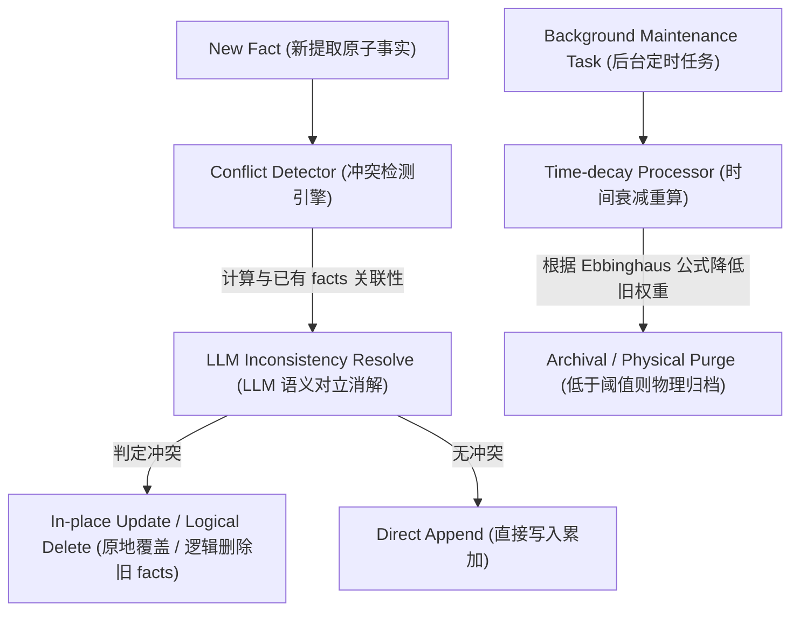

# Day 60: 记忆整合：时序一致性冲突消解与遗忘衰减机制

## 一、 业务场景与物理限制 (Problem)

长期事实记忆（Long-term Facts）由于跨越长会话周期，不可避免地会面临**时序演进冲突（Temporal Inconsistency）**与**数据脏乱（Data Entropy）**：
1. **语义互斥与决策撕裂**：用户的前后陈述可能发生矛盾。例如，历史事实记录了 `{"user_prefer_language": "Java"}`，但今天用户表示 `“我转行写 Python 了，Java 繁琐的语法让我痛苦”`。若在检索时同时将这两条互斥的事实塞给大模型，会导致模型输入的前后矛盾，发生严重幻觉。
2. **记忆堆积与噪音泛滥**：若对长期记忆只增不减，数据库会充斥大量过时、低价值的微观冗余信息。检索时由于干扰项过多，导致检索精度退化。

因此，系统必须配备一个后台清道夫进程，执行**记忆整合 (Memory Consolidation)**，即基于时序对立判定进行冲突消解，并结合遗忘规律施加**时间衰减 (Time-decay)**，保障记忆库的时序一致性与纯净度。

---

## 二、 记忆整合消解架构 (Architecture)

长期事实去重与冲突合并数据流向如下：



---

## 三、 时间衰减权重计算伪代码 (<= 20 行)

结合艾宾浩斯遗忘曲线（Ebbinghaus Forgetting Curve），记忆权重的计算通常引入时间衰减因子 $\lambda$：
$$\text{Retention} = e^{-\lambda \cdot t}$$
在 Python 中，可通过以下控制逻辑实现基于时间的权重计算：

```python
import math
import time
from typing import Dict, Any

def calculate_decay_weight(timestamp: float, decay_rate: float = 0.01) -> float:
    """基于时间戳计算记忆存留权重"""
    # 步骤 1: 计算当前时间与记忆创建时间的时间差（秒/小时）
    elapsed_time = time.time() - timestamp
    # 步骤 2: 应用指数衰减公式计算 retention 分数
    weight = math.exp(-decay_rate * elapsed_time)
    return max(0.1, weight)  # 设置保底权重限制
```

---

## 四、 前沿学术论文与演进 (Latest Research)

### 1. Reflexion (2023)
*   **奠基贡献**：提出了“反思（Self-Reflection）”闭环机制。当 Agent 在环境或交互中遭遇挫败（如计算结果错误、用户纠错），它会将这些负反馈通过反思转换为高阶经验（Reflections），存入长期记忆库，并在下一步规划中用来修正之前的行为，实现了长时行为树的动态编辑。

### 2. Memory Editing & Knowledge Updating (2024-2026)
*   **前沿突破**：研究如何精准更新大模型外挂记忆中的过时信息。提出**“原子级记忆编辑（Memory Editing）”**规范。通过轻量化模型或探针工具，精确定位向量空间中具有时序矛盾的事实特征，执行精准擦除（Erasure）或重写（Rewrite），避免了全量微调大模型的灾难性遗忘。
