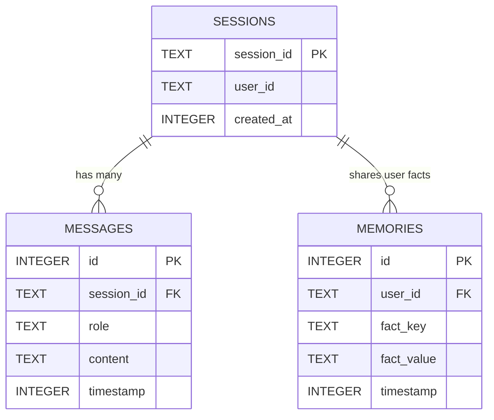

# Day 61: 底层关系持久化：Schema 建模与多 Session 状态重塑

## 一、 业务场景与物理限制 (Problem)

在分布式或多实例的企业级 Agent 生产环境中，依赖进程内存（In-Memory）维护会话状态是不可接受的，这面临着严重的物理瓶颈：
1. **进程中断与上下文遗失 (State Volatility)**：任何容器重启、异常崩溃或网络抖动都会导致保存在内存变量中的活跃 Session 和已沉淀事实瞬间灰飞烟灭。
2. **多租户 Session 无法水平扩展**：在多实例部署下，用户的请求被负载均衡分发到不同的服务器节点，内存中的消息堆栈无法共享，发生“状态割裂”。
3. **状态契约耦合**：业务逻辑与底层数据库 API（如具体的 SQL 执行语句）严重耦合，使得未来将存储介质从 SQLite 替换为分布式 PostgreSQL 时，需要修改全量业务 Pipeline。

因此，系统必须建立可靠的**物理持久化适配层（Persistence Store）**，基于 ACID 关系模型建立标准的三张关联表，支持基于 `session_id` 的反序列化状态重构（State Recovery）。

---

## 二、 关系持久化 Schema 架构 (Architecture)

多 Session 持久化状态流转与表关联如下：



*   **sessions 表**：存储会话元数据（会话 ID 与用户租户 ID）。
*   **messages 表**：存储该会话下顺序发生的消息流历史，基于 `session_id` 关联。
*   **memories 表**：存储该用户增量提取出的原子 facts 偏好，基于 `user_id` 物理隔离关联。

---

## 三、 异步数据库操作伪代码 (<= 20 行)

在 Python 中，我们使用 `aiosqlite` 异步非阻塞执行 SQLite 操作，将关系数据库操作解耦封装：

```python
import aiosqlite
from typing import List, Dict, Any

class PersistenceStore:
    def __init__(self, db_path: str):
        self.db_path = db_path

    async def get_messages(self, session_id: str) -> List[Dict[str, Any]]:
        # 步骤 1: 异步建立连接并查询关联历史
        async with aiosqlite.connect(self.db_path) as db:
            db.row_factory = aiosqlite.Row
            async with db.execute(
                "SELECT role, content FROM messages WHERE session_id = ? ORDER BY timestamp ASC", 
                (session_id,)
            ) as cursor:
                rows = await cursor.fetchall()
                # 步骤 2: 将 SQL 关系记录重构为符合 API 契约的字典列表
                return [{"role": r["role"], "content": r["content"]} for r in rows]
```

---

## 四、 工业界最佳持久化实践 (Latest Research)

### 1. Letta (Agentic OS State Management - 2025)
*   **工程定义**：Letta（MemGPT 演进）彻底将 Agent 的“状态（State）”从应用逻辑中抽离。
*   它将 Memory 的读写生命周期建模为符合 ACID 事务的数据库服务（Letta Server）。每个 Agent 的 Working Memory 和 Disk Memory 都是位于 PostgreSQL 等云端关系型数据库中的持久化记录。当分布式 Agent 需要响应时，通过 Letta RESTful API 进行安全的**锁竞争（Lock Contention）**，在拉取并重构上下文的同时，保障高并发下的状态一致性。这是企业级有状态 Agent（Stateful Agent）的最前沿落地标杆。
