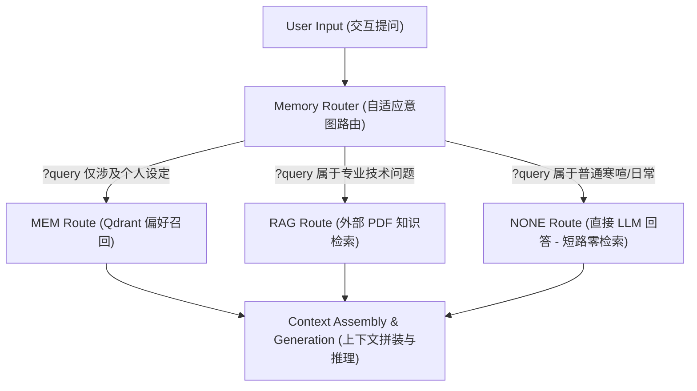

# Day 62: 自适应检索路由与 RAG 多路协同决策

## 一、 业务场景与物理限制 (Problem)

在生产级 Agent 推理流水线中，“盲目进行全量检索”是导致系统可用性退化的罪魁祸首之一：
1. **网络 Rtt 累加与首字时延（TTFT）飙升**：如果每次交互（即使是日常问候“你好”或“今天几号”）都需要去检索 Qdrant 长期偏好库，同时去扫描 Elastic/Chroma 的 RAG 外部知识库，多次并发网络 I/O 带来的平均时延会累加到 500ms 以上，使得系统无法满足高实时交互的要求。
2. **多源噪音干扰与模型幻觉**：强行将不相关的文档或过时的偏好 Facts 注入 LLM 上下文，会引入巨大的语义噪声。大模型极易被这些无关上下文带偏，导致生成质量下降、发生幻觉。
3. **API 与检索计算成本浪费**：全检索带来了极高昂的向量计算、向量数据库读取费率和 LLM 输入 Token 消耗。

因此，系统必须在最前置入口实现**自适应决策路由（Memory Router）**，根据交互意图在毫秒级内将流量安全阻断或分流。

---

## 二、 自适应多路路由架构 (Architecture)

前置决策路由分类与多路协同流程如下：



---

## 三、 自适应路由判断伪代码 (<= 20 行)

在 Python 中，可以通过强约束 Prompt 实现前置路由决策层（本例中使用 JSON 输出），短路过滤无效的数据库交互：

```python
from typing import Dict, Any

class MemoryRouter:
    async def route_query(self, query: str) -> str:
        """自适应判定 Query 检索流向"""
        messages = [
            {"role": "system", "content": "你是一个高精度的检索路由分类器。分析用户提问，判定其检索流向。只返回 JSON 格式: {\"route\": \"MEM\" | \"RAG\" | \"NONE\"}"},
            {"role": "user", "content": f"Query: {query}"}
        ]
        
        # 步骤 1: 调用大模型输出 JSON
        raw_response = await client.request_llm(messages, temperature=0.1)
        # 步骤 2: 解析并提取结果，分流至对应 Pipeline
        decision = json.loads(raw_response)["route"]
        return decision
```

---

## 四、 前沿学术论文与演进 (Latest Research)

### 1. Self-RAG (2023-2024)
*   **奠基贡献**：提出了“自适应检索与反思（Self-Reflective Retrieval）”思想。通过引入特殊的反思 Token（`Critique Tokens`，如 `[Retrieve]`、`[NoRetrieval]` 等），让大模型在生成过程中自主判定“我是否需要检索以补充知识？”以及“我检索回的内容是否包含足够回答的证据？”，实现了大模型生成与检索的主动交织。

### 2. Adaptive Retrieval (2024-2025)
*   **前沿突破**：研究在大模型推理概率不确定（Incertainty）时如何动态调节检索策略。当大模型对首字生成的概率分布置信度较低（Entropy 较高）时，才触发外部检索（Active Retrieval），而置信度高时直接依靠模型自身参数权重生成，最大化压缩了检索开销和交互耗时。
