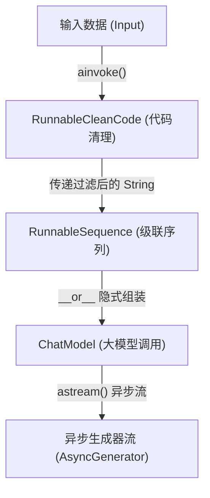

# LangChain 可运行协议 (Runnable Protocol) 技术剖析

## 1. 业务背景与系统痛点

在构建工业级 Agent 系统的组件链条（例如：多 Agent 并发代码审查系统中的“输入代码安全过滤”与“多分支大模型分发”组件）时，系统常常需要调用多种不同功能的底层实体。这包括输入清理器、LLM 客户端、提示词模版和解析器等。

如果每个组件暴露的接口定义不一致：
* 一些组件使用 `predict()`，一些使用 `generate()`，还有些使用自定义的 `execute()` 命名。
* 在面临高并发网络 I/O 时，难以对所有组件统一实施非阻塞并发调度（`ainvoke`）与流式数据传输（`astream`）。
* 在使用旧版 LCEL (LangChain Expression Language) 时，试图通过管道操作符 `|` 来级联这些接口差异巨大的组件，会导致数据流在链中频繁断裂，并且在需要进行复杂的条件分流与环路重试时，隐式的状态流转会使得代码的可观测性与调试极其困难。

---

## 2. 可运行协议 (Runnable Protocol) 原理

Runnable 协议是 LangChain Core 为所有可执行组件制定的统一类型契约。任何继承自 `Runnable` 的类，必须实现其核心的方法矩阵生命周期。

### 2.1 方法矩阵生命周期
Runnable 规范约定了四种核心调用范式，统一了同步、异步、批处理与流式生成的数据通道：

```
                ┌──────────────────────────────────┐
                │        Runnable Interface        │
                └─────────────────┬────────────────┘
                                  │
         ┌────────────────────────┼────────────────────────┐
         ▼                        ▼                        ▼
  Single Input               Batch Inputs             Stream Output
  ┌──────────────┐         ┌──────────────┐         ┌──────────────┐
  │ invoke       │         │ batch        │         │ stream       │
  │ [Sync]       │         │ [Sync]       │         │ [Sync Gen]   │
  ├──────────────┤         ├──────────────┤         ├──────────────┤
  │ ainvoke      │         │ abatch       │         │ astream      │
  │ [Async]      │         │ [Async]      │         │ [Async Gen]  │
  └──────────────┘         └──────────────┘         └──────────────┘
```

### 2.2 LCEL 操作符级联机制
LangChain 利用 Python 的重载魔法方法 `__or__` 和 `__ror__` 实现了 LCEL 的管道式调用（如 `chain = prompt | model | parser`）：
1. 当解析器遇到 `prompt | model` 时，底层触发 `prompt.__or__(model)`。
2. 系统实例化一个 `RunnableSequence` 对象。
3. `RunnableSequence` 内部包含一个 `first`、`middle` 和 `last` 的可运行组件列表。
4. 调用 `.invoke(input)` 时，`RunnableSequence` 会自底向上依次将前一个组件的输出作为下一个组件的输入，以串行数据链路完成流转。

### 2.3 流程拓扑图



---

## 3. LCEL 的局限性与 LangGraph 的兴起

虽然 LCEL 用管道操作符简化了单向线性链条的组装，但在构建工业级 Agent 时，其局限性迅速暴露：
1. **状态合并与归约缺失**：在线性链条中，每个节点的输出直接覆盖输入，无法保留历史中间状态。
2. **缺乏环路控制**：LCEL 链不支持复杂的跳转和环路（例如：代码审查未通过时打回重构的 ReAct 循环），只能通过在 Node 内部硬编码 While 循环实现，这破坏了声明式编程的优雅性。
3. **条件路由臃肿**：LCEL 的路由只能通过复杂的 `RunnableBranch` 表达，条件稍微增多就会导致代码逻辑极难维护。

因此，LangGraph 放弃了管道符 `|` 的隐式流转，改用显式的有向图结构（有向图顶点 Nodes + 有向边 Edges），将每个节点设计为标准的 `Runnable`，通过统一的图状态管理器（State）驱动状态显式转移。

---

## 4. 自定义 Runnable 极简实现（伪代码）

```python
from langchain_core.runnables import Runnable
from typing import AsyncIterator

class CustomFilter(Runnable[str, str]):
    async def ainvoke(self, input: str, config = None) -> str:
        # 防御性转换与数据清理
        return input.strip().upper()

    async def astream(self, input: str, config = None) -> AsyncIterator[str]:
        # 模拟流式生成
        cleaned = await self.ainvoke(input, config)
        for char in cleaned:
            yield char
```
