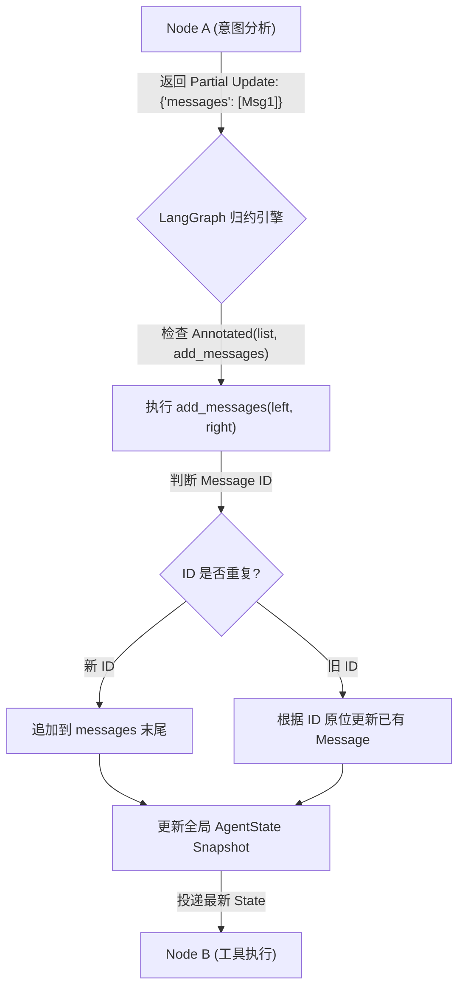

# TypedDict 状态契约与 Reducer 归约机制深度剖析

## 1. 业务背景与系统痛点

在基于 LangGraph 构建多 Agent 协作系统（例如：包含“意图解析 Node”、“知识库检索 Node”与“工具执行 Node”的多轮对话系统）时，各节点需要在图执行过程中频繁向全局状态（State）写入最新产生的数据或对话消息（Messages）。

在没有引入**状态归约器 (State Reducer)** 与 **`typing.Annotated` 类型修饰** 之前，LangGraph 的默认状态更新策略是 **浅覆盖 (Default Shallow Overwrite)**。这会导致以下严重系统痛点：

* **上下文消息被物理覆盖 (Context Loss Failure)**：当 Node A 返回 `{"messages": [AIMessage(content="你好")]}`，而下一个 Node B 产生后续回复 `{"messages": [AIMessage(content="请问有什么可以帮您？")]}` 时，默认的覆盖策略会将全局 `messages` 物理替换为 Node B 的返回值，导致 Node A 的历史消息彻底丢失，对话上下文被毁灭性裁剪。
* **并发节点状态写入冲突 (Concurrent State Mutation Conflict)**：当多个并行分支节点同时执行完毕并尝试写回同一个列表或字典状态字段时，覆盖式更新会导致“后写覆盖先写”（Last-Write-Wins Race Condition），数据更新不确定性大幅上升。
* **内存无节制膨胀 (Unbounded Memory Inflation)**：若仅简单使用 `operator.add` 盲目追加消息列表，随着多轮对话进行，`messages` 列表会无限增长，引发大模型上下文窗口溢出（Token Exceeded Exception）及内存无节制占用。

---

## 2. 状态契约与 Reducer 归约原理

LangGraph 引入了继承自 Python `TypedDict` 的强类型状态定义，并通过 `typing.Annotated` 语法为各个状态属性声明专属的 **Reducer（归约函数）**。

### 2.1 核心概念与契约规范

1. **TypedDict 状态契约 (State Contract)**：作为图节点间流转的强类型数据载体。节点函数入参接收当前全局 Snapshot，返回值则只需包含“欲修改的增量字段（Partial Update）”。
2. **`Annotated[Type, ReducerFunction]` 元数据修饰**：
   * 第一参数为字段的类型提示（如 `list[BaseMessage]` 或 `int`）。
   * 第二参数为归约处理函数。归约函数接收两个入参：`left`（当前全局状态中的既有值）与 `right`（当前节点返回的更新值），必须返回融合计算后的全新值 `updated_value = ReducerFunction(left, right)`。
3. **内置 `add_messages` 归约器**：
   * **追加功能 (Append)**：若增量消息为全新消息，自动追加至历史列表末尾。
   * **ID 覆写更新 (ID-based Replacement)**：若增量消息的 `id` 在历史列表中已存在，`add_messages` 将定位该条旧消息并原位更新（用于实现消息流式修改、工具调用状态更新）。
   * **删除标记处理 (RemoveMessage)**：若增量包含 `RemoveMessage(id=...)` 实体，自动从历史列表中移除指定 ID 的消息。
4. **自定义 Reducer (Custom Reducers)**：
   * 用户可自行编写函数，如实现带滑动窗口上限的列表归约（Keep Latest N Messages）、数值累加器（Token Accumulator）或字典层级合并（Deep Dict Merge）。

---

## 3. 状态归约控制流与逻辑图谱



---

## 4. 模式对比与代码剖析

### 4.1 默认覆盖模式 vs 归约器模式

```python
from typing import TypedDict, Annotated
from langgraph.graph import add_messages
from langchain_core.messages import BaseMessage

# 错误示例：默认覆盖模式 (会导致历史消息丢失)
class BadState(TypedDict):
    messages: list[BaseMessage]  # 没有 Annotated，节点返回值将直接 overwrite 全局 messages

# 正确示例：内置 add_messages 归约器
class GoodState(TypedDict):
    messages: Annotated[list[BaseMessage], add_messages]  # 自动去重、追加与 ID 更新

# 自定义示例：限制最大保留 N 条消息的滑动窗口 Reducer
def windowed_message_reducer(left: list[BaseMessage], right: list[BaseMessage]) -> list[BaseMessage]:
    """带有最大 5 条滑动窗口限制的消息归约器"""
    combined = add_messages(left, right)
    MAX_WINDOW = 5
    if len(combined) > MAX_WINDOW:
        return combined[-MAX_WINDOW:]
    return combined

class CustomWindowState(TypedDict):
    messages: Annotated[list[BaseMessage], windowed_message_reducer]
```

---

## 5. 性能与一致性量化对比

在 100 轮多 Agent 交互及并发状态写入测试中，三种状态处理范式的量化指标对比：

| 评估维度 | 默认浅覆盖模式 (Default Overwrite) | `add_messages` 内置归约模式 | 自定义滑动窗口 Reducer 模式 |
| :--- | :--- | :--- | :--- |
| **上下文完整度 (Context Integrity)** | 极差 (0%)。每次节点更新导致之前所有对话历史被清空。 | 完美 (100%)。完整保留历史对话，支持 ID 原位更新。 | 受控 (100% 保持在窗口上限内)。仅保留最新 N 条有效上下文。 |
| **Token 消耗增长率 (Token Growth)** | $O(1)$，但应用逻辑彻底崩溃。 | $O(N)$ 线性增长，长对话可能超出单次 LLM 上限。 | $O(K)$ 严格有界 ($K \le N$)，有效防止 Token 溢出。 |
| **并发写入数据一致性 (Consistency)** | 极差。并发修改触发 Race Condition，数据覆盖丢失。 | 高。按超步（Superstep）顺序原子执行 Reducer 合并。 | 高。按超步顺序原子执行 Reducer 合并与二次滑动裁切。 |
| **ID 去重与原位修改支持** | 不支持。 | 原生支持 `RemoveMessage` 与 ID 覆写。 | 基于 `add_messages` 继承原生 ID 覆写特征。 |
