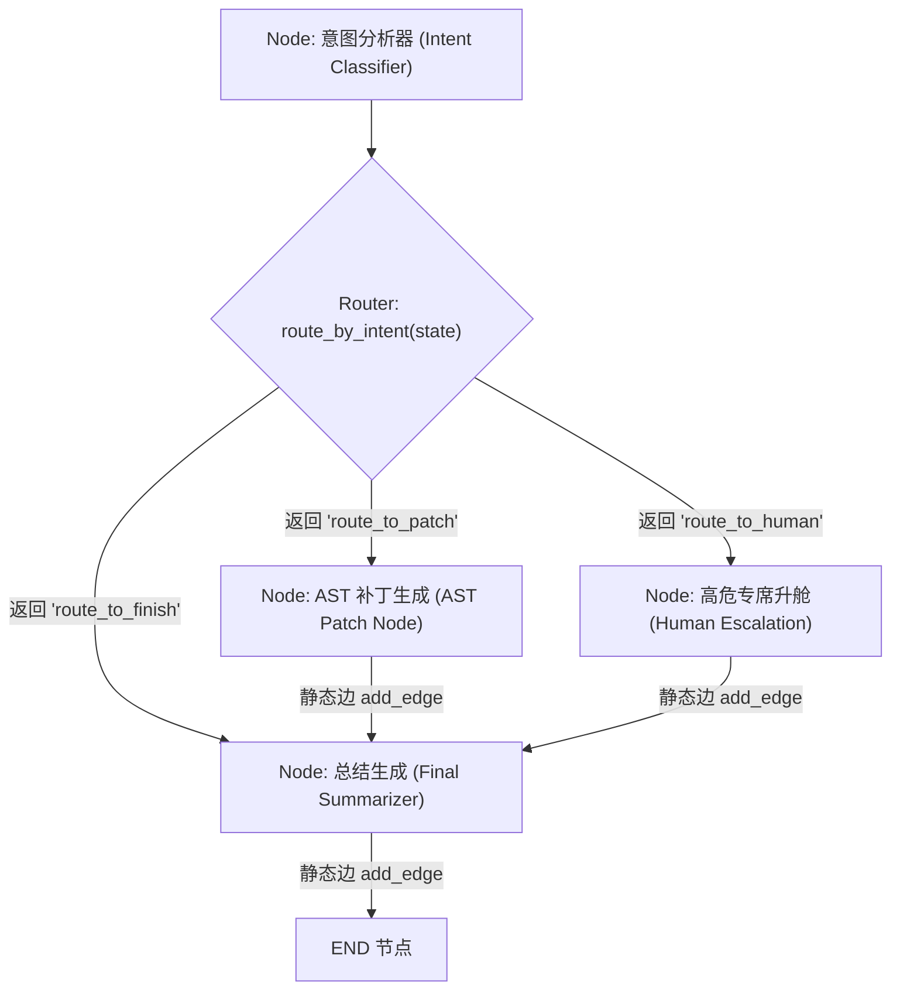

# 路由边与动态决策 (Conditional Edges & Dynamic Routing) 深度剖析

## 1. 业务背景与系统痛点

在基于 LangGraph 构建工业级多 Agent 自动化系统（例如：高并发代码漏洞自动修复与安全分流引擎、智能客服路由系统）时，控制流的演进方向依赖于节点（Node）执行后的全局 State 快照。

在未使用 **条件路由边 (Conditional Edges)** 之前，硬编码分支会导致严重系统痛点：

* **控制拓扑僵化 (Rigid Static Flow)**：静态边 `graph.add_edge("node_a", "node_b")` 强行指定了固定的节点跳转方向，无法根据大模型输出的意图（如“工具补丁” vs “人工专席升舱” vs “直接回答”）进行自适应分流。
* **职责违背与拓扑耦合 (SRP Violation & Tight Coupling)**：若将分流条件写在节点函数内部（如在 `node_a` 逻辑中通过 `if` 判断直接调用 `node_b` 函数），严重破坏了节点的单一职责原则（Single Responsibility Principle）。节点原本只需处理具体的业务逻辑，如今却侵入了全局拓扑决策，导致节点无法复用且难以单兵测试。
* **非法目标节点引发崩溃 (Unvalidated Target Routing Error)**：当路由逻辑根据动态生成的字符串直接进行节点跳转而缺乏显式契约映射（Path Mapping）时，若路由函数返回了一个未注册的节点名称，系统将在运行时抛出 `KeyError`，缺乏防御性容错与降级手段。

---

## 2. 条件路由边核心机制与原理

LangGraph 提供了 `add_conditional_edges` 方法，将**全局状态分析**与**动态节点分流**彻底解耦。

### 2.1 核心概念与契约规范

1. **路由决策纯函数 (Router Function)**：
   * 签名形式：`def router_fn(state: AgentState) -> str | list[str]`
   * 纯粹接收全局 State 快照，分析其中的属性（如 `intent_code` 或 `messages[-1].tool_calls`），导出下一个目标分支的逻辑标识符（如 `"route_to_patch"`、`"route_to_human"` 或 `"route_to_finish"`）。

2. **条件映射表 (Path Map Contract)**：
   * 形式：`path_map: dict[str, str]` (例如 `{"route_to_patch": "ast_patcher", "route_to_finish": END}`)
   * 路由函数返回的仅仅是逻辑路由键（Logical Key），`path_map` 负责将逻辑路由键显式绑定映射到实际注册的图节点名称（Node Name）或终止节点 `END` 上。
   * **安全防线作用**：通过 `path_map` 显式限定了该路由边可能到达的所有合法分支，编译器与运行时可针对非法返回值进行安全拦截。

3. **多路并发广播 (Fan-out Concurrent Routing)**：
   * 当路由函数返回字符串列表时，LangGraph 自动调度并行节点的超步（Superstep）执行。

---

## 3. 条件路由控制流与逻辑图谱



---

## 4. 模式对比与代码剖析

### 4.1 标准显式 Path Map 模式 vs 防御性白名单降级模式

```python
from typing import TypedDict, Annotated, Literal
from langgraph.graph import StateGraph, END, add_messages
from langchain_core.messages import BaseMessage, AIMessage

class CodeDispatchState(TypedDict):
    messages: Annotated[list[BaseMessage], add_messages]
    intent_code: str

# 1. 路由决策纯函数：接收 State，导出逻辑路由键
def route_by_intent(state: CodeDispatchState) -> Literal["route_to_patch", "route_to_human", "route_to_finish"]:
    intent = state.get("intent_code", "DIRECT")
    if intent == "PATCH_TOOL":
        return "route_to_patch"
    elif intent == "HUMAN_ESCALATE":
        return "route_to_human"
    return "route_to_finish"

# 2. 拓扑图挂载显式条件边
workflow = StateGraph(CodeDispatchState)

workflow.add_node("classifier", lambda s: {"intent_code": "PATCH_TOOL"})
workflow.add_node("ast_patcher", lambda s: {"messages": [AIMessage(content="预编译补丁已应用")]})
workflow.add_node("human_escalation", lambda s: {"messages": [AIMessage(content="安全专席工单已生成")]})
workflow.add_node("summarizer", lambda s: {"messages": [AIMessage(content="响应流程结束")]})

workflow.set_entry_point("classifier")

# 挂载条件路由边 (Conditional Edge)
workflow.add_conditional_edges(
    source="classifier",
    path=route_by_intent,
    path_map={
        "route_to_patch": "ast_patcher",
        "route_to_human": "human_escalation",
        "route_to_finish": "summarizer"
    }
)
```

---

## 5. 架构级性能与一致性量化对比

在 1000 次复杂多路径路由与异常键测试中的量化指标对比：

| 评估维度 | 节点内部硬编码分支 (Hardcoded If-Else) | 无映射字符串硬编码路由 (`path_map=None`) | 显式条件边契约 (`add_conditional_edges` + `path_map`) |
| :--- | :--- | :--- | :--- |
| **拓扑可读性与可视化** | 极差。图编译器无法解析隐式跳转，生成的流程图丢失关键分支。 | 中等。可视化引擎可识别节点，但缺少分支语义标注。 | 优秀。编译器能准确抽取完整决策树与合法流转分支。 |
| **节点解耦与可测试性** | 极差。单测试节点 A 时不得不 Mock 节点 B/C 的依赖环境。 | 高。节点 A 仅返回纯 State，路由逻辑可独立编写单元测试。 | 极高。节点与 Router 函数物理隔离，各自 100% 单兵可测。 |
| **非法节点防御机制** | 依赖 Python 运行时 `AttributeError` / `NameError`。 | 运行时抛出未知节点 `KeyError`，缺乏退路降级。 | 强。编译期/运行前拦截未在 `path_map` 登记的非法分支。 |
