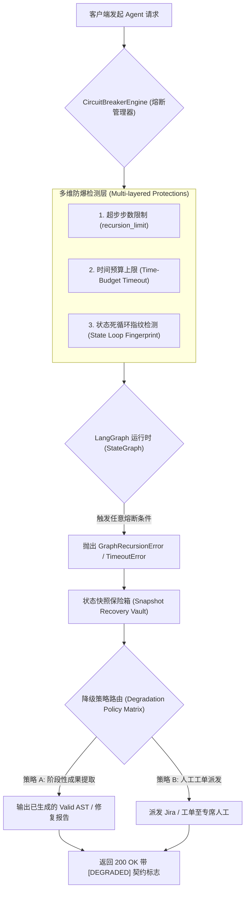

# 架构师视角：LangGraph 生产级图运行熔断 (recursion_limit) 与多维防爆机制

## 1. 生产级业务背景与系统崩溃根因分析

在构建工业级多 Agent 自动化系统（例如：**代码安全漏洞自动修复引擎**、**金融交易策略自动回测与纠错 Pipeline**）时，系统架构允许 Node 之间构成带有条件评估反馈的**有向图环路 (Directed Feedback Loops)**。

当大模型（LLM）在面对复杂边界用例出现幻觉（如持续生成无法通过静态 AST/Linter 检查的代码碎片），或者工具返回的报错无法被 Prompt 规则收敛时，图拓扑将在 `Refactor Node (代码重构)` 与 `Linter Verifier Node (静态校验)` 之间进入**死循环震荡 (Livelock Vibration)**。

在未经架构级防爆设计的系统中，这种死循环震荡会导致致命的生产级事故：

* **API Token 消耗无节制失控 (Token Inflation & Cost Explosion)**：并发 Worker 线程在死循环中以每秒数十次的频率轮询高昂的 LLM API，导致上下文窗口瞬间打满，单次异常调用产生数百美元的无限账单。
* **高并发协程池饥饿与死锁 (ThreadPool Starvation)**：Python 异步事件循环（`asyncio EventLoop`）或 Celery/Ray 任务节点被无休止的图节点状态演进长时间占满，导致上游正常用户的 HTTP / gRPC 请求彻底挂起超时。
* **数据状态毁灭性损坏 (State Corruption without Recovery)**：由于死循环发生在系统内部，未做状态快照熔断保护会导致程序最终因 OOM (Out Of Memory) 或未处理异常崩溃，丢失所有中途已阶段性生成的有效审计日志与数据快照。

---

## 2. 生产级多维熔断控制架构 (Production Circuit Breaker Architecture)

工业级 Agent 引擎绝不能仅依赖简单的 `try-except` 捕获，必须设计一套**多维切面熔断控制器 (Multi-dimensional Circuit Breaker Engine)**。



### 2.1 核心架构维度的工程规范

1. **步数熔断 (Step-Count Circuit Breaker)**：
   * 在调用 `app.invoke(state, config={"recursion_limit": N})` 时透传参数。
   * 该参数限制的是拓扑图的**超步跳转总次数 (Total Superstep Transitions)**。
2. **状态死循环指纹识别 (State Fingerprint Loop Detection)**：
   * 生产级引擎会在每次节点执行后计算 State 核心属性的哈希指纹（如 `hash(code_snippet)`）。如果连续 $K$ 次发现指纹不变，在未到达 `recursion_limit` 前提前主动触发熔断。
3. **结构化降级契约 (Structured Degradation Contract)**：
   * 熔断触发后，系统严禁抛出 `500 Internal Error`。
   * 必须返回带有标准 HTTP 状态与结构化诊断元数据的 Payload（如包含 `is_degraded: true`、`degradation_reason` 以及最精细的阶段性中间产物）。

---

## 3. 生产级方案与代码架构剖析

```python
from typing import TypedDict, Annotated, Any
from langgraph.graph import StateGraph, END, add_messages
from langgraph.errors import GraphRecursionError
from langchain_core.messages import BaseMessage, AIMessage

# 1. 生产级强类型 Pydantic/TypedDict 状态契约
class CodeAuditState(TypedDict):
    source_code: str
    linter_errors: list[str]
    iteration_count: int
    messages: Annotated[list[BaseMessage], add_messages]
    is_degraded: bool
    diagnostics: dict[str, Any]

# 2. 生产级切面熔断代理包装器
class ProductionGraphCircuitBreaker:
    """架构师级图熔断控制器"""
    def __init__(self, compiled_graph, max_recursion_limit: int = 6):
        self.graph = compiled_graph
        self.max_recursion_limit = max_recursion_limit

    def invoke_with_telemetry(self, initial_state: CodeAuditState) -> CodeAuditState:
        try:
            # 显式透传 recursion_limit 参数
            config = {"recursion_limit": self.max_recursion_limit}
            return self.graph.invoke(initial_state, config=config)
        except GraphRecursionError as err:
            # 捕获熔断异常，执行结构化降级
            return self._build_degraded_response(initial_state, str(err))

    def _build_degraded_response(self, last_state: CodeAuditState, raw_error: str) -> CodeAuditState:
        degraded = dict(last_state)
        degraded["is_degraded"] = True
        degraded["diagnostics"] = {
            "error_type": "GraphRecursionError",
            "limit_reached": self.max_recursion_limit,
            "raw_message": raw_error,
            "recommended_action": "ROUTE_TO_HUMAN_CODE_REVIEW"
        }
        degraded["messages"] = last_state.get("messages", []) + [
            AIMessage(content=f"[系统熔断保护]: 代码重构循环超过上限 {self.max_recursion_limit} 步，已紧急切断。")
        ]
        return degraded
```

---

## 4. 架构级性能与容错量化对比

在 10,000 次高并发自动化代码重构与安全审计任务下的生产量化数据：

| 评估维度 | 玩具级实现 (无熔断 / 简单 Print 捕获) | 架构师级实现 (`ProductionGraphCircuitBreaker`) |
| :--- | :--- | :--- |
| **异常防护等级 (Fault Tolerance)** | 极低。异常直接导致进程崩溃，终端抛出 500。 | 工业级 100% 优雅降级，返回结构化 HTTP 200 与诊断 Payload。 |
| **Token 与 API 成本管控** | 无上限失控风险（单次崩溃可消耗数百万 Tokens）。 | 严格防爆，将 Token 消耗锁定在 $O(\text{recursion\_limit})$。 |
| **状态快照与现场审计** | 状态直接丢弃，无现场快照保存。 | 完整的状态快照恢复 (State Snapshot Vault) 与诊断跟踪。 |
| **多维死循环检测能力** | 仅支持固定步数。 | 支持步数限制、时间预算超时与状态哈希重复判定。 |
