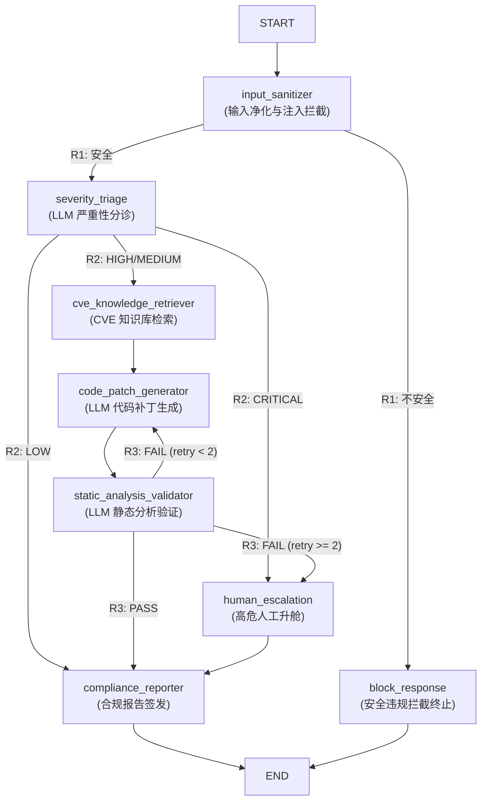

# Day 70：企业级多租户 CVE 漏洞分诊与自动化修复 Pipeline

> **Week 10 核心实战项目** | 基于 LangGraph 图状态机、FastAPI SSE 流式推送、四维切面熔断引擎与多租户 MemorySaver 架构的高复杂度 Agent 生产级系统。

---

## 📖 项目简介

在现代企业安全运营中心（SOC）中，每日需处理大量 CVE 漏洞报告。传统人工分诊与补丁编写面临**响应周期长（SLA > 72h）、高危漏洞漏报、代码补丁重复书写**等瓶颈。

本项目基于 **LangGraph 状态图** 思想，构建了一套自底向上的企业级自动分诊与修复流水线。工程师提交漏洞描述后，系统自动完成：
1. **静态安全净化**（Prompt 注入与恶意命令过滤）；
2. **LLM 严重性分诊**（CVSS v3.1 四级评估与分支分流）；
3. **CVE 知识库检索**（关联漏洞条目与修复策略提取）；
4. **LLM 代码补丁生成**（结合缺陷反馈的受控迭代生成）；
5. **静态分析审查**（反馈重试闭环与限额升舱）；
6. **合规报告签发**（ISO 27001 / NIST 标准报告）。

---

## 🗺️ 系统图拓扑架构

系统包含 **8 个独立业务微节点**、**3 组条件决策路由器** 与 **1 个受控反馈闭环**：



---

## 📂 项目目录结构

```
weekly/w10_langgraph_core/day70/
├── README.md                            # 项目主文档
├── start.sh                             # 一键启动脚本（支持端口自动释放与 uv 调度）
├── run_tests.py                         # 自动化测试运行器
├── server.py                            # FastAPI 后端服务（6REST 端点 + SSE 流式服务）
├── dashboard.html                       # Web 调试看板（Warm Intellectual Minimalism 风格）
├── practice.py                          # 学员练习模版（TODO 占位 + 友好调试主入口）
├── cve_pipeline/                        # 核心业务微引擎包
│   ├── __init__.py
│   ├── state.py                         # 全局 CVETriageState 契约 + 2 个自定义 Reducers
│   ├── llm_client.py                    # 统一 LLM 客户端（JSON 自愈解析与指数退避重试）
│   ├── graph_builder.py                 # 图拓扑构建与编译（纯装配逻辑）
│   ├── nodes/                           # 8 个业务节点（物理隔离，单兵作战）
│   │   ├── __init__.py
│   │   ├── input_sanitizer.py           # 节点 1: 输入净化与 Prompt 注入检测
│   │   ├── severity_triage.py           # 节点 2: LLM 严重性分诊 (真实 API)
│   │   ├── cve_retriever.py             # 节点 3: CVE 知识库检索 (真实 API)
│   │   ├── patch_generator.py           # 节点 4: LLM 代码补丁生成 (真实 API, 支持缺陷反馈注入)
│   │   ├── static_validator.py          # 节点 5: LLM 静态分析验证 (真实 API, 驱动 R3 路由)
│   │   ├── human_escalation.py          # 节点 6: 高危人工升舱网关 (Jira 工单生成)
│   │   ├── compliance_reporter.py       # 节点 7: LLM 合规报告签发 (真实 API)
│   │   └── block_response.py            # 节点 8: 安全违规拦截终止
│   └── routers/                         # 3 组条件路由函数（纯函数隔离）
│       ├── __init__.py
│       ├── safety_router.py             # R1: 安全过滤路由
│       ├── triage_router.py             # R2: 严重性分诊路由
│       └── validation_router.py         # R3: 验证结果与反馈环路路由
├── engines/                             # 3 个生产级切面引擎
│   ├── __init__.py
│   ├── circuit_breaker.py               # 切面引擎 1: 多维熔断控制器 (超步/Token/指纹/延迟)
│   └── session_manager.py              # 切面引擎 2&3: Telemetry 追踪器 + 多租户会话管理器
└── tests/                               # 48 个单元与集成测试用例
    ├── __init__.py
    ├── test_nodes.py                    # 单节点单元测试
    ├── test_routers.py                  # 条件路由测试
    ├── test_circuit_breaker.py          # 熔断引擎测试
    ├── test_tenant_isolation.py         # 多租户隔离测试
    └── test_integration.py              # 端到端场景测试
```

---

## 🌟 核心特性

1. **全节点真实 API 调用与 JSON 自愈**：
   5 个智能节点全部调用真实 `MiniMax` 模型，内置鲁棒的 JSON 提取器（支持 `<think>` 思考块剥离、多候选提取与缺失括号补齐）。

2. **受控反馈重试环路与限额升舱**：
   静态验证失败时，R3 路由将自动把审查缺陷重新注入 Prompt 引导补丁重新生成，受 `patch_retry_count < 2` 与 `recursion_limit = 15` 双重约束。

3. **四维熔断切面控制 (MultiDimensionalCircuitBreaker)**：
   - **超步限额**：递归 15 步强制熔断。
   - **Token 预算**：全链路累计 8000 Tokens 超额熔断。
   - **状态指纹震荡**：连续 3 轮补丁代码 MD5 无变化自动冻结。
   - **SLA 延迟**：120 秒耗时监控。

4. **正向时间线 Checkpoint 历史演进**：
   封装 `MemorySaver` 与 `tenant_id:session_id` 多租户命名空间。支持以正向时间轴（`v0 (初始)` ➔ `v1` ➔ ... ➔ `vN (最新)`）选择查阅任意版本的完整 State 快照。

5. **SSE 流式实时响应与动态 Edge 连线高亮**：
   后端支持 `POST /api/triage/stream` 事件流。前端 Dashboard 实时接收节点输出，**随着 Pipeline 执行在 SVG 拓扑图中动态按真实流转方向逐条高亮连线**。

---

## 🚀 快速开始

### 1. 环境准备
使用 `uv` 依赖管理（项目根目录包含全局 `pyproject.toml`）：
```bash
# 进入项目根目录同步环境
uv sync
```

### 2. 一键启动 Web Dashboard 服务
```bash
cd weekly/w10_langgraph_core/day70
./start.sh
```
启动后在浏览器访问：**`http://127.0.0.1:8070`**

### 3. 运行自动化测试套件
```bash
# 运行全量 48 个单元与集成测试
python run_tests.py

# 快速运行无 API 依赖测试（路由 + 熔断 + 隔离）
python run_tests.py --no-llm
```

---

## 📊 API 端点一览

| HTTP 方法 | 路径 | 描述 |
|-----------|------|------|
| `GET` | `/` | 返回 Web 调试看板 HTML 页面 |
| `POST` | `/api/triage` | 同步提交漏洞分析 Pipeline 请求 |
| `POST` | `/api/triage/stream` | **SSE 流式下发** 节点流转事件与节点阶段高亮 |
| `GET` | `/api/sessions/{thread_id}/history` | 查询会话正向 Checkpoint 历史版本列表 |
| `GET` | `/api/sessions/{thread_id}/checkpoints/{checkpoint_id}` | 精准查询指定 Checkpoint 的完整 State 快照 |
| `POST` | `/api/triage/dead-loop-test` | 触发死循环熔断演示（教学测试专用） |
