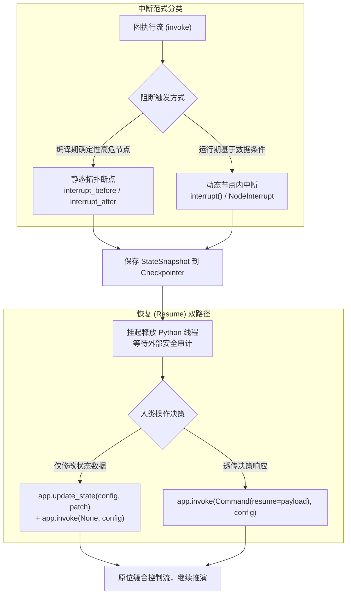

# Day 71 技术沉淀：人在回路（HITL）中断机制与断点控制

> **沉淀定位**：本篇文档系统总结了 LangGraph 人在回路 (Human-in-the-Loop, HITL) 的底层控制流挂起、`StateSnapshot` 状态快照持久化、以及双路径恢复（Resume）机制，为生产环境的高风险 Agent 阻断防护提供架构指南。

---

## 1. 工业级业务场景与工程痛点

在企业级 Agent 落地（如高风险金融转账、生产环境数据库删改、向客户发送商业邮件、自动化代码上线）中，若将决策全权交由 LLM 进行全自动执行（Autonomous Execution），会引发严重的合规与资金安全隐患：

```
[全自动模式风险] 
用户请求 -> LLM 决策/幻觉 -> 触发高危工具 (例: 删除生产数据库 / 支付 $1,000,000) -> 灾难事故 (不可逆)
```

### 生产级痛点分析
1. **黑盒不可控**：Prompt 无法 100% 保证 LLM 不产生参数幻觉或跳过校验逻辑。
2. **跨 HTTP 请求的控制流挂起**：Web 服务是无状态的，在等待人工审批（可能耗时几分钟到数天）期间，无法在服务器内存中保持 Python 线程阻塞。
3. **安全审计与原位纠偏**：人类审批不仅需要“批准/拒绝”，还需要在发现 LLM 生成的参数有微小错误（如收件人邮箱拼错）时，直接原位修正状态并解冻执行。

---

## 2. HITL 架构设计：双范式中断控制

LangGraph 提供了物理层面的**控制流冻结与 Checkpoint 挂起机制**，划分为两套互补的设计范式：



### 2.1 静态拓扑断点 (Static Interrupt-Before/After)
在图编译阶段（`compile`）显式声明阻断节点。无论运行时数据如何，控制流会在目标节点**执行前（或执行后）**强制暂停。

```python
# 编译期硬编码阻断 target 节点
app = builder.compile(
    checkpointer=memory_saver,
    interrupt_before=["execute_high_risk_action"]
)
```
* **适用场景**：确定性的高危节点（如 `send_email`、`drop_table`），原则上每一笔调用都必须经由人工手批。

### 2.2 动态条件中断 (Dynamic Node Interrupt)
在节点函数内部，根据 LLM 吐出的动态入参或风控模型评分，弹性调用 `interrupt()` 挂起。

```python
from langgraph.types import interrupt

def risk_eval_node(state: AgentState):
    # 仅当转账金额超过安全阈值 $10,000 时触发中断
    if state["amount"] > 10000.0:
        approval = interrupt({
            "warning": "HIGH_VALUE_RISK",
            "amount": state["amount"],
            "prompt": "转账金额超过 $10,000，请人工核查"
        })
        return {"status": approval.get("decision")}
    return {"status": "AUTO_APPROVED"}
```
* **适用场景**：风险与入参相关的弹性风控（如按金额、敏感词判定阻断）。

---

## 3. 中断挂起与状态快照 (StateSnapshot) 解构

当阻断触发时，LangGraph 会将当前线程的状态完整写入绑定 `Checkpointer`，并向调用方返回中断时的状态快照。

### 3.1 `StateSnapshot` 核心数据结构

通过 `app.get_state(config)` 获取的快照对象包含以下关键字段：

| 属性字段 | 类型 | 说明 | 生产工程含义 |
| :--- | :--- | :--- | :--- |
| `snapshot.values` | `Dict[str, Any]` | 当前 Checkpoint 的 State 字典完整副本 | 审查历史数据及当前生成的 Payload |
| `snapshot.next` | `Tuple[str, ...]` | 下一个**待执行**的 Node 名称元组 | 挂起时判断图冻结在哪一步（如 `('send_email',)`） |
| `snapshot.tasks` | `Tuple[PregelTask, ...]` | 当前挂起任务列表 | 当使用 `interrupt()` 时，其 `tasks[0].interrupts` 包含暴露给外部的 Payload |
| `snapshot.config` | `RunnableConfig` | 包含 `thread_id` 与 `checkpoint_id` | 用于精确定位与快照寻址 |

### 3.2 挂起数据读取与 Payload 提取模式

```python
# 1. 查询当前线程状态
snapshot = app.get_state(config)

# 2. 判断是否处于挂起阻断状态
if snapshot.next:
    print(f"图已挂起，等待执行节点: {snapshot.next}")

# 3. 提取动态 interrupt 暴露的告警 Payload
if snapshot.tasks and snapshot.tasks[0].interrupts:
    payload = snapshot.tasks[0].interrupts[0].value
    print(f"告警详情: {payload}")
```

---

## 4. 恢复执行 (Resume) 的双路径控制流

解冻已挂起的图并让控制流继续向下推演，共有两种标准的软件工程路径：

### 路径 A：状态覆写 (State Override) 恢复
* **核心 API**：`app.update_state(config, values)` 搭配 `app.invoke(None, config)`。
* **物理机制**：`update_state` 会创建一个新的 Checkpoint 快照，覆写指定 key 的值；调用 `invoke(None)` 告知引擎从当前最新的 Checkpoint 继续向下一个 `next` 节点推进。
* **代码模式**：
  ```python
  # 修正收件人地址并更新审核状态
  app.update_state(config, {"recipient": "correct_boss@company.com", "status": "APPROVED"})
  # 传入 None 解冻执行
  final_res = app.invoke(None, config)
  ```

### 路径 B：Command(resume=...) 响应注入恢复
* **核心 API**：`app.invoke(Command(resume=payload), config)`。
* **物理机制**：专门用于恢复通过 `interrupt()` 挂起的节点。传入的 `resume` 对象会作为节点内部 `interrupt()` 函数的**返回值**直接注入，让节点代码从 `interrupt()` 调用的下一行继续向下执行。
* **代码模式**：
  ```python
  from langgraph.types import Command

  # 注入人类审核意见
  app.invoke(
      Command(resume={"decision": "APPROVED", "reason": "采购合同已核验"}),
      config
  )
  ```

---

## 5. 生产级防错与坑点指南 (Defense Guidelines)

> [!CAUTION]
> **坑点 1：未配置 Checkpointer 直接配置 `interrupt_before`**
> LangGraph 的中断必须依赖持久化 Checkpointer 记录挂起快照。若没有绑定 Checkpointer，`compile()` 时会抛出 `GraphValueError: Cannot use interrupts without a checkpointer`。

> [!IMPORTANT]
> **坑点 2：动态 `interrupt()` 恢复时的幂等性与重复触发**
> 当使用 `Command(resume=...)` 恢复节点时，LangGraph 会重新执行该节点代码，并将 `interrupt()` 的返回值替换为 `resume` Payload。因此，`interrupt()` 之前的代码**会被重复运行一次**，务必保证 `interrupt()` 前的逻辑具备幂等性（不要在 `interrupt()` 前做扣款或写库操作）。

---

## 6. 核心量化指标对比

| 评估维度 | 传统 Agent 全自动模式 | LangGraph HITL 阻断架构 |
| :--- | :--- | :--- |
| **高危事故率** | 高 (依赖 Prompt 约束，防不胜防) | **0%** (拓扑与动态阻断拦截) |
| **跨请求挂起能力** | 无 (内存线程阻塞易丢状态) | **强** (基于 Checkpointer 毫秒级存盘) |
| **人工纠错成本** | 高 (出错需让 LLM 重新生成) | **低** (支持 `update_state` 秒级覆写纠偏) |
| **控制流灵活性** | 单一控制流 | 支持 StateSnapshot 检视与双路径 Resume |
