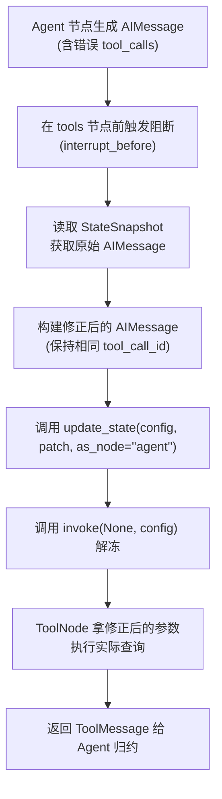

# Day 72：工具调用人工审批与运行时拦截重写

## 1. 业务背景与工程痛点

在基于 Function Calling / Tool Use 的 Agent 系统中，大模型经常因为 Prompt 理解偏差、格式校验失效或数据幻觉，生成**参数错误或存在合规风险的工具调用指令**。

```
[无拦截重写] Agent 生成 tool_calls: {"user_id": "ERR_9999"} -> 直接调用 Tool -> 数据库查无此人 / 抛出 Exception
```

### 传统做法的弊端
当发现 LLM 生成的工具参数错误时，如果直接拒绝并丢回给 LLM 重新生成（Re-Prompting）：
1. **Token 浪费与延迟暴涨**：再次调用大模型需要花费 1~3 秒的推理时间与数百 Token 成本。
2. **结果不可控**：LLM 再次生成依然有可能继续幻觉或拼错参数。

### LangGraph 运行时拦截重写方案
通过在 `tools` 节点执行前挂起控制流（`interrupt_before=["tools"]`），人类管理员可直接调取快照中的 `AIMessage.tool_calls`，使用 `graph.update_state()` **在原位强行重写工具入参字典**，然后放行给 `ToolNode`。

```
[LangGraph 拦截重写] 
Agent 生成 tool_calls: {"user_id": "ERR_9999"} 
  -> 挂起 (interrupt_before) 
  -> 人工原位修正为 {"user_id": "USR_1001"} 
  -> 解冻直接由 ToolNode 执行正确查询
```

---

## 2. AIMessage.tool_calls 结构与原位覆写机制

在 LangChain / LangGraph 契约中，大模型生成的工具调用保存在消息列表末尾的 `AIMessage` 中：

```python
AIMessage(
    content="",
    tool_calls=[
        {
            "name": "query_user_orders",
            "args": {"user_id": "ERR_9999", "limit": 10},
            "id": "call_abc123"  # 唯一的工具调用 ID
        }
    ]
)
```

### 覆写核心步骤
1. **调取挂起快照**：通过 `snapshot = app.get_state(config)` 获取消息列表。
2. **构建修正后的 AIMessage**：保持原始的 `tool_call_id` 不变，仅更新 `args` 中的字段。
3. **`as_node` 精确挂载**：使用 `app.update_state(config, {"messages": [modified_ai_msg]}, as_node="agent")` 告知图引擎当前状态修改是在 `agent` 节点输出时完成的。
4. **解冻执行**：调用 `app.invoke(None, config)`，图引擎会直接拿着修正后的 `tool_calls` 进入下一个节点 `tools` 执行。

---

## 3. 控制流转与 `as_node` 锚点

在进行状态覆写时，`as_node` 参数至关重要：



> [!IMPORTANT]
> **为什么要指定 `as_node="agent"`？**
> 如果不显式指定 `as_node`，LangGraph 默认会将 `update_state` 当作外部节点写入，可能改变 `snapshot.next` 的指向，导致无法正确推进到 `tools` 节点。明确指定 `as_node="agent"` 相当于告诉引擎：“这是对 `agent` 节点产出消息的就地修正”。

---

## 4. 极简核心代码伪代码

```python
# 1. 触发挂起后获取最新消息
snapshot = app.get_state(config)
last_msg = snapshot.values["messages"][-1]

# 2. 构造参数修正后的 Tool Call 列表
new_tool_calls = [
    {
        "name": last_msg.tool_calls[0]["name"],
        "args": {"user_id": "USR_1001", "limit": 5},  # 修正参数
        "id": last_msg.tool_calls[0]["id"]            # 保持相同 id
    }
]

# 3. 构造新的 AIMessage 并原位替换
updated_msg = AIMessage(content=last_msg.content, tool_calls=new_tool_calls, id=last_msg.id)
app.update_state(config, {"messages": [updated_msg]}, as_node="agent")

# 4. 解冻恢复运行
app.invoke(None, config)
```

---

## 5. 核心指标与控制性能

| 评估维度 | 丢回 LLM 重新生成 (Re-Prompting) | LangGraph 原位拦截重写 (update_state) |
| :--- | :--- | :--- |
| **纠错时间延迟** | 1,000 ms ~ 3,000 ms (取决于 API 响应) | **< 10 ms** (纯本地内存操作) |
| **Token 额外开销** | 增加单次 Request Token (几百~上千 Token) | **0 Token** (无网络调用) |
| **纠错确定性** | 80%~90% (LLM 仍可能犯错) | **100%** (强类型人工精确定制) |
| **审计追踪记录** | 历史被二次生成消息覆盖或增长 | 保留修正轨迹，格式规范统一 |
