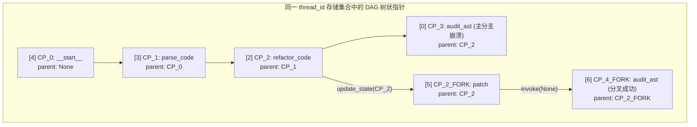

# Day 73：状态“时间旅行”（Time Travel）与回滚分叉重试

## 1. 业务背景与工程痛点

在多步循环推演的 Agent 场景（如自动化代码重构、长链条推理、多步骤 SQL 迁移）中，系统可能会在第 5 步发生崩溃或输出非法结果。

```
[传统崩溃模式] Step 1 -> Step 2 -> Step 3 (LLM 决策偏离) -> Step 4 -> Step 5 (彻底崩溃) -> 整个任务废弃重跑
```

### 生产级痛点分析
1. **算力巨大浪费**：前 2 步完全正确，废弃重跑会导致已经完成的前置 API 调用与 Token 消耗全部丢弃。
2. **调试归因极其困难**：没有中间历史状态快照，无法精确定位 Agent 是在第几步开始走偏的。
3. **不可逆历史破坏**：如果直接修改当前最新的 State 重跑，会覆盖崩溃现场，失去根因诊断（Root Cause Analysis）线索。

---

## 2. “时间旅行”物理机制：Checkpoint DAG 链与分叉 (Forking)

LangGraph 底层的 `Checkpointer` 不仅仅保存最新的一份状态，而是将每一次 Node 执行后的状态增量保存为一个**只读快照节点**。这些节点通过 `checkpoint_id` 与 `parent_checkpoint_id` 构成了树状的有向无环图（DAG）。



### 2.1 物理存储结构：多分支是否在同一个集合？
**答案：是的！主分支与所有分叉分支存储在同一个数据库/表/字典集合中。**

LangGraph 在存储 Checkpoint 时，每一条记录均包含以下核心元数据字段：

| 字段名称 | 说明 | 示例 |
| :--- | :--- | :--- |
| `thread_id` | 线程隔离唯一标识 | `"time_travel_thread_2026"` (所有分叉共享) |
| `checkpoint_id` | 当前快照的物理主键 | `1f18661b-cafa-69c8-8002-...` |
| `parent_checkpoint_id` | **前任指针 (父快照 ID)** | 指向触发当前状态的上一个 `checkpoint_id` |
| `metadata.source` | 触发来源 | `"loop"` / `"update"` / `"input"` |

**分叉寻址原理**：引擎**不需要划分为多个独立集合**，而是通过 `parent_checkpoint_id` 构成的链式 DAG 树进行深度回溯。分叉节点（如 `CP_2_FORK`）将其 `parent_checkpoint_id` 显式设为 `CP_2`，从而在物理上一边保留 `CP_3`（原始崩溃线），一边延伸出 `CP_4_FORK`（新分支线）。

### 2.2 `get_state_history` 为什么 `__start__` 在列表最后？
* **倒序排列 (Reverse Chronological Order)**：`get_state_history` 返回的快照列表**默认按时间倒序排列（Most Recent First）**。
* **索引映射关系**：
  * `history[0]`：最新生成的快照（即最新调用的终点状态/分叉最新点）。
  * `history[-1]`：最初启动时的快照（即传入初始 payload 准备进入 `__start__` 的时刻）。
* **工程优势**：在 90% 的生产场景中，系统优先查询最新状态。倒序排列允许游标分页（Pagination）以 $O(1)$ 复杂度直接读取头部的最新快照。

---

## 3. 核心 API 规范与操作三步法

### 3.1 步骤 1：读取历史快照链 (`get_state_history`)
```python
# 遍历指定 thread_id 的全部 Checkpoint 历史（按时间倒序排列）
for snapshot in app.get_state_history(config):
    print(f"Checkpoint ID: {snapshot.config['configurable']['checkpoint_id']}")
    print(f"  -> 当前待执行节点: {snapshot.next}")
    print(f"  -> State 字段: {snapshot.values}")
```

### 3.2 步骤 2：锚定特定历史快照锚点 (Config Locking)
从历史列表中找到关键转折点（如 `cp_003`），构造锁定该历史快照的 `fork_config`：
```python
target_checkpoint_id = "1ef4b8a2-..."
fork_config = {
    "configurable": {
        "thread_id": "thread_demo_001",
        "checkpoint_id": target_checkpoint_id
    }
}
```

### 3.3 步骤 3：注入修正 Patch 并发起分叉运行 (`update_state` + `invoke`)
```python
# 1. 在历史快照点注入纠偏 Context (例如修改重试参数或修正指令)
app.update_state(
    fork_config,
    {"retry_context": "修改重构策略：使用模块化解耦", "status": "FORKED_RETRY"}
)

# 2. 从该分叉快照点继续推进控制流 (自动生成新 checkpoint_id，旧分支不受影响)
final_result = app.invoke(None, fork_config)
```

---

## 4. 极简核心代码伪代码

```python
# 1. 查阅历史找到崩溃前第 2 步的 checkpoint_id
history = list(app.get_state_history(config))
fork_target_cp = history[2].config["configurable"]["checkpoint_id"]

# 2. 构造分叉 config 锚点
fork_config = {
    "configurable": {
        "thread_id": config["configurable"]["thread_id"],
        "checkpoint_id": fork_target_cp
    }
}

# 3. 原位修补并启动分叉二次推演
app.update_state(fork_config, {"corrected_param": "SAFE_VALUE"})
app.invoke(None, fork_config)
```

---

## 5. 生产级防错与坑点指南 (Defense Guidelines)

> [!CAUTION]
> **坑点 1：手动构造 `fork_config` 缺少 `checkpoint_ns` 报 `KeyError`**
> 在使用 `update_state` 进行历史回溯时，如果仅手动指定 `{"configurable": {"thread_id": "...", "checkpoint_id": "..."}}`，由于缺失了引擎元数据 `checkpoint_ns`，会在底座 Checkpointer 中抛出 `KeyError: 'checkpoint_ns'`。
> **最佳实践**：直接使用 `snapshot.config` 作为 `fork_config` 基底！

> [!IMPORTANT]
> **坑点 2：忽略 `update_state` 返回值 `new_config` 导致分叉失败**
> `app.update_state(fork_config, patch)` 会在持久化引擎中产生一个新的 Checkpoint 快照，并返回包含该新快照索引的 `new_config`。如果在后续调用 `invoke` 时依然传入原始的 `fork_config`，图引擎依然会从未修补的旧快照点继续执行。
> **最佳实践**：必须接收 `new_config = app.update_state(fork_config, patch)` 并使用 `app.invoke(None, new_config)` 解冻恢复！

---

## 6. 核心指标与控制性能

| 评估维度 | 从头重新运行 (Fresh Restart) | 时间旅行分叉重试 (Time Travel Fork) |
| :--- | :--- | :--- |
| **Token 资源开销** | 100% 重新消耗 (丢弃前置步骤) | **节省 60% ~ 80%** (仅运行分叉后步骤) |
| **现场故障保护** | 覆盖崩溃现场，无法进行事故归因 | **全量保留崩溃分支与分叉分支** |
| **恢复确定性** | 不稳定 (前置步骤可能再次抖动) | **100% 锁定** (复用正确的历史 Checkpoint) |
| **状态版本控制** | 无版本号概念 | 具备完整的 `checkpoint_id` 链条 |

