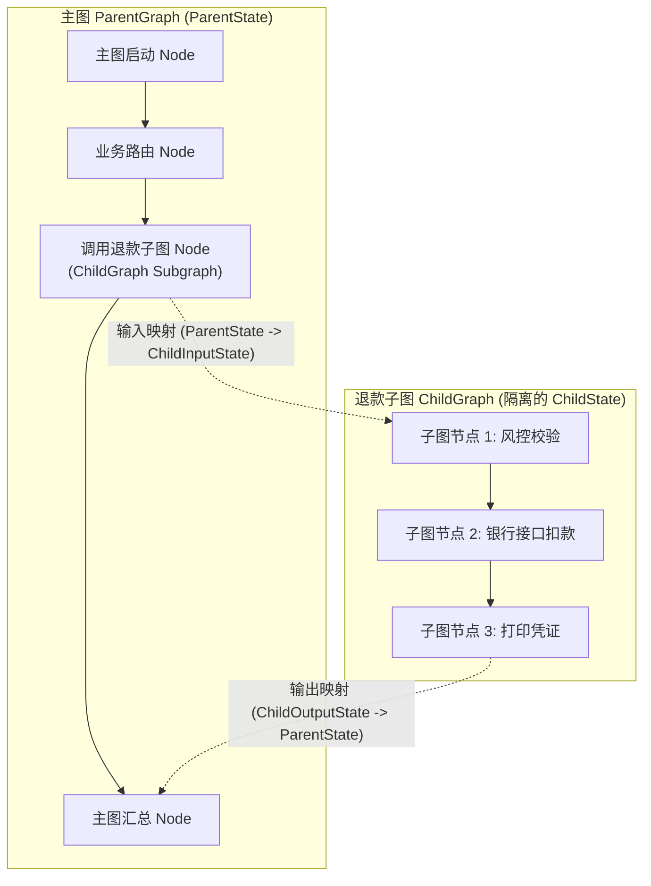

# Day 74：子图（Subgraph）状态隔离与并发子流程设计

## 1. 业务背景与工程痛点

在企业级多 Agent 系统（如电商平台、金融风控系统、代码自动化重构引擎）中，整体业务流极其庞大。若将退款处理、用户身份核验、优惠券计算等所有子模块的节点和变量全都塞在一个全局 `StateGraph` 中：

```
[单图混杂瓶颈]
ParentState {
    messages: [...]              # 主图消息与子图高频消息混在一起，长文本爆满
    refund_step_1_temp_key: ...  # 各种子系统局部中间变量泛滥
    risk_score_temp_calc: ...
}
```

### 生产级痛点分析
1. **状态污染与 Token 爆炸**：子图内部可能需要进行 10 轮高频工具重试（如反复调用第三方查询接口），如果这些中间消息全部追加到主图的 `messages` 列表，会导致传给大模型的 Context 迅速超出窗口限制。
2. **模块耦合与高维护成本**：退款团队修改退款状态机的 Key 时，极其容易破坏主图其他团队依赖的同名字段。
3. **架构不可复用**：独立的退款流程无法作为通用积木被其他主工作流（如客服聊天、自动取消订单）复用。

---

## 2. 子图（Subgraph）架构设计与状态映射机制

LangGraph 的 **子图模式 (Subgraph)** 允许将一个独立编译的 `StateGraph`（即 `ChildGraph`）作为节点添加到另一个 `StateGraph`（`ParentGraph`）中。



---

## 3. 状态隔离与 Schema 映射的三种模式

### 模式 A：显示输入/输出模式映射 (Input / Output Schema Mapping)
子图显式声明其专用的输入/输出 Schema，主图在嵌套该子图时，自动执行过滤与映射。

```python
# 1. 定义子图专用的简化状态
class ChildInputState(TypedDict):
    order_id: str
    refund_amount: float

class ChildOutputState(TypedDict):
    refund_status: str
    transaction_id: str

# 2. 定义子图完整状态 (继承 Input 和 Output)
class ChildState(ChildInputState, ChildOutputState):
    internal_retry_count: int  # 局部中间变量，绝不抛给主图

# 3. 编译子图并声明 input/output 镜像
child_app = child_builder.compile()

# 4. 主图注册子图为 Node
parent_builder.add_node("refund_subgraph", child_app)
```

* **物理效果**：主图运行到 `refund_subgraph` 时，仅提取与 `ChildInputState` 匹配的字段传入子图；子图运行完毕后，仅将 `ChildOutputState` 中的字段写回主图 `ParentState`。子图内部的 `internal_retry_count` 与高频消息被物理隔离！

---

## 4. `checkpoint_ns` 命名空间与持久化隔离

在底座 Checkpointer 中，LangGraph 使用 `checkpoint_ns`（命名空间）对主图与子图的持久化记录进行层次分隔：

```text
主图 Checkpoint: thread_id="t101", checkpoint_ns=""
子图 Checkpoint: thread_id="t101", checkpoint_ns="refund_subgraph:child_graph_inner"
```

这种设计使得子图在持久化层级不仅享有独立的快照树，还能在全图恢复时保持逻辑上的统一性。

---

## 5. 子图机制的三大底层实现原则

### 5.1 同名 Key 契约自动映射 (Key-Name Driven Scoping)
在隐式 Schema 继承模式下，子图与主图的数据交换建立在**同名 Key** 的物理契约上：
* **输入传递**：主图推进至子图节点时，框架过滤出 `ChildInputState` 与 `ParentState` 中**同名**的 Key 并赋值。
* **输出合入**：子图执行完毕后，框架仅过滤 `ChildOutputState` 中与 `ParentState` **同名**的 Key 进行归约写回。
* **工程最佳实践**：若主图字段叫 `main_order_id` 而子图叫 `sub_order_id`，同名映射将失效。全公司各团队应制定统一的接口 Key 命名规范。

### 5.2 Checkpointer 自动透传与命名空间分隔
* **自动继承下发**：仅需在编译主图时配置 `parent_builder.compile(checkpointer=Saver)`，子图编译时**无须手动传入 `checkpointer`**。
* **物理隔离存盘**：主图带 Checkpointer 运行到子图节点时，Parent Graph 会自动将其持久化引擎**透传给 Child Graph**，并在底座数据库中自动增加嵌套的 `checkpoint_ns` 命名空间（如 `checkpoint_ns="refund_subgraph"`），使得主子图共享同一物理数据库，但键空间完全隔离。

### 5.3 嵌套事件流透传与打字机解包 (Subgraphs Event Streaming)
当子图内部包含打字机 Token 输出或耗时节点时，外部可通过 `parent_app.stream(..., subgraphs=True)` 实时捕获子图内部的每一个 Event：

```python
# 实时捕获主图与嵌套子图的流式事件
for namespace, chunk in parent_app.stream(inputs, config, subgraphs=True):
    if namespace == ():
        print(f"[主图 Event] {chunk}")
    elif namespace == ("refund_subgraph",):
        # 带有 namespace 标记，可直接用于前端 UI 画布高亮与弹窗打字机
        print(f"  └─► [退款子图 Event] {chunk}")
```

---

## 6. 核心指标与控制性能

| 评估维度 | 全局单图模式 (Monolithic Graph) | 子图隔离模式 (Subgraph Architecture) |
| :--- | :--- | :--- |
| **主图 Context 污染** | **严重** (子图高频消息直接污染 `messages`) | **0 污染** (局部高频消息隔离在 ChildState) |
| **模块解耦与复用性** | 差 (全局变量交织，无法独立测试) | **极强** (子图可独立单元测试与跨图复用) |
| **状态快照开销** | 单快照体积庞大，包含所有子模块噪声 | 层次化隔离，快照轻量精简 |
| **团队协作效率** | 极低 (各业务线修改同一 Graph) | **极高** (各团队独立维护并交付 Subgraph) |

