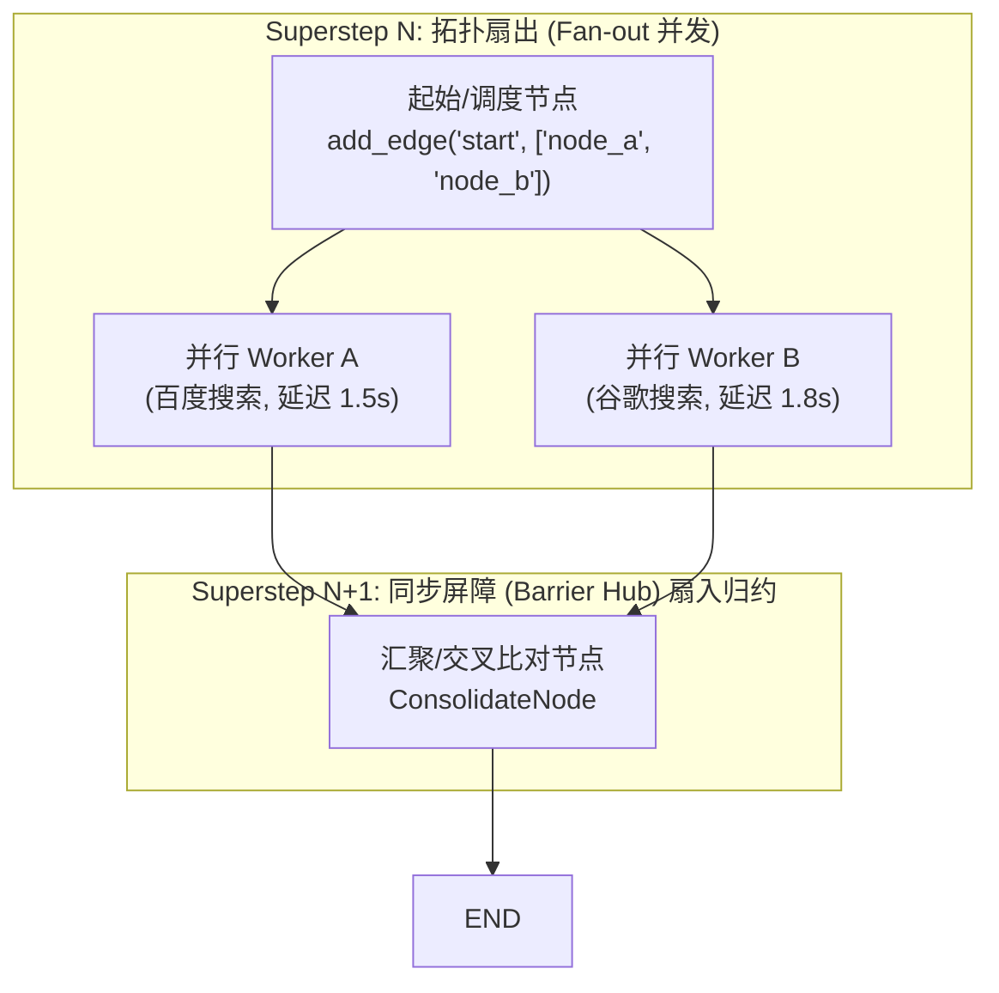

# Day 75：多线程并行节点（Parallel Nodes）的并发执行与分支汇聚

## 1. 业务背景与工程痛点

在企业级 Agent 执行多源信息交叉比对（例如同时检索百度、谷歌、学术数据库）或多维度并行安全审计（例如同时进行 AST 语法检查、SQL 注入扫描、内存泄漏检测）时，如果采用传统的串行（Sequential）节点编排模式：

```
[串行模式总耗时高] 
Start -> 检索源 A (耗时 2s) -> 检索源 B (耗时 2s) -> 检索源 C (耗时 2s) -> 汇总归约 
====> 总耗时: 6.0 秒
```

### 生产级痛点分析
1. **网络延迟死锁与吞吐瓶颈**：多路独立 API 如果串行调用，总响应时间（End-to-End Latency）将等于所有节点耗时**累加**，导致系统响应极其卡顿。
2. **状态竞态写入冲突 (Race Condition)**：当开启多线程并发调用时，若没有严格的状态归约函数（Reducer），多个并发节点同时修改同一个字段（如 `results`）会导致数据被互相覆盖丢弃。
3. **节点同步同步屏障缺失**：外部汇聚节点必须精准等待**所有并发分支全都执行完毕**后才能被触发，否则会拿缺失的数据提早生成总结。

---

## 2. 拓扑扇出与扇入 (Fan-out / Fan-in) 架构

LangGraph 依靠底座 Pregel 引擎的**超级步（Superstep）**机制，天然支持非阻塞的并发分支（Fan-out）与多路汇聚屏障（Fan-in）：



### 2.1 拓扑语法规范
在图构建器中，为同一个起始节点添加多条发往不同终点节点的 `add_edge`：

```python
# 拓扑扇出 (Fan-out)：同一个起点添加两条 Edge，引擎自动识别为并发分支
builder.add_edge("start_dispatcher", "worker_a")
builder.add_edge("start_dispatcher", "worker_b")

# 拓扑扇入 (Fan-in)：两个 Worker 均连接至同一个汇聚节点
builder.add_edge("worker_a", "consolidate_node")
builder.add_edge("worker_b", "consolidate_node")
```

> [!CAUTION]
> **坑点：错把 `add_edge` 的终点传为列表 `["node_a", "node_b"]`**
> 在 LangGraph 中，`add_edge("start", ["node_a", "node_b"])` 会抛出 `TypeError: unhashable type: 'list'`。正确做法是分别调用两次 `add_edge`，底座 Pregel 引擎会自动将其解析为当前 Superstep 的并发分发列表。

---

## 3. 并发安全 Reducer 归约机制

当并发 Worker A 与 Worker B 在同一个 Superstep 内并行执行完毕后，它们分别返回各自更新的字典。LangGraph 会根据状态定义中的 `Annotated[T, reducer_fn]` **自动执行并发无损合并**。

```python
from typing_extensions import Annotated
import operator

class MultiSearchState(TypedDict):
    query: str
    # 关键：使用 operator.add 归约器，并发返回的 list 会自动拼接，防范覆盖
    search_results: Annotated[List[Dict[str, Any]], operator.add]
    consolidated_answer: str
```

### 归约物理流转
1. **Worker A 返回**：`{"search_results": [{"source": "Baidu", "data": "..."}]}`
2. **Worker B 返回**：`{"search_results": [{"source": "Google", "data": "..."}]}`
3. **Pregel 引擎在 Superstep 切换时**：自动调用 `operator.add(state["search_results"], A_results + B_results)`，将其合并为长度为 2 的列表传入 `ConsolidateNode`。

---

## 4. Pregel 超步（Superstep）与同步屏障 (Barrier)

LangGraph 内部的执行调度严格遵守 **BSP (Bulk Synchronous Parallel) 超级步模型**：

1. **同步屏障 (Synchronization Barrier)**：在 `Superstep N` 中，所有被触发的并发 Node（`Worker A` 与 `Worker B`）会在各自的独立协程/线程中非阻塞推进。
2. **全员到位解冻**：必须等待 `Superstep N` 中的**每一个并发 Worker 都返回 Update 结构**后，Pregel 引擎才宣布该 Superstep 结束。
3. **推进到 Superstep N+1**：引擎在合并所有 Update 后，将合并后的 State 整体喂给下游的 `ConsolidateNode`。

---

## 5. 核心指标与控制性能

| 评估维度 | 串行执行模式 (Sequential) | Parallel Nodes 并发模式 (Fan-out/in) |
| :--- | :--- | :--- |
| **总端到端延迟** | $\sum T_i$ (所有节点耗时**累加**) | $\max(T_i)$ (接近**最大单节点耗时**) |
| **状态数据安全** | 简单覆盖写入 (无竞态) | 依赖 `Annotated` Reducer 保障并发无损 |
| **CPU / I/O 利用率** | 单核轮询，利用率极低 | 异步协程高吞吐并发利用 |
| **屏障等待机制** | 顺序依赖 | 引擎控制 `Superstep Barrier` 统一解冻 |
