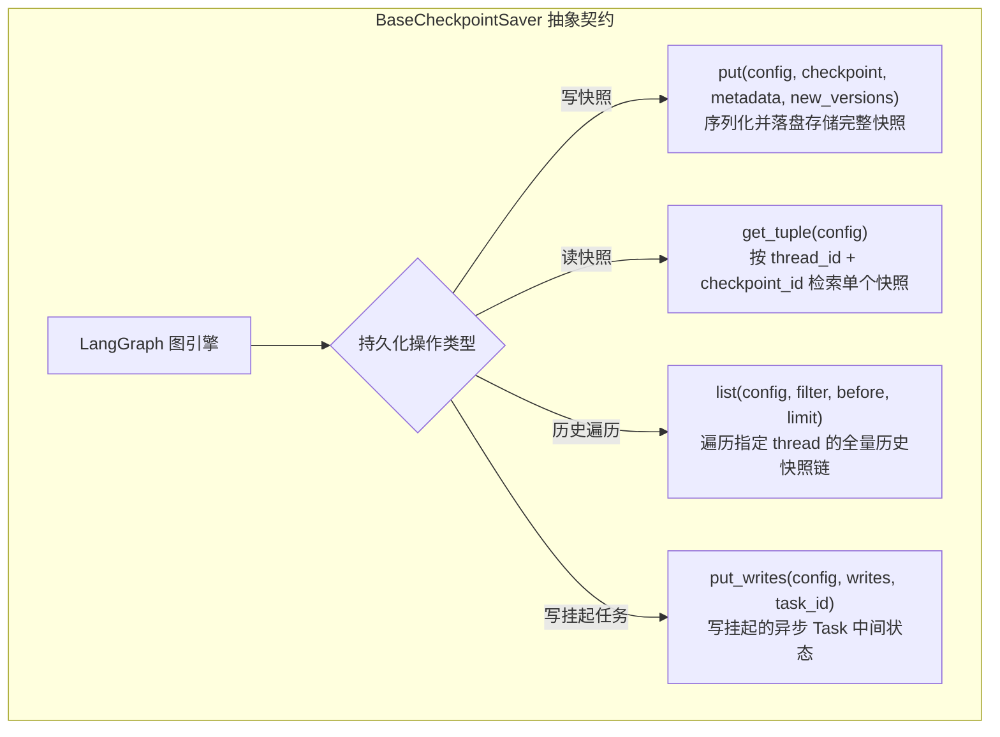

# Day 76：持久化存储接口与自定义 Redis/Postgres Checkpointer 扩展

## 1. 业务背景与工程痛点

在单机测试阶段，LangGraph 默认推荐使用 `MemorySaver` 进行持久化存储。然而，在真正的企业级生产环境（如云原生 Kubernetes 集群部署的多租户 Agent 服务）中，使用 `MemorySaver` 会引发致命的生产事故：

```
[MemorySaver 生产盲区]
Pod A (内存保存 Checkpoint) -> Pod 崩溃 / 自动扩缩容重启 -> 物理内存清空 -> 用户状态彻底丢失 (不可恢复)
```

### 生产级痛点分析
1. **状态随进程销毁而归零**：内存存储无法跨越微服务的重启、发布或崩溃重启生命周期。
2. **无法支持无状态水平扩展 (Horizontal Scaling)**：用户请求由负载均衡器分发到 Pod B 时，Pod B 无法读取 Pod A 内存中的 `thread_id` 快照。
3. **缺少强类型序列化隔离**：必须将复杂的数据类型（如 `BaseMessage`、自定义对象）转换为可跨网络传输与分布式存储的二进制字节流或 JSON Payload。

---

## 2. BaseCheckpointSaver 抽象契约核心 API 解构

LangGraph 所有的持久化扩展插件（如官方的 `langgraph-checkpoint-postgres` 或 `langgraph-checkpoint-redis`）均继承自 `BaseCheckpointSaver` 抽象基类。



### 2.1 4 大核心抽象方法规范

```python
from langgraph.checkpoint.base import BaseCheckpointSaver, Checkpoint, CheckpointMetadata, CheckpointTuple
from typing import Optional, Iterator, AsyncIterator

class CustomBaseCheckpointer(BaseCheckpointSaver):

    def get_tuple(self, config: RunnableConfig) -> Optional[CheckpointTuple]:
        """按 thread_id 与 checkpoint_id 检索单条快照。"""
        # 返回 CheckpointTuple(config, checkpoint, metadata, parent_config, pending_writes)
        pass

    def list(
        self,
        config: Optional[RunnableConfig],
        *,
        filter: Optional[dict[str, Any]] = None,
        before: Optional[RunnableConfig] = None,
        limit: Optional[int] = None,
    ) -> Iterator[CheckpointTuple]:
        """按倒序时间链遍历指定线程的历史快照。"""
        pass

    def put(
        self,
        config: RunnableConfig,
        checkpoint: Checkpoint,
        metadata: CheckpointMetadata,
        new_versions: ChannelVersions,
    ) -> RunnableConfig:
        """落盘保存新的 Checkpoint 快照。"""
        pass

    def put_writes(
        self,
        config: RunnableConfig,
        writes: Sequence[Tuple[str, Any]],
        task_id: str,
    ) -> None:
        """保存挂起任务的中间写操作。"""
        pass
```

## 3. 真实物理数据库 (SQLite / PostgreSQL) 存储表 Schema 设计

为了在生产环境中支持物理落盘与高可用并发，底座持久化数据库需要构建 2 张核心数据表：

### 3.1 物理数据库 DDL 表结构

```sql
-- 1. Checkpoint 主快照表
CREATE TABLE IF NOT EXISTS checkpoints (
    thread_id TEXT NOT NULL,
    checkpoint_ns TEXT NOT NULL DEFAULT '',
    checkpoint_id TEXT NOT NULL,
    parent_checkpoint_id TEXT,
    type TEXT,                           -- 序列化类型标识 (例如 "json" / "pickle")
    checkpoint BLOB NOT NULL,            -- self.serde 序列化后的快照字节流
    metadata BLOB NOT NULL,              -- 序列化后的元数据字节流
    created_at TIMESTAMP DEFAULT CURRENT_TIMESTAMP,
    PRIMARY KEY (thread_id, checkpoint_ns, checkpoint_id)
);

-- 2. Pending Writes 挂起任务表
CREATE TABLE IF NOT EXISTS writes (
    thread_id TEXT NOT NULL,
    checkpoint_ns TEXT NOT NULL DEFAULT '',
    checkpoint_id TEXT NOT NULL,
    task_id TEXT NOT NULL,
    idx INTEGER NOT NULL,
    channel TEXT NOT NULL,
    type TEXT,
    value BLOB NOT NULL,                 -- 序列化后的写操作字节流
    PRIMARY KEY (thread_id, checkpoint_ns, checkpoint_id, task_id, idx)
);
```

---

## 4. 强类型序列化 (SerializerProtocol) 物理读写过程

使用 LangGraph 的 `self.serde` 将动态的 Python 对象转为物理 BLOB 存盘：

```python
# 写入磁盘：SQL INSERT INTO checkpoints (checkpoint) VALUES (?)
serde_cp = self.serde.dumps_typed(checkpoint)
conn.execute("INSERT OR REPLACE INTO checkpoints ...", (serde_cp[0], serde_cp[1]))

# 从磁盘读取：SQL SELECT checkpoint FROM checkpoints WHERE ...
row = cursor.fetchone()
# 从数据库原始 BLOB 字段还原包含 AIMessage 的真实 Python 对象
checkpoint_obj = self.serde.loads_typed((row["type"], row["checkpoint"]))
```

---

## 5. 核心指标与控制性能

| 评估维度 | 原生 MemorySaver | 生产级 Redis Checkpointer | 生产级 PostgreSQL Checkpointer |
| :--- | :--- | :--- | :--- |
| **存储介质** | 纯 Python 内存 Dict | 物理 Redis 内存 / Hash 键 | 物理 PostgreSQL BYTEA 字段 |
| **进程重启持久化** | ❌ 崩溃数据全丢失 | **✅ Redis AOF/RDB 永久保留** | **✅ 关系型数据库落盘保留** |
| **水平扩展能力** | ❌ 仅支持单机 | **✅ 支持 K8s 高并发 Pod 集群** | **✅ 支持高可用数据库集群** |
| **检索性能** | 内存寻址 (极快) | Sub-millisecond 亚毫秒级 | 毫秒级 SQL `SELECT` |


