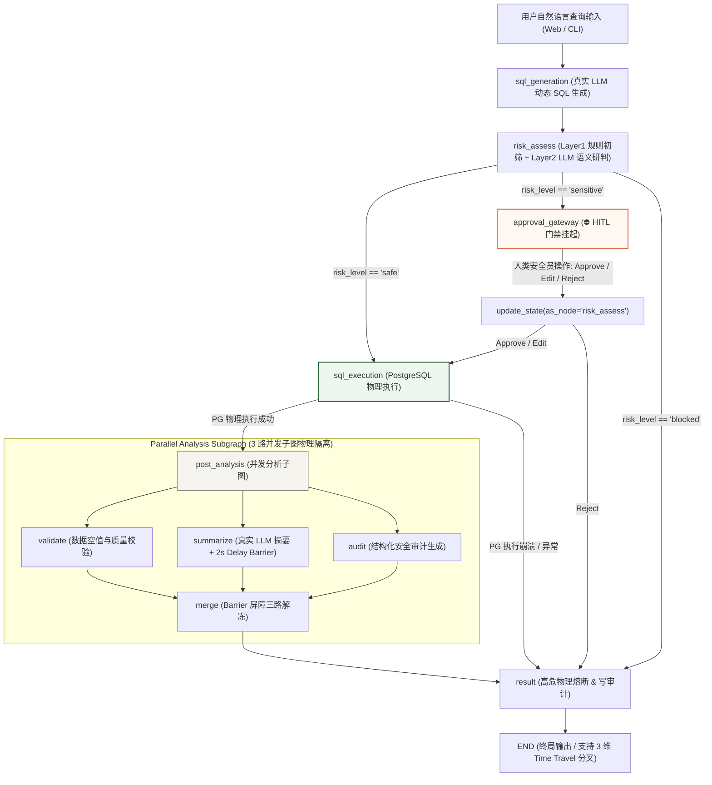

# 📅 Day 77 综合实战：带人工介入审批与时间旅行故障恢复的企业级 SQL Agent 系统

> 本项目为 Week 11 的综合收官实战作品。针对生产环境下高风险 SQL 执行黑盒不可控与异常调试困难的痛点，构建了具备 **HITL 人工审批网关**、**双重风控熔炼引擎**、**SSE 物理流式推送**、**3 维时间旅行 (Time Travel) 故障重发**、**子图状态物理隔离**、**2s Delay Barrier 同步屏障** 以及 **生产级 Redis 持久化 Checkpointer** 七大核心能力的企业级 Agent 系统。

---

## 一、项目背景与核心业务场景

在真实工业级金融、电商与企业 ERP 系统中，将自然语言直接转化为 SQL 并由大模型盲盒全自动执行存在巨大的生产事故隐患：
* **全表覆盖与高危物理毁损**：LLM 偶尔会产生幻觉，生成缺少 `WHERE` 条件的 `UPDATE` 或 `DELETE` 语句，甚至生成 `DROP TABLE`、`TRUNCATE` 等高危摧毁性指令。
* **越权与敏感数据修改**：写操作与改写指令未经安全员审批即提交给物理数据库。
* **物理故障与重试成本高昂**：数据库高并发连接池超时或网络异常时，传统盲目重新调用 LLM 理解不仅浪费 Token，还引入了新的不确定性。

**本项目解决方案**：
1. **双重风控研判 + 静态网关 (`approval_gateway`)**：只读 Safe 查询自动放行，敏感 Sensitive 改写操作在 `approval_gateway` 强行挂起存盘，等待人类安全员 Approve / Edit & Run / Reject 响应。
2. **真实 SSE 物理流式推送 (Server-Sent Events)**：基于 `sql_graph.astream(stream_mode="updates", subgraphs=True)` 实时推送 5 步状态图增量 Log 与子图 Worker 状态。
3. **3 维 Time Travel 时间旅行与故障重发**：通过 Redis Checkpointer 提取 DAG 历史快照，提供 **零修改物理重发 (replay)**、**修补 SQL 重发 (edit_sql)**、**变更需求重新推演 (edit_query)** 3 维重发机制，带智能 `as_node` 锚定与空安全校验。

---

## 二、系统拓扑流程图 (Mermaid & ASCII)

### 格式一：Mermaid 交互式流程图 (Recommended)

> 遵循 `AGENTS.md` 规范：所有包含特殊符号（如括号、单双引号、冒号等）的节点文本均使用双引号 `""` 进行包裹，确保在各大 Markdown 渲染引擎下 100% 兼容。



---

### 格式二：ASCII 极简字符流程图

适用于纯文本终端或非 Markdown 渲染环境查阅：

```text
                           自然语言查询输入 (Web / CLI)
                                      │
                                      ▼
                        [sql_generation_node] (真实 LLM)
                                      │
                                      ▼
                       [risk_assessment_node] (双重风控)
                                      │
              ┌───────────────────────┼───────────────────────┐
              │ safe                  │ sensitive             │ blocked
              ▼                       ▼                       ▼
       [sql_execution]        ⛔ approval_gateway ⛔        [result_node]
              │                       │ (HITL 挂起断点)         │
              │                       │                       │
              │         Web/CLI 审批: Approve/Edit/Reject     │
              │                       │                       │
              │                 update_state()                │
              │                       │                       │
              ▼                       ▼                       │
       [sql_execution] ◄──────────────┘                       │
              │                                               │
              ├── 成功 ────► [post_analysis_subgraph] ────────┤
              │                 │        │        │           │
              │              validate summarize audit         │
              │              (纯校验) (2s延时) (结构化)       │
              │                 │        │        │           │
              │                 └────► merge ◄────┘           │
              │                          │                    │
              └── 异常 ──────────────────┼────────────────────┘
                                         ▼
                                    [result_node]
                                         │
                                         ▼
                                    [END] (支持 3 维 Time Travel 重载)
```

---

## 三、核心技术机制与设计模式

### 1. 双重风控熔炼引擎 (Dual-Layer Risk Engine)
- **Layer 1 规则引擎初筛**：正则匹配 `UPDATE` / `DELETE` / `DROP` / `TRUNCATE` / `ALTER` 关键字。对 `DROP`/`TRUNCATE` 等无条件高危 DDL 直接判定为 `"blocked"`。
- **Layer 2 真实 LLM 语义研判**：调用真实 LLM 分析 SQL 语义（如判断 `UPDATE`/`DELETE` 是否丢失 `WHERE` 条件、是否存在 SQL 注入）。
- **风险熔炼机制**：取两层判定中最严级别的结果（`blocked > sensitive > safe`），绝对零漏网之鱼。

### 2. HITL 审批门禁解耦 (`approval_gateway`)
- 静态配置 `interrupt_before=["approval_gateway"]`。
- `safe` 查询路由直通 `sql_execution`（0 打扰自动化物理放行）；`sensitive` 查询走向 `approval_gateway` 原位存盘挂起。
- 支持人类安全员在 Web/CLI 控制台输入放行：
  - `Approve`: 直接物理执行；
  - `Edit & Run`: 原位更新修补后的 SQL 物理执行；
  - `Reject`: 拒绝执行并跳转 `result` 记录审计。

### 3. 3 维时间旅行 (Time Travel) 与故障重发控制台
通过 Redis Checkpointer 调取历史链，提供 3 维 Time Travel 分叉控制：
- **🔄 原地故障重发 (Zero-Code Replay)**：不修改状态，擦除异常日志后从选定点原封不动物理重跑（适用于数据库断连/网络恢复场景）。
- **✏️ 修补物理 SQL 语句 (Patch SQL)**：注入自定义 SQL，锚定 `risk_assess` 节点跳过上游 LLM 生成直奔 PG 执行。
- **💬 变更自然语言需求 (Re-run Query)**：注入新 Question，锚定从 `sql_generation` 重新发起全套 LLM 生成与双轨风控。

### 4. 真实 SSE (Server-Sent Events) 物理流式通道
- 后端提供 `/api/stream_query`、`/api/stream_approve` 与 `/api/stream_fork` 接口。
- 使用 `sql_graph.astream(..., stream_mode="updates", subgraphs=True)`，将主图及子图 Worker 的状态增量逐帧实时推送给前端。

### 5. 子图 Schema 隔离与 2s Delay Barrier 同步屏障
- 主图使用 `SQLAgentState`，子图使用 `AnalysisSubState`（隔离内部私有日志 `internal_trace`）。
- 子图 Worker `summarize_node` 注入 2.0s 延时并调用真实 LLM，Pregel 引擎在超步中冻结等待三路 Worker 全部完成（Barrier 屏障解冻）后触发 `merge` 节点。

### 6. 生产级 ProductionRedisCheckpointer (Hash + ZSet)
- 继承 `BaseCheckpointSaver`，实现 `put` / `get_tuple` / `list` / `put_writes` 及对应的 4 个异步 `a*` 代理。
- 使用 Redis **Hash** 存储快照字节流，使用 Redis **Sorted Set (ZSet)** 按 timestamp 建立倒序索引，避免传统 `KEYS *` 扫描引发的 Redis 阻塞。

---

## 四、PostgreSQL 物理沙箱数据库

项目在本地 PostgreSQL 中初始化两张典型表及 20 条种子数据：

```sql
-- 用户表
CREATE TABLE users (
    id SERIAL PRIMARY KEY,
    name VARCHAR(100) NOT NULL,
    email VARCHAR(150) UNIQUE NOT NULL,
    status VARCHAR(20) NOT NULL DEFAULT 'active',
    last_login TIMESTAMP DEFAULT CURRENT_TIMESTAMP
);

-- 订单表
CREATE TABLE orders (
    id SERIAL PRIMARY KEY,
    user_id INT REFERENCES users(id) ON DELETE CASCADE,
    product VARCHAR(200) NOT NULL,
    amount NUMERIC(10, 2) NOT NULL,
    status VARCHAR(20) NOT NULL DEFAULT 'completed',
    created_at TIMESTAMP DEFAULT CURRENT_TIMESTAMP
);
```

---

## 五、物理项目目录结构说明

```
weekly/w11_langgraph_advanced/day77/
├── README.md                          # 本架构与使用说明文档
├── start.sh                           # 物理环境校验与 Web Dashboard 启动脚本 (chmod +x)
├── dashboard.html                     # Warm Intellectual Minimalism 极简风格 Web 看板 (带 3 维 Modal 弹窗)
├── server.py                          # FastAPI 后端 API 服务入口 (支持 3 路 SSE 流式通道)
│
├── state/
│   ├── main_state.py                  # SQLAgentState 主图状态契约 (含 error_log 追加 Reducer)
│   └── analysis_state.py             # AnalysisSubState 子图隔离状态契约 (带 internal_trace 追加 Reducer)
│
├── nodes/
│   ├── sql_generation_node.py         # 真实 LLM 动态 SQL 生成 (带 <think> 思考链剥离 & error_log 重置)
│   ├── risk_assessment_node.py        # 规则初筛 + 真实 LLM 语义研判 (带空安全防御 & approval_status 重置)
│   ├── sql_execution_node.py          # PostgreSQL 物理执行与可控故障注入 (带空 SQL 拦截防护)
│   └── result_node.py                 # 结果格式化与 blocked / rejected 专属收尾
│
├── subgraph/
│   ├── analysis_graph.py              # 并行分析子图编排与 2s Barrier 屏障
│   ├── validate_node.py               # 数据质量与空值校验
│   ├── summarize_node.py              # 真实 LLM 摘要生成 (含 2s 延时 Barrier)
│   └── audit_node.py                  # 结构化安全审计生成
│
├── graph/
│   ├── build_graph.py                 # 主图编排与 approval_gateway 门禁挂载
│   └── routing.py                     # 条件边路由跳转 (解耦历史 error_log 残留)
│
├── checkpoint/
│   ├── redis_checkpointer.py          # 从零实现的 ProductionRedisCheckpointer (Hash + ZSet + 异步代理)
│   └── redis_schema.md                # Redis Schema 存储规范
│
├── database/
│   ├── init_db.py                     # PostgreSQL 数据库连接与初始化
│   └── schema.sql                     # PG 表结构定义与 20 条种子数据
│
├── cli/
│   └── main.py                        # 纯终端 REPL 交互入口
│
└── tests/
    ├── test_interrupt_approval.py     # 单元测试：HITL 门禁挂起放行/拒绝/编辑
    ├── test_as_node_routing.py        # 单元测试：as_node 语义路由影响对比
    ├── test_time_travel.py            # 单元测试：历史链读取与 3 维 Time Travel 分叉
    ├── test_subgraph_parallel.py      # 单元测试：子图并行与 Barrier 屏障
    └── test_redis_persistence.py      # 单元测试：Redis 跨进程恢复
```

---

## 六、快速物理启动与验证指南

### 1. 物理拉起 Web 调试看板 (Recommended)

运行物理启动脚本 `start.sh`：

```bash
./weekly/w11_langgraph_advanced/day77/start.sh
```

打开浏览器访问 **`http://127.0.0.1:8000`** 体验 Web 调试看板。

### 2. 纯终端 REPL 交互

在命令行中直接运行：

```bash
python3 weekly/w11_langgraph_advanced/day77/cli/main.py
```

### 3. 运行自动化单元测试集 (9/9 PASSED)

全量验证所有架构验收标准与边界断言：

```bash
pytest weekly/w11_langgraph_advanced/day77/tests/ -v
```
