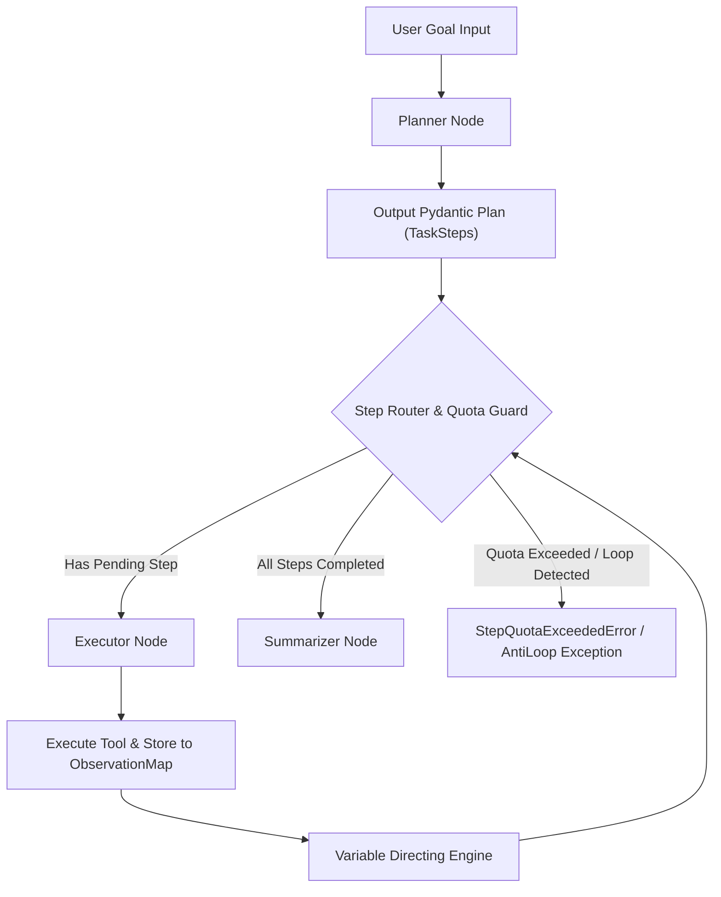

# Day 78：Plan-and-Execute 强类型解耦与上下文变量映射架构

## 一、业务背景与工程痛点

在构建工业级复杂 Agent 系统（如**多源多步骤代码安全审计与漏洞分析引擎**）时，传统的 ReAct 模式（`Thought -> Action -> Observation` 循环交织）会暴露严重的软件工程缺陷：

```
[ReAct 经典缺陷]
Input ➔ Step 1(Obs) ➔ Step 2(Obs) ➔ ... ➔ Step 10(Obs)
        └────────────────────────────────────────┘
          Context 全量累积，发生注意力漂移 (Goal Drift) 与 Context 爆表
```

1. **目标漂移 (Goal Drift)**：ReAct 采用“走一步看一步”的探针式逻辑，一旦某一步工具返回了干扰性强或冗长的 Observation，LLM 的注意力极易偏离原始目标，导致后半程下发无关的工具调用。
2. **Context 爆炸与 Token 暴涨**：在第 10 步决策时，LLM 必须完整计算前 9 步所有原始 Observation 的注意力矩阵，极易迅速触及模型上下文窗口上限并产生巨大的 Token 成本。
3. **缺少死循环保护**：当模型陷入“尝试工具 A 失败 ➔ 重试工具 A”的盲目循环时，ReAct 缺乏物理层的计划指纹去重与步数熔断控制。

---

## 二、Plan-and-Execute 范式架构原理

Plan-and-Execute 范式通过将系统划分为 **Planner（宏观规划）**、**Executor（微观执行）** 和 **Summarizer（全局归约）** 三个物理解耦的微引擎，根治了上述痛点：



### 1. 强类型 Plan 拓扑 (Pydantic Schema)
不再使用脆弱的纯文本或字符串列表，必须通过 Pydantic 强制约束每一个子任务步阶：
- `step_id`: 步骤唯一整型标识
- `title`: 步骤摘要说明
- `tool_name`: 指定调用的工具名称
- `input_args`: 包含占位符的参数字典（如 `{"target_file": "{step_1_output}"}`）
- `status`: 状态枚举（`PENDING`, `COMPLETED`, `FAILED`）

### 2. 上下文变量依赖映射 (Variable Directing Engine)
前置步骤的输出结果存入历史 Observation 字典（以 `step_id` 为 Key）。在 Executor 触发当前 Step 前，变量映射引擎自动使用正则表达式扫描 `input_args` 中的 `{step_X_output}` 占位符，完成运行时动态替换。

### 3. 防死循环与步数预算熔断 (Step Quota & Anti-Loop Guard)
- **步数预算 limit**：设置硬性 `max_steps` 上限，一旦轮询执行次数超标，强制中断图拓扑并抛出结构化异常。
- **指纹哈希去重**：对 Planner 生成的 `tool_name` + `input_args` 进行 SHA256 哈希计算。若连续出现相同的任务指纹，立即拦截死循环。

---

## 三、生产级核心控制流伪代码

```python
# 1. 结构化 State 契约
class PlanExecuteState(TypedDict):
    input_goal: str
    plan: list[TaskStep]
    completed_steps: dict[int, str]  # step_id -> result_text
    current_step_index: int
    execution_counter: int  # 熔断计数器

# 2. 路由控制逻辑 (Router Node)
def route_next_step(state: PlanExecuteState) -> str:
    if state["execution_counter"] >= MAX_STEP_BUDGET:
        return "QUOTA_EXCEEDED"
    
    pending_steps = [s for s in state["plan"] if s.status == "PENDING"]
    if not pending_steps:
        return "TO_SUMMARIZER"
    return "TO_EXECUTOR"
```

---

## 四、核心防错设计与异常响应

| 异常类型 | 触发条件 | 防御性拦截机制 |
| :--- | :--- | :--- |
| `PlanParseError` | Planner 输出非法 JSON 或未满足 Pydantic 字段规范 | 自动触发一次带 Syntax Schema 提醒的重试纠偏 |
| `VariableMappingKeyError` | 当前 Step 引用的 `{step_X_output}` 在历史字典中不存在 | 拦截执行并抛出清晰诊断 Payload，路由回 Planner 重建依赖 |
| `StepQuotaExceededError` | 循环执行总轮次超过 `max_steps` 预算 | 触发紧急熔断，保留现有 `completed_steps` 并强制生成降级报告 |
| `PlanLoopDetectedError` | 连续 N 次下发具有相同 SHA256 指纹的任务 | 抛出死循环震荡警报，终止图拓扑 |
