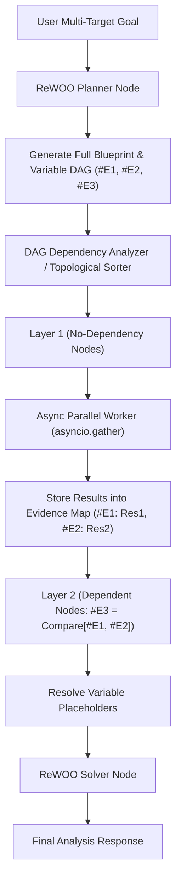

# Day 79：ReWOO (Reasoning Without Observation) 规划与执行解耦架构

## 一、业务背景与工程痛点

在处理**数据密集型、多源多维度数据提取与分析任务**（如：同时并发抽取并对比 Apple、Microsoft、Google 3 家科技巨头的最新 Q1 财报数据）时，串行控制流（ReAct 或传统 Plan-and-Execute）会遇到严重的工程瓶颈：

```
[传统串行 ReAct / Plan-and-Execute]
LLM 思考 ➔ 工具 1 (AAPL, 2.5s) ➔ LLM 思考 ➔ 工具 2 (MSFT, 2.5s) ➔ LLM 思考 ➔ 工具 3 (GOOG, 2.5s) ➔ LLM 总结
└───────────────────────────────────────────────────────────────────────────────────────┘
 总耗时 ≈ 3 次 LLM 推理 (3s) + 3 次工具串行 (7.5s) = 10.5s | LLM 调用频次: 4 次
```

1. **端到端延时爆炸 (High Latency)**：如果 3 个查询任务彼此没有任何数据依赖，串行依次调用工具将产生巨大的网络等待延迟（Latency 随工具数量线性暴增）。
2. **Token 消耗与成本极高**：在传统 ReAct 中，每触发一次工具调用都需要重新跑一次大模型注意力计算，导致大量重复的 Prompt Token 浪费。
3. **单点故障中断**：若 Step 1 工具耗时过长或出现短时震荡，后续完全独立的 Step 2、Step 3 只能被动阻塞等待。

---

## 二、ReWOO 范式架构原理

ReWOO (Reasoning Without Observation) 架构通过将 **Reasoning (推理规划)** 与 **Observation (工具观察)** 物理解耦，彻底打破了顺序等待机制：



### 1. 变量占位符拓扑 (Variable DAG Blueprint)
Planner 节点在任务启动时**一次性生成全部蓝图**，并为每个工具输出指定变量占位符（`#E1`, `#E2`, ...）：
- `Plan Step 1`: `#E1` = `fetch_financials[ticker="AAPL", period="2025Q1"]`
- `Plan Step 2`: `#E2` = `fetch_financials[ticker="MSFT", period="2025Q1"]`
- `Plan Step 3`: `#E3` = `compare_metrics[data1=#E1, data2=#E2]` *(依赖 #E1, #E2)*

### 2. 按拓扑分层非阻塞并发 (Topological Layer Parallel Worker)
分析器根据 `dependencies` 字段将 Plan 划分为物理层级：
- **Layer 1（零依赖独立层）**：并发拉起 Task 1 (`#E1`) 和 Task 2 (`#E2`)，使用 `asyncio.gather` 并行请求，耗时仅取决于响应最慢的单路 API（例如 2.5s）。
- **Layer 2（后置依赖层）**：当 Layer 1 的 `Evidence Map` 填充完毕后，自动替换 `#E3` 中的占位符，触发解算。

### 3. 两阶段 LLM 瓶颈消除 (2-Call LLM Protocol)
整个生命周期**仅产生 2 次 LLM 调用**：
- **Call 1 (Planner)**：生成初始无观察依赖的蓝图。
- **Call 2 (Solver)**：接收填充好的 `Evidence Map`，直接生成终极业务报告。

---

## 三、生产级核心控制流伪代码

```python
# 1. ReWOO Pydantic 契约
class ReWOOStep(BaseModel):
    step_id: int
    variable: str          # 变量占位符，如 "#E1"
    tool_name: str
    tool_args: dict
    dependencies: list[str] = [] # 依赖的占位符列表，如 ["#E1", "#E2"]

# 2. 非阻塞并发调度器逻辑 (Parallel Layer Runner)
async def execute_layer(steps: list[ReWOOStep], evidence_map: dict) -> dict:
    async def run_single(step: ReWOOStep):
        # A. 替换入参中的变量占位符
        resolved_args = resolve_placeholders(step.tool_args, evidence_map)
        # B. 异步触发物理工具调用
        result = await invoke_tool_async(step.tool_name, resolved_args)
        return step.variable, result

    # 并发拉起本层所有独立的工具请求
    results = await asyncio.gather(*[run_single(s) for s in steps])
    return dict(results)
```

---

## 四、核心防错设计与异常响应

| 异常类型 | 触发条件 | 防御性拦截机制 |
| :--- | :--- | :--- |
| `DAGCircularDependencyError` | Planner 生成了循环依赖（如 `#E1` 依赖 `#E2` 且 `#E2` 依赖 `#E1`） | 拓扑排序器在构建图阶段抛错拦截，路由回 Planner 重建拓扑 |
| `EvidenceUnresolvedError` | 前置独立 Task 在 Layer 1 返回了空值或 Timeout | Solver 节点识别缺省变量，降级触发 Mock 补充或优雅提示 |
| `PlaceholderMismatchError` | Solver 得到的字符串与占位符正则不匹配 | 变量替换引擎校验字符串边界，防止意外误替正常业务文本 |
