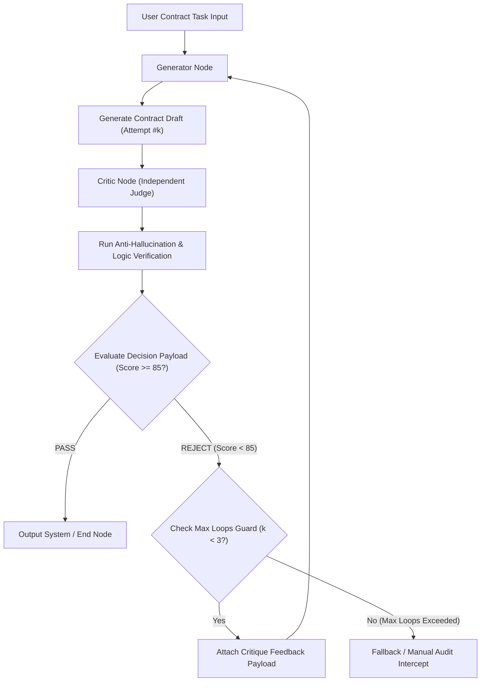
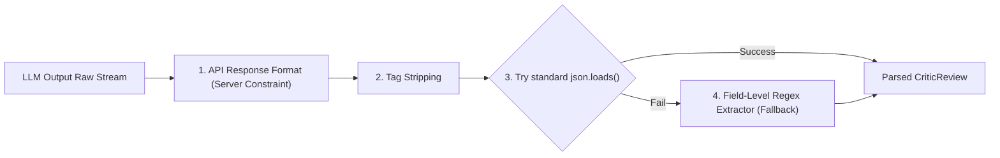

# Day 80：LLM-as-Critic 独立审查器与双模型博弈架构

## 一、业务背景与工程痛点

在自动化生成高严肃性业务文本（如：**跨境合规法律合同、智能合约、自动化代码重构报告**）时，依赖单一模型进行“自我检查”会触发严重的工程卡点：

```
[单一模型自我检查缺陷]
Prompt ➔ Generator LLM ➔ 生成草稿 ➔ 要求模型“自查” ➔ 模型：“无误，完美符合要求！”
                                                            └─ 自我包庇 & 认知盲区 (Confirmation Bias)
```

1. **认知盲区与自我包庇 (Confirmation Bias)**：LLM 很难在同一个上下文注意力域中发现自己上一轮推理中的逻辑盲点。在同一个 Prompt 域内，模型倾向于对自己的错误输出产生肯定偏见。
2. **缺乏结构化拒收标准**：缺乏独立的角色隔离与明确的评分门槛，导致只要文本格式大致对齐，系统就会误判放行，产生合规漏洞与业务风险。
3. **缺少博弈循环与收敛控制**：缺乏明确的 Generator-Critic 回退路由与最大博弈轮数熔断Guard（如最大重试 3 轮），系统易陷入盲目生成或无限拒绝的死循环。

---

## 二、LLM-as-Critic 范式架构原理

LLM-as-Critic 范式通过将系统划分为 **Generator Node（生成器）**、**Critic Node（法官审查器）** 和 **博弈路由控制边 (Game Loop Router)**，实现了严格的质量把关与收敛控制：



### 1. 物理隔离的 Critic 角色 (Independent Judge Prompt)
Critic 节点使用独立的 System Prompt，以极度苛刻的审查法官身份运行，专门寻找草稿中的：
- 模糊条款与责任缺失（如未定义违约金上限或终止条件）
- 逻辑悖论与语句残缺
- 隐蔽的格式漏洞与格式规范偏移

### 2. 结构化决策 Payload (Pydantic CriticReview)
Critic 节点的输出被强类型契约解析：
- `decision`: 枚举 `PASS` 或 `REJECT`
- `score`: 整数评分 (0 - 100)
- `risk_items`: 扫描出的隐患点列表
- `critique_feedback`: 针对性的改进指令

### 3. Generator 对抗重构与收敛控制 (Game Loop Guard)
- **精准反馈迭代**：当 decision 为 `REJECT` 时，路由边将 `critique_feedback` 注入 Generator 的输入，指导其进行针对性修补，而不是盲目全盘重写。
- **博弈熔断 Guard**：记录博弈轮次 `loop_counter`，若达到最大限制（如 3 轮）仍未达到 PASS 门槛，自动触发人工审核降级或拦截。

---

## 三、双重防御机制与工业级容错架构

在处理中长篇大模型输出与结构化解析时，仅靠 API 的强制约束是不够的，生产级 Agent 必须采用 **“服务端厂商约束 + 客户端字段级抽取兜底”** 的双重防御机制：



### 1. 标签分隔架构 (Tag-Separated Format)
对于生成数千字的法律合同正文，若将其打平压缩在 JSON 的单个字符串属性中，内部极易混入未转义双引号与物理换行导致 `JSONDecodeError`。生产级实践采用 `===TITLE===` 与 `===CONTENT===` 自定义标签分隔解析，实现 **100% 格式稳健性**。

### 2. 字段级正则强力提取器 (Field-Level Regex Extraction)
当大模型吐出的 JSON 因为个别属性的控制字符损坏时，代码**绝不整盘抛弃大模型输出的数据**，而是通过正则表达式将 `decision`、`score`、`risk_items` 和大模型**真实的 `critique_feedback` 精准解包**，确保修改意见 100% 成功下发。

---

## 四、生产级核心控制流伪代码

```python
# 1. 强类型 Critic 决策 Payload 契约
class CriticReview(BaseModel):
    decision: Literal["PASS", "REJECT"]
    score: int = Field(ge=0, le=100)
    risk_items: list[str]
    critique_feedback: str

# 2. 字段级正则强力提取器 (Fallback Protection)
def parse_critic_json(raw_output: str) -> dict:
    cleaned = re.sub(r"<think>.*?</think>", "", raw_output, flags=re.DOTALL).strip()
    try:
        return json.loads(cleaned, strict=False)
    except Exception:
        # 正则精准独立抽取各属性
        dec = "PASS" if re.search(r'"decision"\s*:\s*"PASS"', cleaned, re.I) else "REJECT"
        score = int(m.group(1)) if (m := re.search(r'"score"\s*:\s*"?(\d+)"?', cleaned)) else 70
        fb = m.group(1).strip() if (m := re.search(r'"critique_feedback"\s*:\s*"(.*?)"', cleaned, re.S)) else cleaned
        return {"decision": dec, "score": score, "risk_items": ["规则项检查"], "critique_feedback": fb}

# 3. 博弈条件路由控制 (Router Guard Edge)
def evaluate_routing(state: CriticGameState) -> str:
    review = state.get("latest_review")
    if review and review.decision == "PASS" and review.score >= 85:
        return "TO_END"
    if state["loop_counter"] >= MAX_LOOPS:
        return "TO_FALLBACK"
    return "TO_GENERATOR_REVISE"
```

---

## 五、核心防错设计与性能指标

| 异常类型 | 触发条件 | 防御性拦截机制 |
| :--- | :--- | :--- |
| `ConfirmationBias` | 单一模型既当起草人又当自查员，漏检严重条款 | 物理隔离 Critic System Prompt 角色，强制以第三方极度苛刻的法官身份盲审 |
| `UnterminatedStringError` | 长篇生成物内部混入裸换行符或未转义双引号 | 引入 `parse_contract_tag_format` 标签分隔架构与 `strict=False` 解析器 |
| `EmptyFeedbackFallback` | 解析失败导致修改意见丢失，触发盲目无限重试 | 引入 **字段级正则强力提取器**，即使 JSON 损坏也能精准捕获真实 `critique_feedback` |
| `InfiniteRejectLoop` | Critic 判定标准过于苛刻导致博弈无法收敛 | `GameLoopGuard` 计数器在达到 3 轮上限时物理切断博弈，自动降级至人工复核 |
