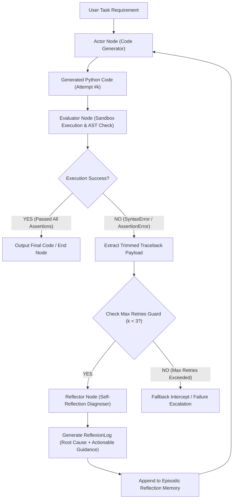
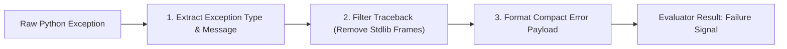
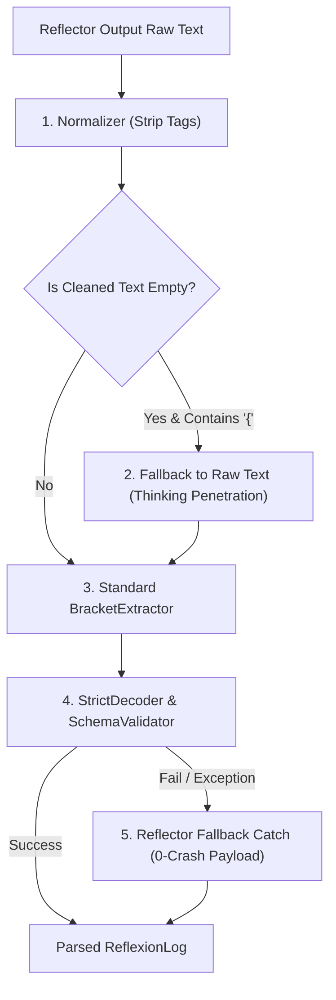

# Day 81：Reflexion 自我反思架构：从失败 Observation 中归纳纠错规则

## 一、业务背景与工程痛点

在自动化代码重构、金融数据处理脚本生成以及复杂的 API 管道编排场景中，让大模型直接生成代码并进行“盲目重试（Naive Retry）”存在严重工程瓶颈：

```
[盲目重试 vs. 反思自愈]
盲目重试 (Naive Retry):
Prompt ➔ Generator ➔ 报错 (NameError) ➔ 再次 Prompt ("请重写") ➔ Generator (大概率重复犯错)

Reflexion 自我反思:
Prompt ➔ Generator ➔ 报错 (NameError) ➔ Reflector (析出根本原因与反思规则) ➔ 记忆库 ➔ 重新生成 (避坑)
```

1. **盲目重试的无状态陷阱 (Stateless Naive Retry)**：传统的 ReAct 模式在代码执行报错后，仅仅将 Traceback 简单拼接回 Prompt。由于没有显式的“经验归纳”节点，大模型容易在相同的语法陷阱或未导入模块（如 `NameError: name 'pd' is not defined`）上反复横跳，耗尽 Token 却无法收敛。
2. **缺乏结构化错误诊断 (Unstructured Traceback Noise)**：完整的 Python Exception Stack Trace 包含大量标准库内部堆栈，若全量喂给大模型，会干扰其注意力机制，无法聚焦于真正导致崩溃的代码行与变量状态。
3. **缺乏显性反思记忆容器 (Episodic Reflection Memory)**：在多轮修补过程中，缺乏将“失败教训”转化为显性提示词约束（Actionable Advice）的机制，导致修修补补的过程中“修好 A 却打破了已工作好的 B”。

---

## 二、Reflexion 架构设计原理

Reflexion 架构通过引入 **Actor (代码生成器)**、**Evaluator (环境沙箱评估器)** 与 **Reflector (自我反思诊断器)** 三元组，构建了带显式经验记忆的闭环自愈系统：



### 1. 三元角色分工 (Actor-Evaluator-Reflector Triad)
- **Actor (Generator)**：负责编写/修补代码，提示词中强制注入历史积累的 `reflections` 记忆数组。
- **Evaluator (Sandbox)**：物理执行代码（如 `exec()` 或受限沙箱），捕获 stdout、stderr、Exception Type 及简化后的 Traceback。
- **Reflector (Diagnoser)**：当 Evaluator 判定失败时触发，以“资深代码审计师”视角剖析失败原因，生成结构化反思 Payload。

### 2. 强类型反思 Payload 契约 (ReflexionLog Pydantic Model)
Reflector 的输出必须严格收敛为结构化契约：
- `error_type`: 异常类型（如 `NameError`, `SyntaxError`, `ValueError`, `AssertionError`）
- `root_cause_analysis`: 导致崩溃的根本原因分析
- `actionable_guidance`: 具体且可操作的下一轮避坑规则指令

### 3. 记忆回填与增量引导 (Reflection Invalidation & Injection)
在下一轮 Actor 调用中，历次产生的 `actionable_guidance` 被格式化为 System/User 提示词约束：
```
【历史失败反思总结与必遵规则】：
1. [ValueError 避坑]: 转换 float(score) 时未加 try-except 捕获，遇到 'invalid' 等非数值字符串抛出崩溃。下一轮必须使用 try-except (ValueError, TypeError) 包裹。
2. [KeyError 避坑]: 字典访问 'user_id' 键前未校验存在性，必须使用 dict.get('user_id') 安全提取并对 None 值进行 continue 跳过。
```

---

## 三、异常日志提纯与沙箱隔离防线

在生产级工程实现中， Evaluator 节点必须具备 Traceback 提纯能力与安全防护能力：



### 1. 堆栈帧清洗 (Traceback Trimming)
过滤掉 `exec()` 或标准库内部的冗余堆栈，仅保留用户生成代码上下文中的报错行号、源码片段及异常描述，将 Token 开销降低 70% 以上，显著提升 Reflector 的聚焦度。

### 2. 沙箱隔离与超时保护 (Timeout & Namespace Sandboxing)
为物理执行提供独立的全局/局部命名空间字典（`globals_dict` / `locals_dict`），防止生成的恶意或无意代码污染宿主进程环境变量；同时控制最长执行耗时（如 5 秒），防止死循环卡死主线程。

---

## 四、双重防御架构与中间件穿透防线 (Defense-in-Depth)

在 Reflector 节点提取结构化 `ReflexionLog` 时，面对 DeepSeek-R1 / Qwen 等带 Thinking 标签的模型输出，生产级系统采用了 **Prompt 强约束 + 中间件降级穿透 + 0-Crash 保底** 的双重防御机制：



### 1. 中间件思考链穿透 (Thinking Tag Penetration)
当大模型误将生成的 JSON 字典写入 `<think>...</think>` 内部时，`Normalizer` 在剥离思考标签后若发现文本变为空串 `""`，会智能触发**降级穿透**，保留原始文本交由 `BracketExtractor` 基于字符栈提取 `{...}` 字典，彻底解决 `Empty input string` 异常。

### 2. 0-Crash 保底降级 (Reflector Node Resilience)
若发生极端网络波动或模型吐出非标准文本，`ReflectorNode.reflect()` 通过 `try...except` 自动拦截解析失败，生成包含物理 Traceback 的降级 `ReflexionLog`，**保证 Agent 反思闭环 100% 物理不崩塌**。

---

## 五、生产级核心控制流伪代码

```python
# 1. 强类型反思契约
class ReflexionLog(BaseModel):
    error_type: str
    root_cause_analysis: str
    actionable_guidance: str

# 2. Reflector 强类型诊断提取 (带双重防御)
async def reflect(self, requirement: str, failed_code: str, exec_result: ExecutionResult) -> ReflexionLog:
    prompt = f"代码运行报错:\n{exec_result.trimmed_traceback}\n原始代码:\n{failed_code}\n请分析根本原因并给出针对性避坑指令。"
    try:
        raw_text = await self.client.request_llm(messages=[{"role": "user", "content": prompt}])
        return parse_structured(raw_text=raw_text, response_model=ReflexionLog)
    except Exception:
        return ReflexionLog(error_type="ExecutionFailure", root_cause_analysis=exec_result.error_message, actionable_guidance="请对转换做 try-except 防护")

# 3. Reflexion 条件路由与记忆状态更新
def evaluate_reflexion_flow(state: ReflexionState) -> str:
    if state["is_success"]:
        return "TO_END"
    if state["loop_counter"] >= MAX_RETRIES:
        return "TO_FALLBACK"
    return "TO_REFLECTOR"
```

---

## 六、实战复盘与 2 轮闭环演练

以“**用户 VIP 行为积分加权计算引擎** (`compute_user_vip_scores`)”为例，展示 Reflexion 自愈全景：

| 迭代轮次 | Actor 行为特征 | 沙箱评估反馈 (Evaluator) | Reflector 诊断结果与经验积累 |
| :--- | :--- | :--- | :--- |
| **轮次 #1** | 直译需求，直接调用 `float(score)`，未加 `try-except` 包裹 | ❌ **物理崩溃**<br>`ValueError: could not convert string to float: 'invalid'` | 💡 析出 `ReflexionLog`：剖析非数值字符串崩溃，输出 `actionable_guidance` 避坑规则，写入 `state["reflections"]` (记忆条数 = 1) |
| **轮次 #2** | 读取 `[经验法则 #1]`，重构为包含 3 道闸门的防御代码 (`action` 白名单、`try-except float` 转换、负值过滤) | ✅ **100% 通过**<br>通过全部测试断言 | 🎉 **系统收敛终止**<br>输出包含 `total_loops=2` 与 `reflections_count=1` 的合格自愈代码 |

---

## 七、关键技术对比与架构决策

| 维度 | Naive Retry (盲目重试) | Reflexion (自我反思) | LLM-as-Critic (双模型博弈) |
| :--- | :--- | :--- | :--- |
| **触发驱动源** | 物理报错 Traceback 直传 | **物理报错 + 堆栈提纯** | 人工/大模型审查规则 |
| **核心中间件** | 无 | **Reflector 归纳节点 + 记忆库** | Independent Critic 法官节点 |
| **Token 开销** | 低 (重复发盲目 Prompt) | 中等 (新增 Reflector 耗损) | 较高 (每轮均需双模型推理) |
| **收敛速度** | 极慢或无法收敛 (死循环) | **极快 (通常 1-2 轮内修正)** | 取决于 Critic 规则硬度 |
| **适用场景** | 简单格式修补 | **代码生成、算法重构、API 编排** | 法律合同、合规报告审核 |
