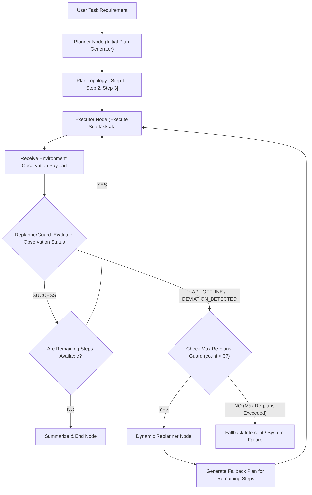

# Day 82：动态计划重构（Dynamic Re-planning）分支控制

## 一、业务背景与工程痛点

在多步骤复杂 Agent 系统（如：**分布式多源数据检索、跨境金融行情分析、自动化运维故障排查**）中，静态的 Plan-and-Execute (规划-执行) 架构存在致命的盲目性：

```
[静态计划崩溃 vs. 动态计划重构]
静态计划 (Static Plan-and-Execute):
Planner ➔ 生成固定 Plan [Step 1, Step 2, Step 3] ➔ 执行 Step 1 (OK) ➔ 执行 Step 2 (API 离线崩溃) ➔ 死守计划撞墙 (System Fail)

动态计划重构 (Dynamic Re-planning):
Planner ➔ 生成 Plan ➔ 执行 Step 1 (OK) ➔ 执行 Step 2 (发现 API_OFFLINE) ➔ Replanner (识别偏差并刷新剩余计划) ➔ 降级 Plan [Step 2_Fallback, Step 3] ➔ 成功收敛
```

1. **静态计划的僵化陷阱 (Static Plan Rigidness)**：在真实生产环境中，工具与外部 API 的响应充满不确定性（如 API 离线 `API_OFFLINE`、触发限流 `RATE_LIMITED` 或返回空数据）。静态计划引擎无法在运行期感知环境变化，只能盲目按原计划硬撞，最终导致系统彻底挂掉。
2. **缺乏运行时计划刷新机制 (No Runtime Plan Refresh)**：缺少在观察到非预期 Observation 时自动将控制流切回 Planner 重新生成“剩余步骤（Remaining Steps）”的路由分支。
3. **缺少上下文状态指纹与防死震荡 Guard**：当环境持续离线时，若动态重构缺少重规划次数上限与计划指纹比对，系统容易在“计划重构 ➔ 再次失败 ➔ 再次重构”中引发死循环震荡。

---

## 二、动态计划重构 (Dynamic Re-planning) 架构原理

动态计划重构范式通过在 Plan-and-Execute 状态图上引入 **Observation Re-planner Edge (观察结果重规划边)** 与 **Dynamic Replanner Node (动态重规划器)**，实现了见机行事的自适应弹性：



### 1. 结构化 Plan 与 TaskStep 契约 (Pydantic Schema)
计划列表必须以强类型 `TaskStep` 表示：
- `step_id`: 步骤唯一标识（如 `step_1`, `step_2`）
- `tool_name`: 拟调用的工具名称（如 `QueryPrimaryAPI`, `ReadLocalCache`）
- `arguments`: 步骤入参或变量占位符
- `status`: 状态枚举（`PENDING`, `COMPLETED`, `FAILED`, `REPLANNED`）

### 2. 状态容器中的双计划追踪 (State Schema)
TypedDict 状态容器中设计 `executed_steps` 与 `remaining_steps`：
- `executed_steps`: 记录已完成的步骤及其观察结果 `Observation`
- `remaining_steps`: 动态待执行的 TaskStep 队列，支持在运行期被 Replanner 直接覆盖或重构。

### 3. 动态重规划触发器 (Observation Evaluator & Router Guard)
当 Executor 执行某个 Sub-task 并返回 Observation 时，路由边 `ReplannerGuard` 审查其 `status`：
- 若状态为 `SUCCESS` 且仍有 `remaining_steps`，继续指向 `ExecutorNode`。
- 若状态包含 `API_OFFLINE` 或 `FORCE_REPLAN` 标志，控制流**强制路由跳转回 `ReplannerNode`**，将已执行步骤记录与当前离线报错上下文喂给 LLM，重新生成更新后的降级 `remaining_steps`。

---

## 三、生产级容错与防死震荡防护防线

为了保证动态重规划机制在生产环境中的绝对稳健，必须构建以下两道防线：


### 1. 最大重规划次数熔断 (Max Re-plans Guard)
为控制流引入 `replan_counter` 计数器，一旦动态重构次数超过预设限制（如 3 次），强制触发人工干预或抛出全局熔断降级异常，防止无限重规划消耗 Token。

### 2. 计划指纹哈希去重 (Plan Fingerprint Anti-Loop)
对重新生成的 `remaining_steps` 计算 md5/sha256 指纹。如果重构后的计划与上一轮失败的计划指纹完全一致（说明 Planner 没能给出有效的降级方案），直接切断循环，避免无效重重规划。

---

## 四、生产级核心控制流伪代码

```python
# 1. 强类型 TaskStep 与 Plan 契约
class TaskStep(BaseModel):
    step_id: str
    tool_name: str
    arguments: dict
    status: Literal["PENDING", "COMPLETED", "FAILED", "REPLANNED"] = "PENDING"

# 2. 动态重规划节点
class ReplannerNode:
    async def replan(self, requirement: str, executed: list, failed_step: TaskStep, observation: str) -> list[TaskStep]:
        prompt = f"需求: {requirement}\n已完成步骤: {executed}\n失败步骤: {failed_step}\n离线反馈: {observation}\n请重新规划剩余的降级执行步骤列表。"
        # 使用通用可靠性中间件提纯 Pydantic 降级 Plan
        return parse_structured(raw_text=..., response_model=ReplannedStepsPayload).steps

# 3. 条件路由判定 (Replanner Guard Edge)
def evaluate_routing(state: DynamicReplanState) -> str:
    last_obs = state["latest_observation"]
    if last_obs and last_obs.status == "API_OFFLINE":
        if state["replan_counter"] >= MAX_REPLANS:
            return "TO_FALLBACK"
        return "TO_REPLANNER"
    if not state["remaining_steps"]:
        return "TO_END"
    return "TO_EXECUTOR"
```

---

## 五、关键技术对比与架构决策

| 维度 | Static Plan-and-Execute | Naive ReAct | Dynamic Re-planning (动态计划重构) |
| :--- | :--- | :--- | :--- |
| **计划灵活性** | 静态（开局固定后不可变更） | 无显式计划（走一步看一步） | **动态自适应（运行期实时重构）** |
| **API 离线容错能力** | 极差（死守静态计划崩溃） | 一般（依靠上下文漫无目的试） | **极强（自动切换降级备用 API/Mock 缓存）** |
| **Token 开销** | 低（仅开局规划一次） | 高（每步工具均需要 LLM） | **适中（仅在发生偏差时拉起 Replanner）** |
| **控制流清晰度** | 高（线性链条） | 极低（黑盒隐式循环） | **极高（显式 Graph 状态图路由分支）** |
| **适用场景** | 确定性高的简单管道 | 探索性单工具搜索 | **复杂分布式 API 调度、高可用政企 Agent 检索** |
