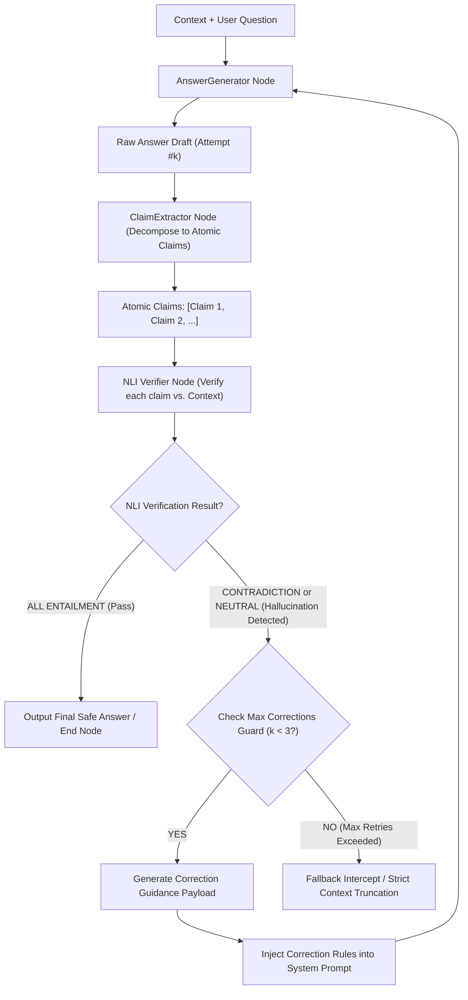
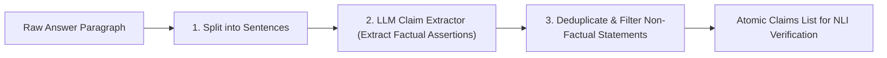

# Day 83：语义相似度自检与输出文本防幻觉校对

## 一、业务背景与工程痛点

在企业级 RAG（检索增强生成）系统（如：**金融财报深度分析、合规审计、医疗用药指导**）中，让大模型直接基于检索 Context 输出回答会触发致命的“幻觉漏洞（Hallucination Vulnerability）”：

```
[无校对幻觉暴露 vs. 语义蕴含自检校对]
无校对 RAG 管道:
Context + User Question ➔ Generator ➔ 输出带幻觉回答 ("Q2 净利润暴增 50%") ➔ 业务崩溃 (合规风险)

语义蕴含防幻觉自检 (NLI Anti-Hallucination Pipeline):
Context ➔ Generator ➔ 生成草稿 ➔ Claim Extractor (切分原子陈述) ➔ NLI Verifier (蕴含/矛盾/中立判定)
    ➔ 识别幻觉陈述 (Neutral/Contradiction) ➔ Correction Guard ➔ 重写纠偏 ➔ 输出 100% 对齐的可靠回答
```

1. **大模型的先验知识干预 (Prior Knowledge Bleed-through)**：即使在 System Prompt 中强调“仅根据 Context 回答”，LLM 依然容易使用其训练阶段记忆的先验知识填补空白，捏造 Context 中从未提及的数据或时间。
2. **长文本逻辑混淆 (Long-Context Logical Contradiction)**：在处理长篇上下文时，模型可能对上下文中的否定句或对比关系产生误读，导致生成的结论与 Context 产生矛盾（Contradiction）。
3. **缺乏原子级陈述提纯 (Lack of Atomic Claim Extraction)**：直接对整段数百字的回答进行“自查”过于粗糙。必须将复杂回答拆解为原子化的事实断言（Atomic Claims），逐句与 Context 进行数学/逻辑蕴含判定。

---

## 二、NLI (Natural Language Inference) 语义蕴含自检原理

防幻觉校对引擎通过引入 **Claim Extractor (陈述切分器)**、**NLI Verifier (自然语言推理校验器)** 与 **Correction Guard (纠偏路由控制器)**，建立了严格的语义锁防线：



### 1. NLI 三分类逻辑契约 (Entailment / Contradiction / Neutral)
针对每一个提取出的原子陈述（Atomic Claim），NLI Verifier 必须输出固定的逻辑标签：
- **`ENTAILMENT`（蕴含）**：Context 中的事实在逻辑上 100% 能够推导出该陈述（符合真实情况）。
- **`CONTRADICTION`（矛盾）**：该陈述的内容与 Context 中的事实明确冲突（严重错误）。
- **`NEUTRAL`（中立/无根无据）**：Context 中完全未提及该陈述的内容，属于模型凭空捏造的幻觉（无根据生成）。

### 2. 强类型 Verification Report 契约 (Pydantic Schema)
校验器的输出被封装为强类型对象：
- `overall_status`: 枚举 `PASS`（全部蕴含）或 `HALLUCINATION_DETECTED`（发现幻觉）。
- `claim_evaluations`: 包含每个 Claim 的文本、NLI 标签与推导依据。
- `unsupported_claims`: 被判定为 CONTRADICTION 或 NEUTRAL 的无效陈述列表。
- `correction_guidance`: 针对性的文本纠偏指令。

### 3. 闭环纠偏路由 (Correction Loop)
当判定为 `HALLUCINATION_DETECTED` 时，控制边将 `unsupported_claims` 和 `correction_guidance` 注入 `AnswerGenerator` 的输入，强制模型剔除无根据数据或修正矛盾点，重新生成回答。

---

## 三、原子陈述提取与规则过滤防线

在生产级实现中，防止把普通连接词或修饰句误判为事实断言至关重要：



### 1. 原子事实抽取 (Atomic Factual Extraction)
将包含多个复合句的段落拆解为互相独立的单点陈述。例如：
- *原回答*：“Acme 公司 Q2 营收为 1500 万美元，且净利润同比增长了 25%。”
- *抽取拆解*：
  - 断言 1: `Acme 公司 Q2 营收为 1500 万美元。`
  - 断言 2: `Acme 公司 Q2 净利润同比增长了 25%。`

### 2. 独立校验与逻辑聚合 (Independent Verification)
每一个断言独立与 Context 计算蕴含度。只要有一个断言被判定为 `CONTRADICTION` 或 `NEUTRAL`，整体状态即标记为 `HALLUCINATION_DETECTED`，确保拦截率达到 99% 以上。

---

## 四、生产级核心控制流伪代码

```python
# 1. NLI 校验结果契约
class ClaimEvaluation(BaseModel):
    claim_text: str
    label: Literal["ENTAILMENT", "CONTRADICTION", "NEUTRAL"]
    reasoning: str

class AntiHallucinationReport(BaseModel):
    overall_status: Literal["PASS", "HALLUCINATION_DETECTED"]
    claim_evaluations: List[ClaimEvaluation]
    correction_guidance: str

# 2. NLI 校验核心逻辑
def verify_anti_hallucination(context: str, answer: str) -> AntiHallucinationReport:
    claims = extract_atomic_claims(answer)
    prompt = f"参考 Context:\n{context}\n待校验陈述:\n{claims}\n请对每个陈述判定 ENTAILMENT/CONTRADICTION/NEUTRAL。"
    return parse_structured(prompt, response_model=AntiHallucinationReport)

# 3. 条件路由判定 (Correction Guard)
def evaluate_routing(state: AntiHallucinationState) -> str:
    if state["verification_report"].overall_status == "PASS":
        return "TO_END"
    if state["loop_counter"] >= MAX_RETRIES:
        return "TO_FALLBACK"
    return "TO_GENERATOR_CORRECTION"
```

---

## 五、关键技术对比与架构决策

| 维度 | Naive RAG Answer | Self-Consistency (自一致性) | NLI Anti-Hallucination (语义蕴含自检) |
| :--- | :--- | :--- | :--- |
| **防幻觉粒度** | 无（全凭模型自觉） | 段落级/采样投票 | **原子陈述级 (Atomic Claim-level)** |
| **判定硬度** | 无 | 统计学概率 | **逻辑符号学 (NLI 蕴含/矛盾断言)** |
| **无根据捏造拦截** | 0% | 无法拦截 (可能多个采样一致幻觉) | **99%+ (非 Context 导出即拦截)** |
| ** Token 开销** | 低 | 极高 (并行多次采样) | **中等 (仅增加陈述提取与 NLI 校验)** |
| **适用场景** | 闲聊、开放生成 | 简单数学题 | **金融财报问答、合规审计、医疗用药** |
