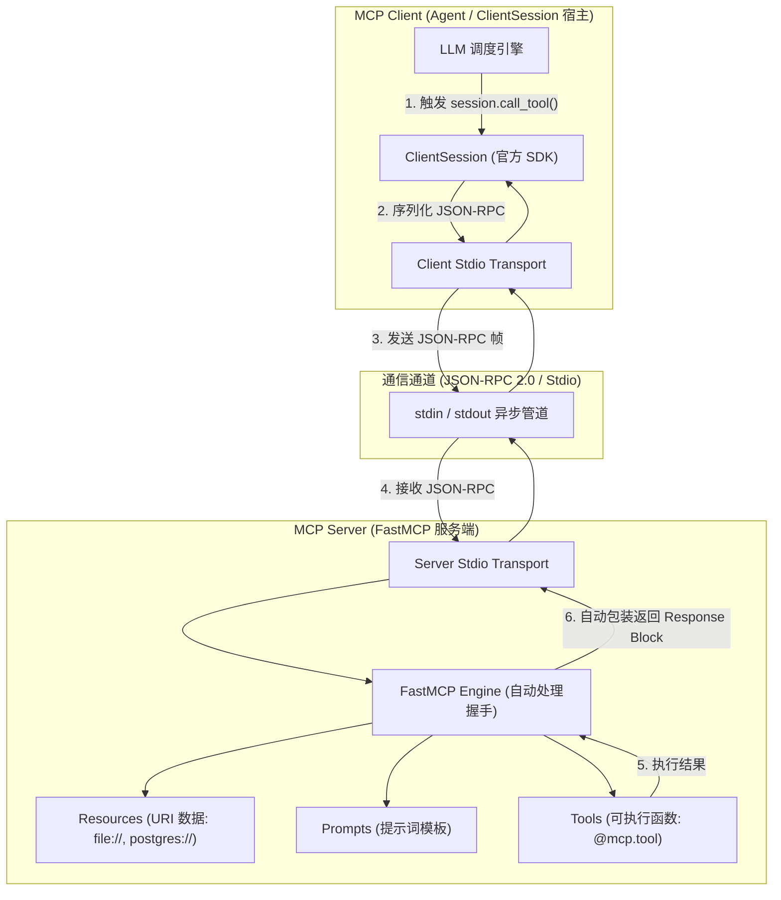
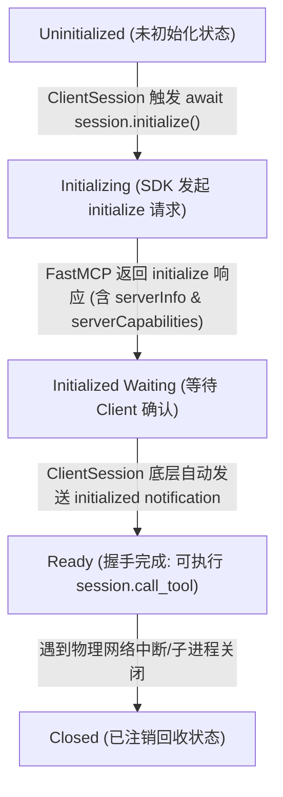

# 📘 Day 85 课堂笔记：Model Context Protocol (MCP) 客户端-服务器架构规范与协议原语

## 一、 工业业务背景与传统 Tool 调用的系统瓶颈

在构建复杂 Agent 系统的过程中，传统将 Tool 函数硬编码嵌入 Agent 代码的方案暴露出了严重的软件工程弊端：

1. **协议格式碎片化**：OpenAI Function Call、LangChain Tools 与自研 Agent 框架各自采用不同的 JSON Schema 包装契约，导致工具代码无法跨框架复用。
2. **越权访问与安全沙箱缺失**：Agent 工具直接访问宿主机文件系统或数据库，缺乏标准化的资源 URI 寻址机制与访问边界隔离。
3. **跨宿主即插即用受限**：开发的本地工具无法在不修改源码的前提下直接挂载到 Cursor、Claude Desktop 等主流 IDE / 宿主应用中。

---

## 二、 MCP 协议架构与会话状态机知识图谱

**Model Context Protocol (MCP)** 是由 Anthropic 开源的标准模型上下文协议。在生产级 Python 开发中，它由官方 **`mcp` 1.28.1+ SDK (FastMCP & ClientSession)** 提供原生支持。

### 1. 协议底层控制流交互架构图



### 2. SDK 托管的初始化握手状态机知识图谱

在官方 SDK 内部，握手过程由 `ClientSession.initialize()` 与 `FastMCP` 引擎自动在底层流转，开发者**无需手写任何初始化拼串与状态判断代码**：



---

## 三、 官方 SDK 自动化托管原理与代码模式

在 Anthropic 官方 Python SDK 规范中，**JSON-RPC 2.0 反序列化、Protocol 初始化握手、Capabilities 协商与错误码转换全由 SDK 自动托管**：

```python
# 官方正统生产级代码模式伪代码
# 1. Server 侧: 声明式注册 (FastMCP 托管底层协议)
mcp = FastMCP("security-audit-engine")

@mcp.tool()
def audit_python_ast_security(code_snippet: str) -> dict:
    return {"clean": True}

# 2. Client 侧: stdio_client + ClientSession (自动托管握手)
async with stdio_client(server_params) as (read, write):
    async with ClientSession(read, write) as session:
        # SDK 底层自动处理请求 -> 接收 capabilities -> 发送 initialized 通知
        init_info = await session.initialize()
        
        # 握手就绪后直接业务调用
        result = await session.call_tool("audit_python_ast_security", {"code_snippet": "..."})
```

---

## 四、 协议三大元实体与高级原语深钻

### 1. 三大元实体职责划分

| 元实体类型 (Entity) | 寻址与声明方式 | 核心职责与应用场景 |
| :--- | :--- | :--- |
| **Resources** | URI 寻址（如 `file://...` 或 `postgres://...`） | 暴露只读数据（日志流、配置文件、系统监控状态），仅供 Context 组装。 |
| **Prompts** | 字符串 Name + 动态 Argument 声明 | 导出预定义的提示词模板与上下文补全，收敛 LLM 注意力。 |
| **Tools** | 强类型 JSON Schema + 可执行逻辑 | 暴露带入参校验的计算、数据库写入或文件修改能力。 |

### 2. 生产级高级原语理论机制

* **Sampling (反向采样)**：当 Server 端工具执行遇到复杂子任务（如需清洗 HTML 文本或提取语义）时，可通过发送 `sampling/createMessage` 反向请求 Client 借用 LLM 进行二次提取，无需 Server 单独配置 API Key，实现了 Client-Server 间的“计算与智能解耦”。
* **Roots (工作区沙箱)**：Client 向 Server 传递可访问的工作区根路径 `list_roots()`，从物理层面锁定受限文件工具的访问范围，杜绝越权访问系统根目录。

---

## 五、 通信通道选型与防御性异常设计

### 1. 通信通道对比

| 通道类型 | 物理传输通道 | 优势与安全边界 | 适用场景 |
| :--- | :--- | :--- | :--- |
| **Stdio** | 标准输入/输出 (`stdin`/`stdout`) | 无端口暴露，生命周期随宿主启动/挂断，高安全隔离 | 本地工具、IDE 插件与 CLI 扩展 |
| **SSE** | HTTP + Server-Sent Events | 支持跨网络远程挂载、异步双向推流与分布式协同 | 远端微服务、多客户端共享工具池 |

### 2. 标准 JSON-RPC 2.0 错误码防御 (SDK 底层自动封装)

| 错误码 (ErrorCode) | 标准名称 | 含义与防御拦截措施 |
| :--- | :--- | :--- |
| **`-32700`** | Parse Error | 接收到的文本非合法 JSON 格式，触发底层解析拦截。 |
| **`-32600`** | Invalid Request | 缺少 `jsonrpc: "2.0"` 协议版本或 `method` 字段缺失。 |
| **`-32601`** | Method Not Found | 请求的 Tool 或 Resource URI 未在 Server 端注册。 |
| **`-32602`** | Invalid Params | 工具入参与 Pydantic / JSON Schema 契约不匹配。 |
| **`-32000`** | Execution Error | 工具内部逻辑执行崩溃，包装异常链后返回 Client。 |

---

## 六、 权威学术论文与官方规范文献引用

1. 🌐 **[Anthropic Model Context Protocol Specification](https://modelcontextprotocol.io/specification)**：MCP 官方协议标准规范文档。
2. 🌐 **[JSON-RPC 2.0 Specification Standard (RFC 3122)](https://www.jsonrpc.org/specification)**：JSON-RPC 2.0 消息标准规范。
3. 📄 **[Gorilla: Large Language Model Connected with Massive APIs (arXiv:2305.15334)](https://arxiv.org/abs/2305.15334)**：大规模 API 检索与调用的理论基石。
4. 📄 **[Toolformer: Language Models Can Teach Themselves to Use Tools (arXiv:2302.04761)](https://arxiv.org/abs/2302.04761)**：LLM 动态 Tool Call 机制经典论文。
5. 💻 **[Python MCP SDK Official Repository](https://github.com/modelcontextprotocol/python-sdk)**：官方开源 Python SDK。
