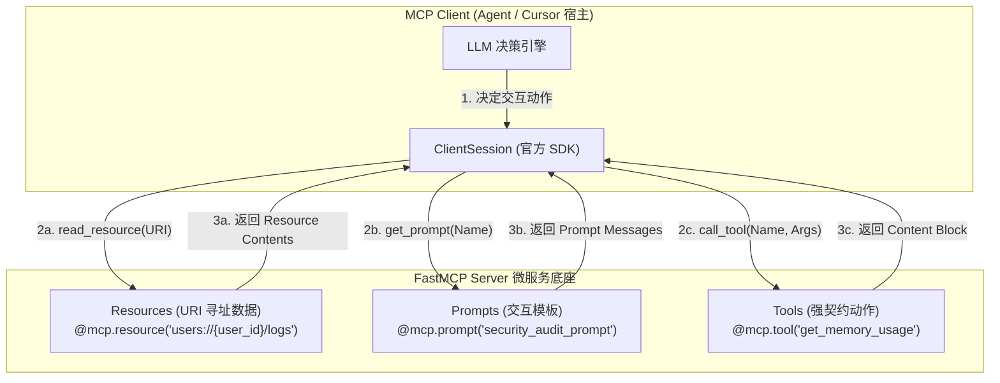
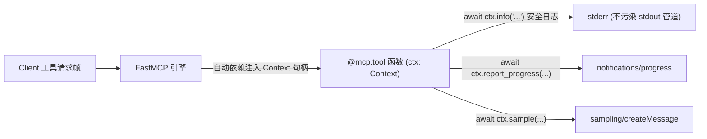

# 📘 Day 86 课堂笔记：基于 Python FastMCP SDK 开发自定义资源、提示词与工具暴露服务器

## 一、 工业业务背景与 FastMCP 三大元实体架构

在企业级 Agent 微服务体系中，单纯的“函数工具（Tools）”无法满足所有的业务抽象需求：
1. **只读数据寻址诉求**：日志流、只读配置文件、监控指标需要安全寻址（URI），避免被 LLM 误写。
2. **上下文提示词标准导出**：不同微服务拥有专属的 Prompt 拼接逻辑，需由服务端标准化导出给 Client 组装。

**FastMCP** 通过三大元实体契约（Resources, Prompts, Tools）实现了高度解耦的微服务架构。

### 1. 三大元实体交互架构图



---

## 二、 三大元实体定义范式与 RFC 6570 动态 URI 模板

### 1. Resources（只读资源与 RFC 6570 动态 URI 模板）
* **静态资源 (Static Resource)**：使用固定的 URI（如 `@mcp.resource("config://app/config.json")`）。
* **动态资源模板 (Dynamic URI Template)**：遵循 **RFC 6570** 规范，在 URI 中嵌入 `{placeholder}`。FastMCP 会底层自动提取路径参数并传参给函数。

```python
# 极简伪代码: RFC 6570 动态 URI 模板范式
@mcp.resource("users://{user_id}/audit-logs/{log_date}")
def get_user_audit_log(user_id: str, log_date: str) -> str:
    # FastMCP 自动从 URI (如 users://usr_99/audit-logs/2026-07-26) 提取参数
    return f"Log for {user_id} on {log_date}"
```

### 2. Prompts（动态提示词模板）
Prompts 允许服务端定义可参数化的 Message 数组或 String 模板，Client 调用 `session.get_prompt()` 检索并直接注入 LLM 上下文。

### 3. Tools（带 Context 依赖注入的强契约工具）
工具支持使用 `Annotated[T, Field(description="...")]` 显式增强 Schema，同时支持**依赖注入 `ctx: Context`**。

---

## 三、 Context 依赖注入与生产日志防御防错

在 `stdio` 通道传输中，标准输出 (`stdout`) 专门用于传输 JSON-RPC 2.0 帧。**生产严禁使用 `print()` 输出调试日志**，否则会导致 Stdio JSON 帧破损崩溃。

### Context 依赖注入流向图



---

## 四、 生产级异常拦截与三实体对比

| 元实体类型 | 物理声明方式 | 寻址/触发机制 | 生产级防错拦截 |
| :--- | :--- | :--- | :--- |
| **Resources** | `@mcp.resource("scheme://path")` | URI 精确匹配 / RFC 6570 模板提取 | 只读性防护（`readOnlyHint=True`），URI 格式校验。 |
| **Prompts** | `@mcp.prompt("prompt_name")` | 名称查找与 Arguments 替换 | 必填参数校验，防止模版渲染空洞。 |
| **Tools** | `@mcp.tool(name="...")` | 工具名称 + inputSchema 校验 | `pydantic.ValidationError` 拦截与 `ctx.info` 安全日志。 |

---

## 五、 权威学术论文与官方规范文献引用

1. 🌐 **[Anthropic FastMCP Python SDK Documentation](https://py.sdk.modelcontextprotocol.io/)**：FastMCP 官方 SDK 最佳实践指南。
2. 🌐 **[RFC 6570: URI Template Standard Specification](https://datatracker.ietf.org/doc/html/rfc6570)**：MCP 动态资源 URI 模板所依据的国际标准规范。
3. 📄 **[OpenAPI 3.0 Specification (OAS)](https://spec.openapis.org/oas/v3.0.3)**：MCP Tool inputSchema 兼容的数据模式规范。
4. 📄 **[Gorilla: Large Language Model Connected with Massive APIs (arXiv:2305.15334)](https://arxiv.org/abs/2305.15334)**：微服务工具解耦与 API 检索理论论文。
