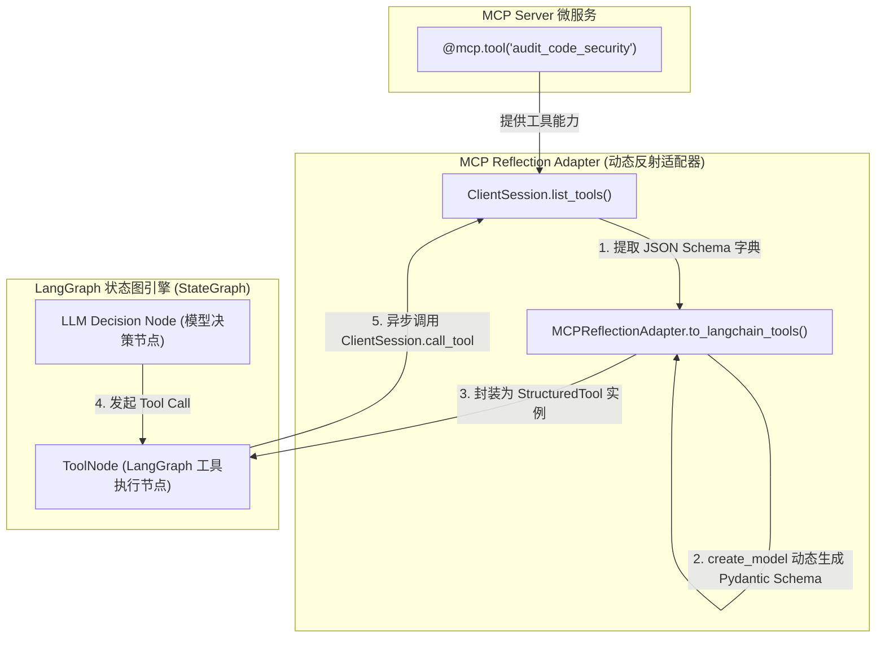
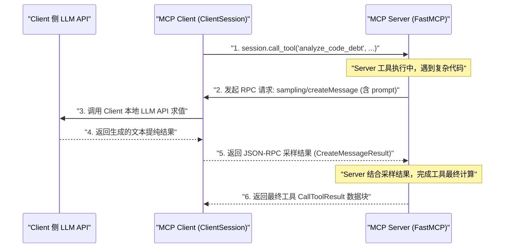

# 📘 Day 87 课堂笔记：MCP 客户端接入、LangGraph 多工具绑定与 Client Sampling 反向采样

## 一、 工业业务背景与 LangGraph 工具绑定痛点

在企业级 Agent 编排系统中，主系统（如基于 LangGraph / StateGraph 构建的核心决策 Agent）需要作为 **MCP Client** 动态挂载分布在多台机器上的 MCP 微服务服务器。

但在物理接入时存在两大工程卡点：
1. **签名与契约适配卡点**：MCP `ClientSession.list_tools()` 拿到的工具契约与 LangGraph Node 认可的 `StructuredTool` / `Runnable` 接口不兼容。如果为每个工具手写胶水代码，系统将丧失动态可扩展性。
2. **Server 侧无脑算力瓶颈与 Sampling 需求**：很多运行在边缘或无 LLM 凭证的 MCP Server（如本地日志解析器）在工具执行中需要提炼文本。通过 MCP 协议的 **Sampling（客户端采样）** 原语，Server 可以向 Client 侧“借用 LLM 大脑”，避免 Server 侧单独配置敏感 API Key。

---

## 二、 MCP 到 LangGraph 的工具反射转换架构

利用**动态反射适配器模式（Dynamic Reflection Adapter Pattern）**，在运行期利用 Python 元编程（如 `pydantic.create_model`），自动解析 MCP Tool 的 `name`、`description` 和 `inputSchema`，并将其直接封装为 LangChain / LangGraph 兼容的异步 `StructuredTool` 实例。

### 1. 工具反射包装与注入 LangGraph Node 架构图



---

## 三、 Client Sampling (反向借脑采样) 深度剖析与工业本质

### 1. Sampling 的工程本质：Tool 内部的远程 LLM 函数调用

**核心事实澄清**：
Tool 本身是一个确定性的 Python/TypeScript 函数，它**并不具备自发思考或自然语言能力**。
在实际开发中，Sampling 的触发（`ctx.session.create_message`）是**开发者提前在 Tool 代码中逻辑设计好、硬编码写入控制流的**。在开发者眼里，Sampling 就是一个**“由 Client 宿主提供、无需配置 API Key 的远程 LLM 函数”**。

### 2. 三类典型工业开发场景

| 场景类型 | 确定性代码做的事情 | Sampling 反向借脑做的事情 |
| :--- | :--- | :--- |
| **场景 A: 非结构化数据清洗** | 用 `git log` 抓取 500 行原始 Commit 日志 | 调用 `create_message()` 借脑将混乱日志提纯为干净的 3 行 Markdown |
| **场景 B: 多步 Pipeline** | 读取本地 SQLite 表结构定义 Schema | 调用 `create_message()` 借脑将自然语言转为 SQL，再由 Tool 本地执行 |
| **场景 C: 动态安全防御栅栏** | 接收外部命令行写文件指令 | 调用 `create_message()` 借脑判断该写指令是否包含恶意删库风险 |

### 3. Client Sampling 四大工业价值

1. **🔑 API Key 凭证集中收拢（防泄露）**：成百上千个微服务 Server **0 Key 运行**，密钥 100% 集中锁死在 Client 宿主内，避免敏感 API Key 在边缘容器泄露。
2. **🎯 智能与计算彻底解耦**：Server 专注做纯粹的硬件/数据计算，自然语言高阶推理全反向抛给 Client 处理。
3. **💰 Token 成本与模型偏好控制**：Client 在回调句柄中统一限制 Token 消耗、设置限流与审查策略。
4. **👤 人机协同拦截 (Human-in-the-loop)**：Client 收到 Sampling 请求时，可在 UI 界面弹窗让人类二次确认敏感操作。

### 4. Server 工具反向触发 Client Sampling 序列流图



---

## 四、 核心伪代码与生产防错

### 1. Client Sampling Callback 处理伪代码

```python
# 极简伪代码: Client 侧 Sampling 采样回调注册
async def handle_client_sampling_request(*args, **kwargs) -> CreateMessageResult:
    # 提取 params 参数中的 prompt 文本，调用 Client 本地 LLM 求值
    params = kwargs.get("params") or args[0]
    user_prompt = params.messages[0].content.text
    
    # 调 Client 本地大模型大脑
    llm_response = await client_llm.generate(user_prompt)
    return CreateMessageResult(
        role="assistant",
        content=TextContent(type="text", text=llm_response),
        model="minimax-01"
    )

# 在初始化 ClientSession 时传入 sampling_callback
session = ClientSession(read, write, sampling_callback=handle_client_sampling_request)
```

### 2. 生产级长连接生命周期管理与垃圾回收

| 生命周期环节 | 生产防错与安全防护 |
| :--- | :--- |
| **连接创建与初始化** | 必须捕获 `ConnectionRefusedError` 与握手超时异常；使用 `async with` 自动管理管道。 |
| **工具反射转换** | 校验 MCP `inputSchema` 的必填字段与默认值，使用 `create_model` 动态生成正确的 Pydantic Schema。 |
| **Sampling 安全鉴权** | Client 侧 Sampling 句柄必须对请求频次进行限流，防范非法 Server 恶意消耗 Client Token。 |
| **优雅注销与回收** | 子进程退出或长连接断开时，自动触发 `session.close()` 并注销底层 Stdio/SSE 管道。 |

---

## 五、 权威学术论文与官方规范文献引用

1. 🌐 **[Anthropic MCP Sampling Specification](https://modelcontextprotocol.io/docs/concepts/sampling)**：MCP 官方 Sampling 采样原语规范文档。
2. 🌐 **[LangChain & LangGraph Tool Integration Guide](https://python.langchain.com/docs/how_to/custom_tools/)**：LangChain `StructuredTool` 契约规范。
3. 📄 **[LangGraph: Building Language Agents as Graphs](https://github.com/langchain-ai/langgraph)**：LangGraph 循环图架构官方仓库。
4. 📄 **[Gorilla: Large Language Model Connected with Massive APIs (arXiv:2305.15334)](https://arxiv.org/abs/2305.15334)**：动态工具适配与反射理论论文。
