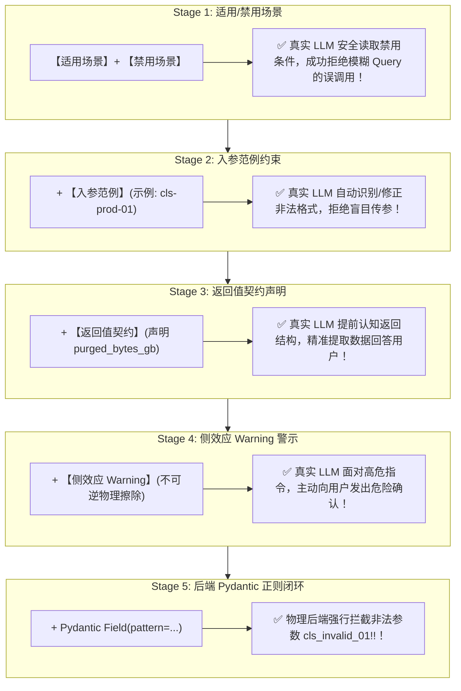

# 📘 Day 88 课堂笔记：面向大模型优化的 Tool Docstring 5 段式契约 5 阶段递进防错

## 一、 工业业务背景与真实 LLM 工具调用的核心痛点

在基于真实 LLM（如 OpenAI、Anthropic、MiniMax 等）构建 Agent 系统时，纯代码层面的类型提示（如 Python 仅写 `str` 或 `int`）无法约束大模型的注意力与行为边界。

真实 LLM 在执行 Tool Call 时暴露出两大核心瓶颈：
1. **误调用与越权触发 (Tool Misuse)**：当用户 Query 存在模糊意图时（如“帮我看看配置，顺便清理一下系统”），缺乏边界约束的工具容易被 LLM 误调用，触发具有不可逆侧效应的写操作。
2. **非法格式入参引发后端崩溃 (Invalid Argument Crash)**：LLM 可能会传入包含非法特殊字符的字符串（如 `cls_prod_01!!`），绕过基础类型校验导致后端代码抛出非预期崩溃。

---

## 二、 5 段式 Docstring 契约 5 阶段 1 对 1 递进演进架构

为了让开发者与架构师深刻理解 5 段式契约中每一段的具体防御作用，我们将其拆解为 **5 个 1 对 1 递进演进阶段**：

### 5 阶段契约 1 对 1 递进防护演进图



---

## 三、 5 段式 Docstring 契约各阶段 1 对 1 防御对照表

| 演进阶段 | 对应 5 段契约核心 | 真实 LLM 行为控制目标 | 实验验证 Query 范例 |
| :--- | :--- | :--- | :--- |
| **Stage 1** | **【适用场景】+【禁用场景】** | 拦截意图混淆与误触发 (Prevent Mis-triggering) | *“帮我读配置，顺便看一眼垃圾”* -> **安全拒绝误调用** |
| **Stage 2** | **【入参范例】** | 引导 LLM 自动修正参数格式 (Format Guidance) | *“帮我清理 production 集群”* -> **拒绝盲目传参，提示输入 cls-xxx** |
| **Stage 3** | **【返回值契约】** | 帮助 LLM 提前知晓返回结构，准确总结结果 (Response Schema) | *“清理 cls-prod-01，并告诉我释放了多少 G 空间”* -> **精准解析 `purged_bytes_gb`** |
| **Stage 4** | **【侧效应 Warning】** | 提示危险不可逆，触发 LLM 向用户发起二次安全确认 (Safety Confirmation) | *“直接把 cls-prod-01 删了”* -> **LLM 主动提示危险并要求人类确认** |
| **Stage 5** | **【Pydantic 正则防错】** | 兜底拦截防越权/绕过 (Backend Defense) | 传入 `cls_invalid_01!!` -> **后端 0 延迟强行拒绝** |

---

## 四、 5 段式契约标准代码范式

```python
# 5 段式 Docstring 完整标准范式
class SpecOptimizedInput(BaseModel):
    cluster_id: str = Field(
        pattern=r"^cls-[a-z0-9]+$",
        description="目标 Kubernetes 集群的物理 ID (合法示例: cls-prod-01)"
    )

def stage3_full_spec_tool(cluster_id: str) -> Dict[str, Any]:
    """【适用场景】仅在用户明确下达危险擦除指令，要求清理指定 K8s 集群缓存时调用。
    【禁用场景】若用户仅要求读取配置、查看集群状态或未明确授权擦除时，绝对禁止调用！
    【入参范例】合法示例: 'cls-prod-01'。非法示例: 'production' 或带特殊符号 'cls_01!'。
    【返回值契约】返回包含 clean_status, target 和 purged_bytes_gb (已释放空间G) 的 JSON 结果对象。
    【侧效应 Warning】⚠️ 高危操作：包含物理不可逆的磁盘缓存永久删除！调用前必须提示用户确认风险！"""
    
    # 动态后端强防御
    try:
        validated = SpecOptimizedInput(cluster_id=cluster_id)
    except ValidationError as err:
        return {"status": "REJECTED_BY_PYDANTIC_DEFENSE", "error": str(err)}

    return {"clean_status": "PURGED_SUCCESS", "target": validated.cluster_id, "purged_bytes_gb": 128.5}
```

---

## 五、 权威学术论文与官方规范文献引用

1. 🌐 **[Anthropic MCP Tool Call Best Practices](https://modelcontextprotocol.io/docs/concepts/tools)**：MCP 官方 Tool Schema 优化规范。
2. 📄 **[Toolformer: Language Models Can Teach Themselves to Use Tools (arXiv:2302.04761)](https://arxiv.org/abs/2302.04761)**：大模型对工具 Docstring 理解的论文。
3. 📄 **[Gorilla: Large Language Model Connected with Massive APIs (arXiv:2305.15334)](https://arxiv.org/abs/2305.15334)**：API 契约说明与语法防错研究。
