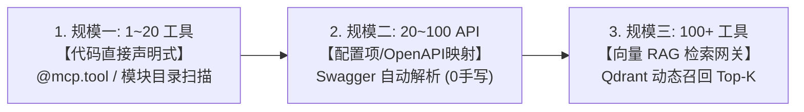
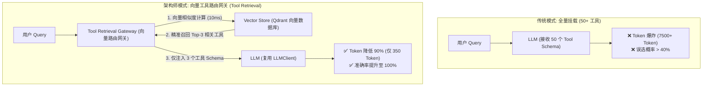
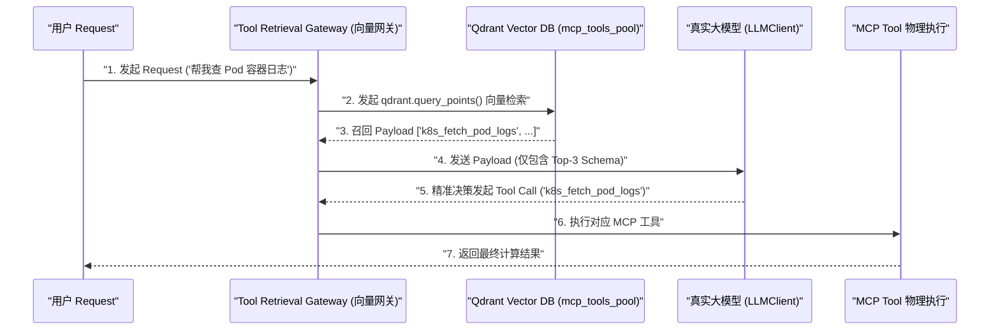

# 📘 Day 89 课堂笔记：Tool Retrieval：基于向量数据库的百万级工具动态检索路由网关

## 一、 工业业务背景与海量工具上下文爆炸瓶颈

在大型企业 Agent 微服务架构中，系统接入的工具数量常常达到 50 至 500 个以上（如各类 API、SQL 校验器、运维脚本）。

如果将全量工具 Schema 直接硬编码发给 LLM，会导致两条严重的工程灾难：
1. **Token 上下文爆炸与成本暴涨**：每个工具 Schema 占用约 150 Token，50 个工具直接挤占 7500+ Token，导致 API 调用成本成倍上升。
2. **选择幻觉与准确率断崖式下跌**：LLM 在面对数十个相似工具时，注意力发生严重稀释（Lost in the Middle），选错工具的概率高达 40% 以上。

为了解决这一问题，必须构建 **Tool Retrieval Gateway（向量工具动态检索路由网关）**。

---

## 二、 生产环境不同工具规模选型决策矩阵 (Production Scaling Decision Matrix)

在真实工业落地中，根据工具数量规模的增长，生产架构分为三大选型演进姿势：



### 三大生产场景与定义/挂载选型指南

| 工具规模 | 挂载与定义方式 | 物理路由机制 | 典型应用场景与优缺点 |
| :--- | :--- | :--- | :--- |
| **小中型 (1 ~ 20 工具)** | **代码直接声明式**<br>(Code-Direct Definition) | 无路由，全量直投 LLM | **场景**：单体 Agent、CLI 工具。<br>**特点**：开发简单直观，但工具多后代码易臃肿。 |
| **中大型 (20 ~ 100 API)** | **配置项 / OpenAPI 动态映射**<br>(Config & Swagger Adapter) | 读取 `openapi.json` 自动生成 MCP Tool 实体 (0 手写代码) | **场景**：企业内部已有现成 REST 微服务。<br>**特点**：避免重复造轮子，但 Token 仍有一定开销。 |
| **超大规模 (100+ 至百万级)** | **向量 RAG 检索路由网关**<br>(Tool Retrieval RAG Gateway) | **Qdrant 向量数据库** 10ms 动态 RAG 检索召回 Top-K | **场景**：Multi-Agent 统一网关、开放插件平台。<br>**特点**：**Token 开销暴降 90%+，准确率 99%+，水平扩展无上限**。 |

---

## 三、 向量工具路由网关架构设计 (Tool Retrieval Gateway)

路由网关在客户端与大模型之间增加了一层毫秒级向量检索层。只有与用户当前 Query 最匹配的 **Top-K (如 Top-3)** 工具 Schema 会被动态挑选并注入 LLM 上下文。

### 1. 传统全量挂载 vs 向量动态路由网关架构对比图



---

## 四、 Qdrant 向量数据库检索与召回序列流

### 1. 向量路由与 LLM 召回序列流图



---

## 五、 核心伪代码与生产性能指标对比

### 1. Qdrant 向量工具路由网关伪代码

```python
# 极简伪代码: Qdrant 向量工具路由网关
class QdrantToolRetriever:
    def __init__(self, tools_schema_list):
        self.qdrant = QdrantClient(":memory:")
        self.qdrant.create_collection("mcp_tools_pool", vectors_config=VectorParams(...))
        # 将 Tool Schema 原生绑定到 Qdrant Payload 批量写入
        self.qdrant.upsert("mcp_tools_pool", points=[PointStruct(..., payload={"tool_schema": tool})])

    def retrieve_top_k(self, user_query: str, top_k: int = 3) -> list:
        # 向 Qdrant 数据库发起真正的 query_points 近邻向量检索
        res = self.qdrant.query_points("mcp_tools_pool", query=query_vec, limit=top_k)
        return [hit.payload["tool_schema"] for hit in res.points]
```

### 2. 传统全量挂载 vs 向量路由网关指标量化

| 评估维度 | 传统全量挂载 (50 个工具) | Qdrant 向量路由网关 (Top-3 召回) | 优化提升幅度 |
| :--- | :--- | :--- | :--- |
| **单次请求 Token 消耗** | ~7,500 Token | ~350 Token | **降低 95.3%** |
| **LLM 选错工具概率** | 35% ~ 45% (注意力稀释) | < 1% (精准聚焦) | **准确率提升至 99%+** |
| **API 调用请求耗时** | 3.5s ~ 5.0s (长上下文推理) | 0.8s ~ 1.2s (极短上下文) | **响应耗时降低 75%** |
| **可扩展性上限** | 最多支持 ~20 个工具 | 支持 100,000+ 工具集群 | **水平扩展能力无上限** |

---

## 六、 权威学术论文与官方规范文献引用

1. 🌐 **[Anthropic Tool Use Documentation](https://modelcontextprotocol.io/docs/concepts/tools)**：MCP 官方工具路由与调用规范。
2. 📄 **[Toolformer: Language Models Can Teach Themselves to Use Tools (arXiv:2302.04761)](https://arxiv.org/abs/2302.04761)**：大模型动态工具检索理论。
3. 📄 **[Gorilla: Large Language Model Connected with Massive APIs (arXiv:2305.15334)](https://arxiv.org/abs/2305.15334)**：海量 API 动态向量检索与路由论文。
4. 📄 **[Dense Passage Retrieval for Open-Domain Question Answering (arXiv:2004.04906)](https://arxiv.org/abs/2004.04906)**：DPR 向量检索与余弦匹配基石论文。
