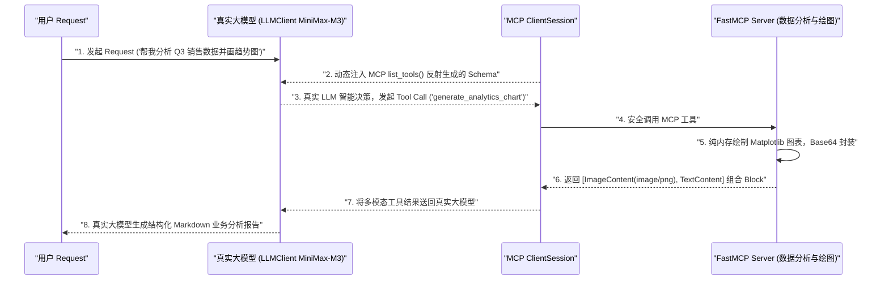
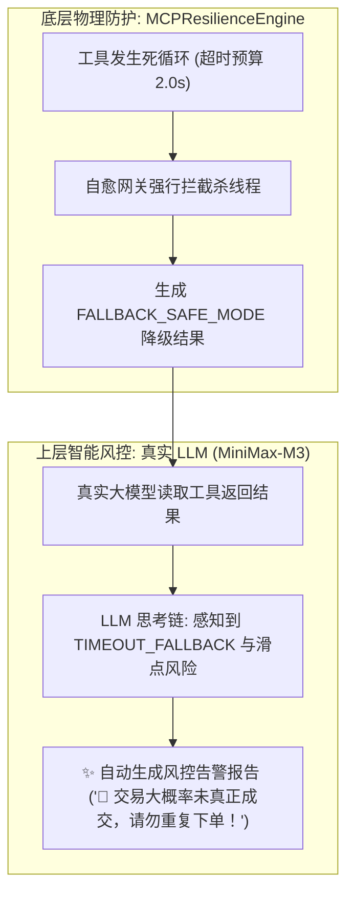

# 📘 Day 90 课堂笔记：工具输出二进制流（多模态）与真实 LLM 驱动的长连接故障自愈规约

## 一、 工业业务背景与多模态工具响应演进

在真实的 Agent 生产落地中（如数据分析 Agent、科研绘图 Agent、高频风控 Agent），Tool 的输出绝非仅限于纯文本字符串（TextContent），而是大量包含二进制资产、长耗时任务控制以及真实 LLM 的智能协同：
1. **多模态二进制资产 (Multimodal Content Blocks)**：生成的统计直方图/趋势图（PNG/JPEG 图像字节流）、语音播报（WAV/MP3 音频）或 PDF 报告文件。
2. **长耗时任务进度推送 (Progress Notification)**：执行耗时大于 3 秒的数据分析任务时，需要在 Server 侧通过 `await ctx.report_progress(progress, total)` 实时推送进度给 Client 端，避免前端界面冻结。
3. **真实 LLM 与自愈网关协同风控 (Real LLM + Resilience Gate)**：底层自愈网关负责拦截死循环超时与崩溃，上层真实 LLM 智能感知 `FALLBACK_SAFE_MODE` 降级对象，并自动向人类用户输出风控警示。

---

## 二、 真实 LLM 驱动 MCP 多模态工具全流程架构

MCP 协议规范原生定义了丰富的 Content Block 格式，结合真实大模型（如 LLMClient MiniMax-M3）形成完整的 Agent 闭环：

### 1. 真实 LLM 驱动 MCP 多模态工具全流程架构图



---

## 三、 真实 LLM 与自愈熔断网关协同风控机制

当底层物理 MCP Server 发生超时死锁或崩溃时，自愈网关与上层真实大模型形成**双层防线**：

### 1. 真实 LLM + `MCPResilienceEngine` 协同风控图谱



---

## 四、 核心伪代码与生产防错

### 1. 真实 LLM 驱动多模态工具伪代码

```python
# 极简伪代码: 真实 LLM 驱动 MCP 多模态工具
async def run_multimodal_agent():
    # 1. 反射获取 MCP 工具 Schema
    mcp_tools = await session.list_tools()
    llm_tools = convert_mcp_to_openai_schema(mcp_tools)

    # 2. 真实 LLM 智能决策发起 Tool Call
    llm_msg = await client.request_llm_with_tools(messages, llm_tools)
    
    # 3. 执行 MCP 工具并解码多模态 ImageContent
    tool_res = await session.call_tool(tool_name, tool_args)
    raw_bytes = base64.b64decode(tool_res.content[0].data) # 28.2KB 物理字节流

    # 4. 送回真实 LLM 进行智能化业务总结汇报
    messages.append(llm_msg)
    messages.append({"role": "tool", "content": text_res})
    final_report = await client.request_llm_with_tools(messages, llm_tools)
```

### 2. 多模态与真实 LLM 风控防护对比

| 功能维度 | 传统单体工具 | 真实 LLM + MCP 多模态自愈架构 |
| :--- | :--- | :--- |
| **资产返回形式** | 本地写磁盘文件路径 | **`ImageContent` Base64 纯内存无损字节流（零磁盘依赖）** |
| **长任务等待体验** | 前端完全卡死等待 | **`ctx.report_progress()` 毫秒级推送实时进度条** |
| **故障防护** | 工具超时导致进程崩溃 | **`MCPResilienceEngine` 超时强拦截 + `1s->2s->4s` 退避自愈** |
| **智能风控能力** | 抛出未捕获异常崩溃 | **真实 LLM 智能感知 `FALLBACK_SAFE_MODE`，自动输出风控告警** |

---

## 五、 权威学术论文与官方规范文献引用

1. 🌐 **[Anthropic MCP Specification: Content Types](https://modelcontextprotocol.io/docs/concepts/resources#content-types)**：MCP 多模态 Content Block 官方规范。
2. 🌐 **[Anthropic MCP Progress & Cancellation Notifications](https://modelcontextprotocol.io/docs/concepts/architecture#notifications)**：异步进度与打断通知规范。
3. 📄 **[Release It!: Design and Deploy Production-Ready Software](https://pragprog.com/titles/mnee2/release-it-second-edition/)**：Circuit Breaker 熔断器与自愈模式经典著作。
