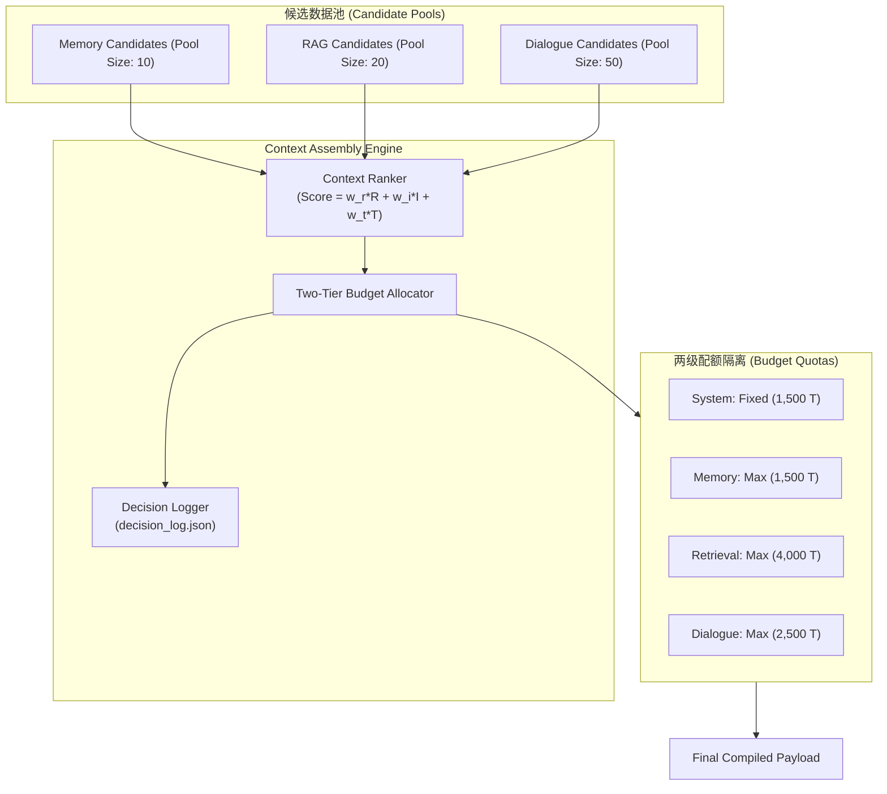

# Day 93 课堂笔记：Context Assembly Engine (动态上下文编译器) 与两级预算治理

## 一、 工业痛点与上下文编译原理

在生产级 Agent 运行中，简单地将所有召回的 RAG 知识片段、长期 Memory 事实与全部会话历史直接堆叠到 Prompt 中，会引发三大软件工程灾难：

1. **Context Starvation (上下文挤占效应)**：单次超大 RAG 检索（如 8,000 Token）会吞噬所有额度，导致 Memory 偏好与 User 最新指令被挤压至 0 Token。
2. **Lost in the Middle (注意力中间迷失)**：研究（Liu et al., 2023）表明，LLM 对位于长 Prompt 中间的文本感知能力呈 U 型衰减曲线。包含过量低质噪音会导致检索准确率急剧下降。
3. **Token 成本无上限失控**：无效无关信息的发送直接翻倍 API 计费。

为了解决上述问题，必须构建 **Context Assembly Engine (动态上下文编译器)**。其核心职责是在 LLM 发起调用前的毫秒级时间内，执行**“多维综合打分 (Ranking)”**、**“两级预算隔离裁切 (Two-Tier Budget Allocation)”**与**“全链路可观测性日志记录 (Context Decision Log)”**。

---

## 二、 核心打分算法与时间衰减模型

### 1. 综合质量评分公式 (Context Scoring)
打分引擎 (`ContextRanker`) 对任意上下文候选条目 $i$ 计算综合分值 $\text{Score}_i \in [0, 1.0]$：

$$\text{Score}_i = w_r \cdot \text{Relevance}_i + w_i \cdot \text{Importance}_i + w_t \cdot \text{Recency}_i$$

*   $\text{Relevance}_i$: 语义余弦相似度或 BM25 检索得分 ($0.0 \sim 1.0$)
*   $\text{Importance}_i$: 业务标注的实体/规则重要度权重 ($0.0 \sim 1.0$)
*   $\text{Recency}_i$: 基于时间戳的**指数衰减因子 (Exponential Time Decay)**：

$$\text{Recency}_i = e^{-\lambda \cdot (t_{current} - t_{item})}$$

其中半衰期参数 $\lambda = \frac{\ln(2)}{T_{half}}$。衰减机制保证越新鲜的会话消息与记忆享有越高的优先级权重。

---

## 三、 两级预算隔离分配模型 (Two-Tier Budget Allocation)



### 算法流程 (伪代码 < 20 行)

```python
# 两级预算裁剪算法伪代码
def assemble_context(candidates: List[ContextItem], policy: ContextPolicy) -> CompiledResult:
    selected_items, decision_logs = [], []
    category_token_usage = defaultdict(int)
    
    # 1. 优先按得分降序排列
    sorted_items = sorted(candidates, key=lambda x: x.score, reverse=True)
    
    for item in sorted_items:
        rule = policy.get_rule(item.context_type)
        curr_used = category_token_usage[item.context_type]
        
        # 2. 两级预算校验：分类硬上限与全局总硬上限
        if curr_used + item.tokens <= rule.max_tokens and global_tokens + item.tokens <= policy.global_max_tokens:
            selected_items.append(item)
            category_token_usage[item.context_type] += item.tokens
            decision_logs.append({"id": item.id, "selected": True, "reason": "High Score & Within Budget"})
        else:
            decision_logs.append({"id": item.id, "selected": False, "reason": f"Quota Exceeded ({curr_used}/{rule.max_tokens})"})
            
    return selected_items, decision_logs
```

---

## 四、 参考文献与学术支持

1.  **Lost in the Middle: How Language Models Use Long Contexts (arXiv:2307.03172)**  
    [https://arxiv.org/abs/2307.03172](https://arxiv.org/abs/2307.03172)  
    证实了 LLM 对 Prompt 中间位置信息的忽视，阐明了利用 `ContextRanker` 将关键信息精简并前置/后置的必要性。
2.  **MemoryBank: Enhancing Large Language Models with Long-Term Memory (arXiv:2305.10250)**  
    [https://arxiv.org/abs/2305.10250](https://arxiv.org/abs/2305.10250)  
    详细论述了指数时间衰减模型在 Agent 记忆与上下文关联中的数学推导。
