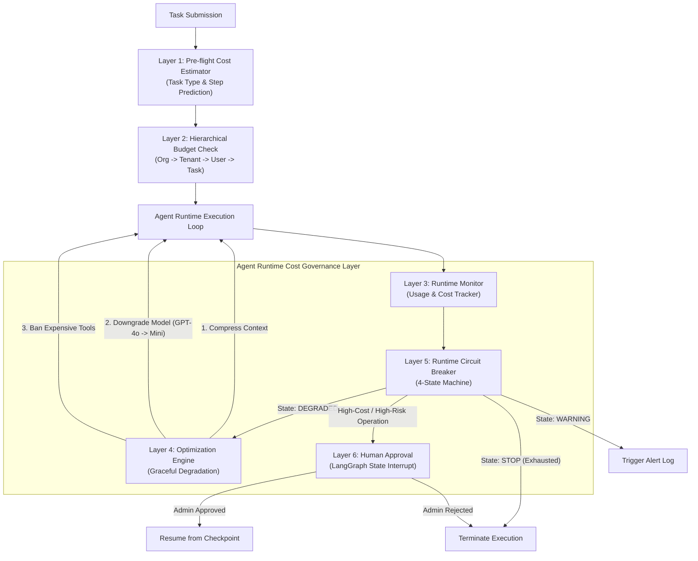
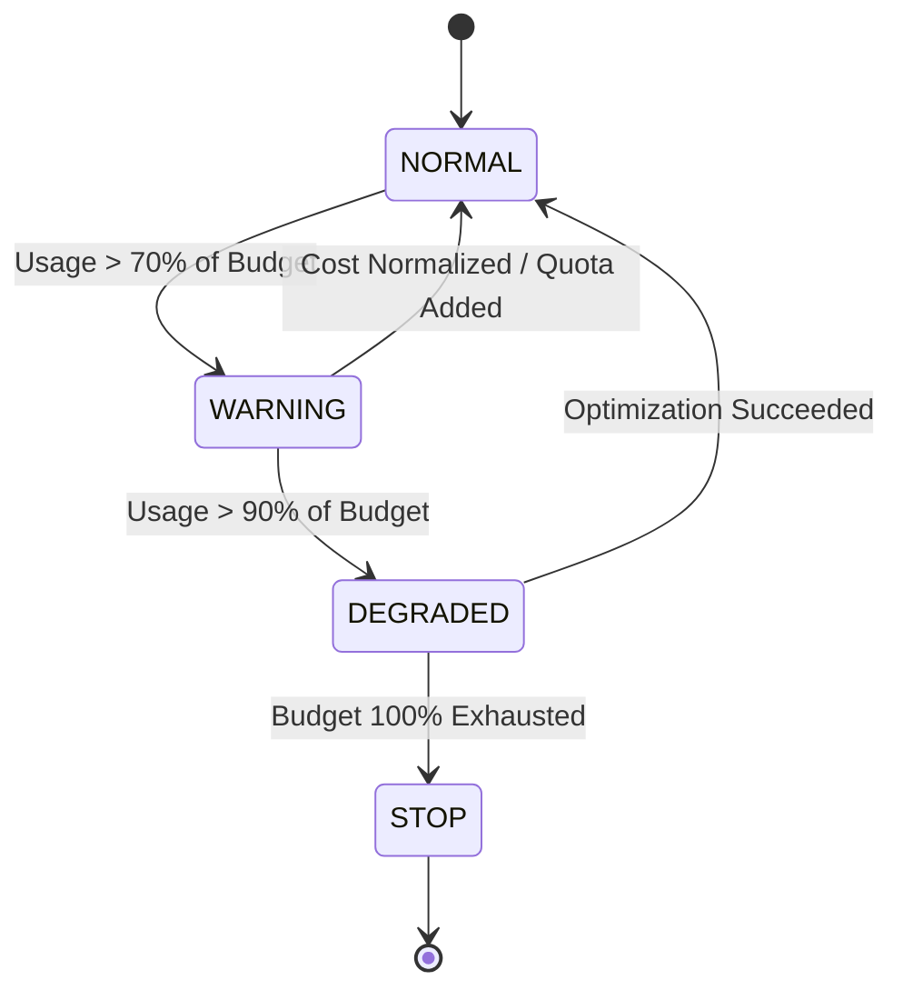

# Day 94 课堂笔记：Enterprise Agent Runtime Cost Governance & AI FinOps 架构

## 一、 工业背景与 Level 1 vs Level 4 架构进化

在传统 MVP 或 Demo 阶段的 Agent 开发中，成本控制往往简单粗暴地表现为一个安全阀（Hard Limit Break）：

```python
# 🔴 MVP 阶段粗暴代码 (不具备生产可用性)
if current_tokens > 10000:
    raise Exception("Token limit exceeded, killing Agent!")
```

这种直接杀掉 Agent（Kill Agent）的模式在真实生产集中环境（如企业级 AI 平台、SaaS 多租户系统）中存在致命缺陷：
1. **未完成任务上下文丢失**：Agent 已经运行了 8 轮、消耗了 $0.5 美元，因为差 10 个 Token 被硬生生拔掉电源，之前的所有计算投入全部泡汤。
2. **缺乏预判与归因**：无法在提交 Task 前告知用户预算是否足够，也无法得知究竟是哪一个步骤或哪一个昂贵工具导致了账单爆炸。
3. **无法隔离租户与组织**：无法防止单用户恶意消费击穿整个企业或 Project 的云厂商限额。

生产级 Agent 必须从“单体硬熔断”进化为 **Enterprise Agent Runtime Cost Governance & AI FinOps System**。

---

## 二、 工业界参考标准 (Industry Best Practices)

### 1. OpenAI API Platform Projects & Usage Limits
根据 [OpenAI API Project Management Specification](https://help.openai.com/en/articles/9186755-managing-projects-in-the-api-platform)，企业级 API 治理引入了多维 Project 划分、成员角色隔离、速率限制 (Rate Limits) 与 **Spend Limits (硬性与软性月度美分限额)**。这启发了我们必须构建**多级分层预算模型 (Hierarchical Budget Engine)**。

### 2. LangGraph Persistence & Human Interrupt
根据 [LangGraph Interrupts Standard](https://docs.langchain.com/oss/python/langgraph/interrupts)，生产级 Agent 运行时不是单向死循环，而是基于 Checkpoint 挂起。当触发高费用操作或高危指令时，系统通过 `interrupt()` 挂起，等待人工审核（Human Approval），审批通过后通过 Checkpoint 复原 Resume 执行。

### 3. Google Vertex AI Throughput Quotas
根据 [Google Cloud Vertex AI Quota Docs](https://docs.cloud.google.com/vertex-ai/generative-ai/docs/resources/throughput-quota)，云厂商不仅监控 Token 消耗，更引入了吞吐量配额 (Throughput Quota) 与降级队列。当超出配额时，系统自动降级路由至容量更高的轻量级模型（如 Flash / Mini 版本）。

---

## 三、 六层成本治理护栏 (6-Layer Governance Architecture)



---

## 四、 六层护栏详细理论与数学模型

### Layer 1: Pre-flight Cost Estimator (执行前预估)
在任务提交（Pre-flight）阶段，根据历史同类任务步骤分布模型预测预估总费用：

$$\text{EstimatedCost} = \sum_{s=1}^{N_{\text{est}}} \left( \text{InputTokens}_s \cdot P_{\text{input}} + \text{OutputTokens}_s \cdot P_{\text{output}} \right) + \sum_{t=1}^{M_{\text{est}}} \text{ToolCost}_t$$

若 $\text{EstimatedCost} > \text{AvailableBudget}$，在任务提交刹那拒绝对接网络 API。

### Layer 2: Hierarchical Budget (多级分层预算)
建立五级垂直配额继承树：
$$\text{OrgBudget} \ge \text{TenantBudget} \ge \text{UserBudget} \ge \text{AgentBudget} \ge \text{TaskBudget}$$
任何一级的配额穿透都会触发父级的隔离报警，防止单用户将企业账户资源耗尽。

### Layer 3 & 5: Runtime Monitor & Circuit Breaker (4 态熔断状态机)



*   **`NORMAL`**：全功能运行，使用旗舰大模型与全量工具。
*   **`WARNING`**：写日志发告警，预先准备降级队列。
*   **`DEGRADED`（优雅降级 mode）**：
    1. 触发增量 Context 压缩，裁切低分历史；
    2. 将请求路由自 GPT-4o / Claude-3.5 降级为 GPT-4o-mini / Qwen-Flash；
    3. 禁用高开销付费 Tool（如搜索 API、沙盒计算）。
*   **`STOP`**：只有在优雅降级完全无法挽救且配额彻底耗尽时，才执行停机断电。

### Layer 4: Optimization Engine (优雅降级决策树)
不是直接断电，而是按照优先级梯度进行降级尝试：
`Compress Context` $\rightarrow$ `Model Downgrade` $\rightarrow$ `Restrict Tools` $\rightarrow$ `Stop`

### Layer 6: Human Approval (人机协同挂起恢复)
当检测到单次 Tool 调用费用高于安全红线（如单次 API 调用需 $2.00 美元），或者准备执行高风险物理动作（如删除数据、推送生产变更）时：
1. 挂起当前 State 并持久化到 Checkpoint 容器；
2. 触发 `HumanApprovalRequiredException`，生成包含批准 UUID 的 Token；
3. 后台管理员审阅通过后，通过 `resume(approval_id)` 从挂起点无缝继续执行。
