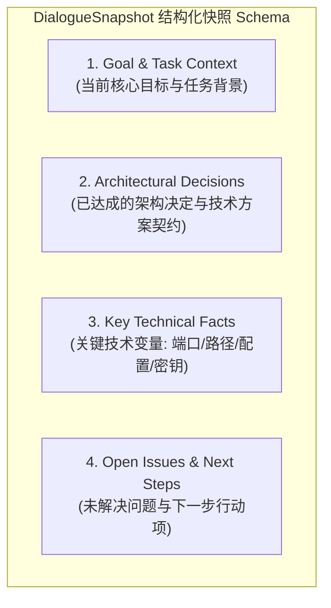
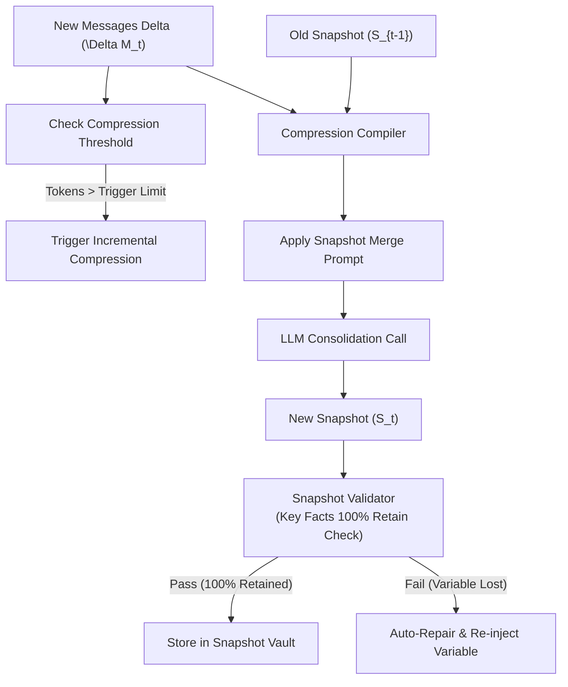
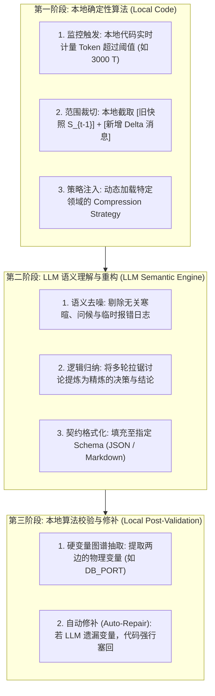

# Day 95 课堂笔记：Context Compression 与 Incremental Memory Consolidation

## 一、 工业背景与算法演进

在长任务 Agent（如运行 30 分钟以上的代码重构 Agent、深度论文研报 Agent）中，对话历史随着交互轮次呈线性上升。如果不加干预，上下文很快就会膨胀至数万甚至数十万 Token。

下表对比了主流的上下文处理方案：

| 方案模式 | 运行机制 | 优点 | 缺点 / 工业致命隐患 |
| :--- | :--- | :--- | :--- |
| **全量保留 (Full History)** | 保留所有历史 Message 列表 | 零信息丢失 | 计费极高、响应极慢、触发 Token 溢出 |
| **滑动窗口 (Sliding Window)** | 仅保留最近 $N$ 轮，裁切丢弃前文 | 实现极简单 | **Context Loss（上下文失忆）**：丢失前文已确认的架构决策与关键变量 |
| **全量重新压缩 (Full Re-compression)**| 每次把第 $1 \sim N$ 轮全量发给 LLM 重新生成摘要 | 无滑动断层 | 计算复杂度 $O(N^2)$，极慢且产生**累积幻觉** |
| **增量摘要压缩 (Incremental Compression)**| **$\text{Old Snapshot} + \text{Delta Messages} \rightarrow \text{New Snapshot}$** | **复杂度 $O(1)$，常数级 Token 消耗，变量 100% 留存** | 需要设计严格的强 Schema 结构化快照 |

---

## 二、 增量归约算法推导 (Incremental Update Model)

假设系统当前处于第 $t$ 次压缩周期：
*   $S_{t-1}$: 上一次压缩生成的结构化对话快照（Dialogue Snapshot）， Token 占用约 $300 \sim 500$ Tokens。
*   $\Delta M_t$: 最近新增的 $N$ 轮未压缩消息（Delta Messages）， Token 占用约 $1,500 \sim 3,000$ Tokens。

增量归约计算公式定义为：

$$S_t = \text{ExtractAndConsolidate}(S_{t-1}, \Delta M_t)$$

无论历史总轮次累积到多少轮（如 10 轮还是 100 轮），每次发往 LLM 进行归约的输入 Token 数量固定维持在 $|S_{t-1}| + |\Delta M_t|$ 的常数范围内，使归约计算开销实现 $O(1)$ 级控制。

---

## 三、 结构化对话快照 Schema (`DialogueSnapshot`)

为了防止大模型在压缩过程中将关键的技术变量（如数据库端口号、API 密钥路径、配置文件路径等）当成废话过滤掉，快照必须被强制约束为 4 大不可动摇的黄金区块：



### 快照 Markdown 规范格式
```markdown
# Dialogue State Snapshot
- **Goal & Task**: 设计高可用 Redis 缓存层
- **Architectural Decisions**: 选用 Redis Sentinel 哨兵架构，禁用 keys 命令
- **Key Technical Facts**: 
  - `REDIS_PORT`: 6379
  - `SENTINEL_PORTS`: [26379, 26380, 26381]
  - `CLUSTER_NAME`: "mymaster"
- **Open Issues & Next Steps**: 监控 Prometheus Exporter 尚未部署
```

---

## 四、 增量归约与变量校验流程



### 变量保留率校验算法 (Key Facts Retention Check)
校验器使用图谱或正则从原始文本中抽取硬变量表达式（如 `[A-Z0-9_]+=\w+`），比对 $S_{t-1} + \Delta M_t$ 中的变量图谱 $V_{\text{src}}$ 与新快照 $S_t$ 中的变量图谱 $V_{\text{target}}$：

$$\text{RetentionRate} = \frac{|V_{\text{src}} \cap V_{\text{target}}|}{|V_{\text{src}}|}$$

若 $\text{RetentionRate} < 100\%$，触发自动修补机制（Auto-Repair），强行将遗失的变量回填回 `Key Technical Facts` 区域，确保绝对零丢失。

---

## 五、 本地确定性算法与 LLM 语义能力的“三阶段双轮驱动”

在生产级 Agent 架构中，上下文归约遵循 **【本地算法的确定性】 + 【LLM 的语义理解力】** 的分工协作哲学：



*   **本地算法决定“什么时候压”和“把什么东西拿去压”**；
*   **LLM 决定“压缩归纳成什么”**；
*   **本地算法兜底“绝对不漏掉核心技术变量”**。

---

## 六、 多场景可插拔的领域压缩策略矩阵 (Domain-Specific Compression Strategy)

在真实工业界中，一套固定的 Markdown Schema 无法涵盖所有 Agent 业务场景。必须设计可插拔的策略模式（Strategy Pattern）：

| 业务场景 (Domain) | 核心关注的上下文（应该保留的分类区块） | 示例关键变量 (Key Facts) |
| :--- | :--- | :--- |
| **软件工程 / 代码重构** | 架构决策、依赖库版本、部署配置、待办 Task | `DB_PORT`, `REDIS_HOST`, `JWT_SECRET` |
| **电商售后 / 客服 Agent** | 用户情绪变化、订单明细、已承诺补偿政策、服务单号 | `ORDER_ID`, `REFUND_AMOUNT`, `USER_SENTIMENT` |
| **医疗诊断 / 问诊 Agent** | 患者主诉症状、既往病史、药物过敏源、化验指标 | `ALLERGIES`, `BLOOD_PRESSURE`, `DIAGNOSIS` |
| **数据分析 / SQL Agent**  | 表结构 Schema、已应用的 Filter 条件、时间范围 | `TABLE_NAME`, `DATE_RANGE`, `WHERE_CLAUSE` |

### 架构代码拓展抽象 (伪代码)
```python
class BaseCompressionStrategy(ABC):
    @abstractmethod
    def get_system_prompt(self) -> str:
        """返回特定场景的 Prompt 契约"""
        pass
        
    @abstractmethod
    def extract_domain_variables(self, text: str) -> Dict[str, str]:
        """返回特定场景需 100% 留存的关键正则变量"""
        pass

class CustomerSupportStrategy(BaseCompressionStrategy):
    def get_system_prompt(self) -> str:
        return "请提取：1. 用户诉求与情绪; 2. 订单号及涉案金额; 3. 已承诺的补救方案..."

    def extract_domain_variables(self, text: str) -> Dict[str, str]:
        # 正则抽取 ORDER_ID=ORD-xxxx 等
        ...
```
