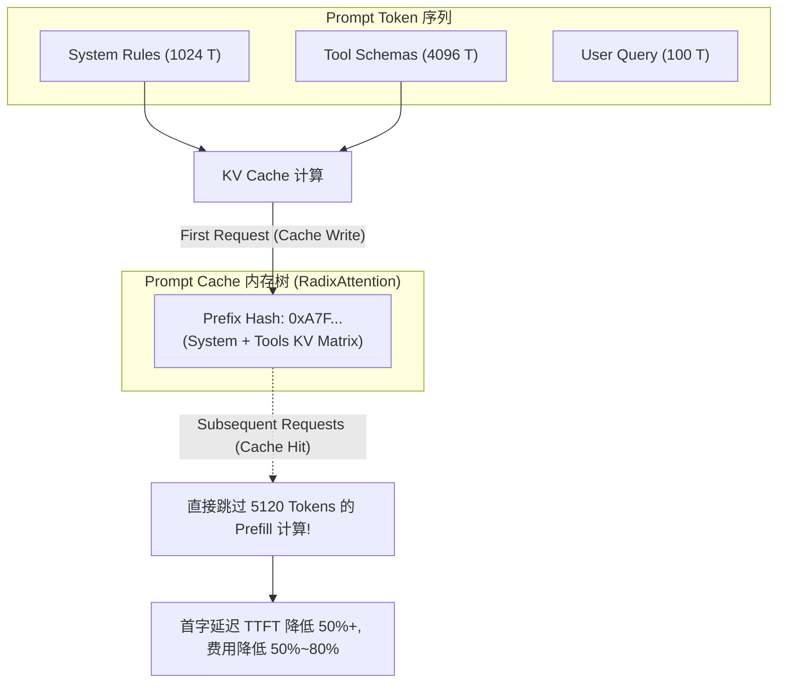
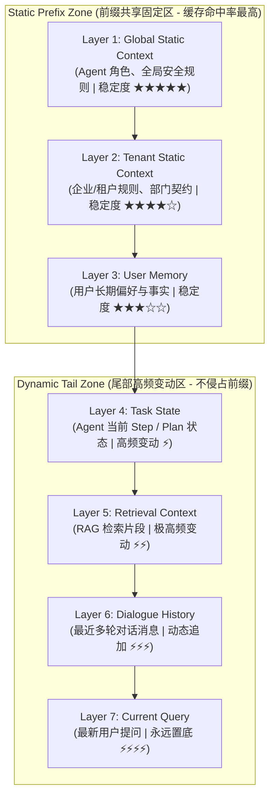

# Day 96 课堂笔记：Enterprise Context Layout Engine 与 Prompt Cache 工程化设计

## 一、 工业背景与 Prompt Caching 底层原理

在企业级 Agent 应用中（如包含数万 Token 工具定义与企业知识库的 AI Assistant），每次发给 LLM 的 Payload 中有 **60%~80% 的内容是完全静态不变的**。

如果每次请求都让大模型重新从 Token 1 计算到 Token 30,000，会导致：
1. **API 费用高昂**：重复为不变的 System Rules 与 Tool Schema 支付高额 Input 费用。
2. **首字延迟 (TTFT - Time To First Token) 过高**：Transformer 需要对数万 Prefix Token 执行全量 Prefill 注意力计算，导致用户等待数秒才开始流式输出。

### Transformer KV Cache 重用机制
Prompt Caching 不是缓存最终的文本答案，而是缓存 Transformer 推理引擎（如 vLLM/SGLang）中的 **Key-Value Cache (KV Cache)** 计算结果。



---

## 二、 工业界两大云厂商 Cache 机制深度对比

根据官方文档：
*   **Anthropic Prompt Caching**: [https://docs.anthropic.com/en/docs/build-with-claude/prompt-caching](https://docs.anthropic.com/en/docs/build-with-claude/prompt-caching)
*   **OpenAI Prompt Caching**: [https://platform.openai.com/docs/guides/prompt-caching](https://platform.openai.com/docs/guides/prompt-caching)

| 维度 | Anthropic Prompt Caching | OpenAI Prompt Caching |
| :--- | :--- | :--- |
| **缓存触发方式** | **Explicit Control (显式标记)** | **Automatic Matching (自动前缀匹配)** |
| **开发者语法** | 在 Block 添加 `"cache_control": {"type": "ephemeral"}` | 零代码修改，要求前缀 Token 序列 100% 一致 |
| **最小缓存门槛** | Claude-3.5 Sonnet: **1,024 Tokens** | GPT-4o: **1,024 Tokens** (以 128 Token 增量块递增) |
| **缓存存活时间 (TTL)**| 5 分钟 (每次命中自动刷新 TTL) | 5~10 分钟 (动态管理) |
| **计费折扣** | Cache Write: +25% | Cache Read: **-50% 折扣** (Cache Read 价格为普通 Input 半价) |
|              | Cache Read: **-90% 折扣** (仅收 10% 费用) | |

---

## 三、 生产级 7 层 Context Segment 分成与稳定性布局

为了确保前缀哈希 (Prefix Hash) 在多轮、高频、多租户场景下保持 100% 一致，**Context Layout Engine** 将上下文划分为 7 级稳定性梯队：



### 七层 Segment 详细职责

1. **Layer 1 (Global Static)**: 全局人设与硬性格式规范，变动率 ~ 0，所有用户共享缓存。
2. **Layer 2 (Tenant Static)**: 多租户隔离层（如医院 A、部门 B 专属规章），按 `tenant_id` 建立租户级缓存前缀。
3. **Layer 3 (User Memory)**: 用户长期偏好（如偏好 Java、禁用 eval），按 `user_id` 共享。
4. **Layer 4 (Task State)**: 当前 Agent 规划与 Step 进度（如 Step 3/5）。
5. **Layer 5 (Retrieval Context)**: RAG 向量检索召回的 Top-K 结果（每轮提问可能发生变化）。
6. **Layer 6 (Dialogue History)**: 聊天消息历史。
7. **Layer 7 (Current Query)**: 用户最新一次发起的 Prompt，物理上**永远放置在最后**。

---

## 四、 静态前缀占比 (Static Prefix Ratio) 与成本推导

### 计算公式
布局分析器 (`CacheAnalyzer`) 计算 Prompt 的静态前缀占比 $\text{Ratio}_{\text{static}}$：

$$\text{Ratio}_{\text{static}} = \frac{\sum_{i \in \text{StaticLayers}} \text{Tokens}(L_i)}{\text{TotalTokens}}$$

### 理论成本节省公式
假设单次请求 Input 费用为 $P_{\text{input}}$，前缀缓存读取折扣为 $d_{\text{cache}}$（如 Anthropic 为 $0.1$，OpenAI 为 $0.5$）：

$$\text{Cost}_{\text{optimized}} = \text{TotalTokens} \cdot P_{\text{input}} \cdot \left[ (1 - \text{Ratio}_{\text{static}}) + \text{Ratio}_{\text{static}} \cdot d_{\text{cache}} \right]$$

在静态前缀占比达到 $70\%$ 时，Anthropic 环境下可**直接降低 63% 的总 Input 成本**！

---

## 五、 多租户缓存隔离 (Multi-Tenant Cache Isolation) 伪代码

```python
# 多租户前缀隔离伪代码 (< 20 行)
def build_tenant_isolated_payload(tenant_id: str, segments: List[ContextSegment]) -> List[Dict]:
    # 1. 严格过滤非本租户的静态 Segment
    tenant_static = [s for s in segments if s.scope in ("global", f"tenant:{tenant_id}")]
    
    # 2. 必须先拼 Global Static，再拼 Tenant Static，最后拼动态尾部
    ordered_segments = sorted(tenant_static, key=lambda s: s.layer_index)
    
    # 3. 生成具备前缀对齐保障的 Payload
    return [{"role": "system", "content": "\n".join([s.content for s in ordered_segments])}]
```
