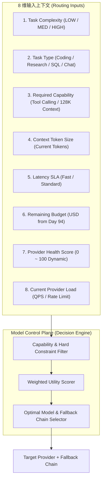
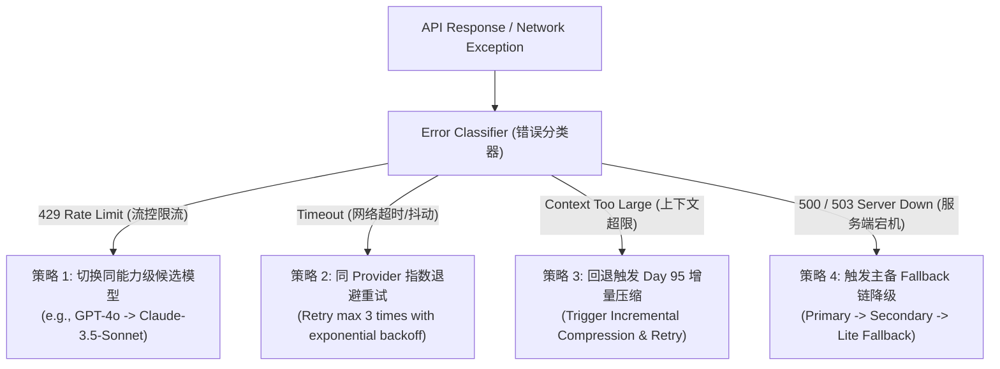

# Day 97 课堂笔记：Agent Model Control Plane & LLM Gateway 基础设施

## 一、 工业背景：微服务 Gateway vs Agent Control Plane

在简单的 Demo 中，模型路由往往被简化为一个低维分类器：`Complexity => LOW / MEDIUM / HIGH => Model Choice`。

然而在企业级 Agent Platform 生产环境中，这种粗放的分类存在四大工程瓶颈：
1. **能力不匹配 (Capability Mismatch)**：同样是 HIGH 复杂度的任务，SQL 生成需要 Coding 强化模型，而 10 万字合同审查需要 128K+ 窗口模型；如果只靠 LOW/HIGH 划分，极易分配给不支持 Tool Calling 或上下文不足的模型。
2. **盲目 Fallback (Naive Retry/Switch)**：当发生 API 失败时，直接无脑切备用模型是危险的。如果是 429 (Rate Limit)，说明模型健康只是需要切同级节点；如果是 Context 溢出，切模型毫无作用，必须触发 Day 95 的增量压缩。
3. **缺乏预算联动 (Budget Disconnect)**：Router 不知道 Day 94 治理引擎中的剩余 Task 预算，导致在只剩 $0.01 美元时依然分发给 GPT-4.5 导致任务熔断。
4. **缺乏 Agent 节点感知 (Node-Level Unawareness)**：Agent 在单次任务中包含 `Planner`（规划）、`Executor`（工具执行）、`Reflection`（反思）等不同节点，所有节点使用统一模型会带来巨大的资金浪费。

必须将简单的“API 代理网关”升维为 **Agent Model Control Plane (模型决策控制平面)**。

---

## 二、 8 维路由决策引擎 (8-Dimension Decision Engine)



### 动态健康评分公式 (Dynamic Health Score)
对于任意 Provider 节点，实时计算 0 ~ 100 的健康分值 $\text{HealthScore} \in [0, 100]$：

$$\text{HealthScore} = 100 \times \text{SuccessRate} \times \exp\left(-\frac{\text{P95\_Latency}}{2000}\right) \times (1 - \text{ErrorRate}) \times \left(1 - \frac{\text{CurrentLoad}}{\text{MaxCapacity}}\right)$$

当 $\text{HealthScore} < 40$ 时，节点进入隔离衰减队列，路由引擎自动将其调出主推荐链。

---

## 三、 Error Classifier 与智能 Fallback 路由矩阵

生产级 Gateway 绝对不能在抛出 Exception 后只做单向 switch。必须引入 **Error Classifier（错误分类器）** 执行差异化策略：



---

## 四、 LangGraph 节点级路由 (Node-Level Routing)

在 Multi-Agent 或 ReAct 架构中，针对不同的 Agent 节点分配最适配、性价比最高的模型：

```text
                           LangGraph Agent Task
                                    │
       ┌────────────────────────────┼────────────────────────────┐
       ▼                            ▼                            ▼
  Planner Node                Executor Node               Reflection Node
 (高复杂推理 / 规划)          (高频工具调用 / 结构提取)       (关键逻辑审查 / 纠错)
       │                            │                            │
       ▼                            ▼                            ▼
Model Router Decision        Model Router Decision        Model Router Decision
 (Flagship: GPT-4o)          (Lite: GPT-4o-mini / Qwen)   (Flagship: Claude-3.5)
```

1. **Planner Node**：需要极致的 Logical Reasoning，路由至旗舰模型；
2. **Executor Node**：仅需提取参数与执行工具，路由至高性价比轻量模型（GPT-4o-mini / Qwen-Flash），直接缩减 **70% 运行成本**；
3. **Reflection Node**：需要判断错误原因，路由至高精度验证模型。
