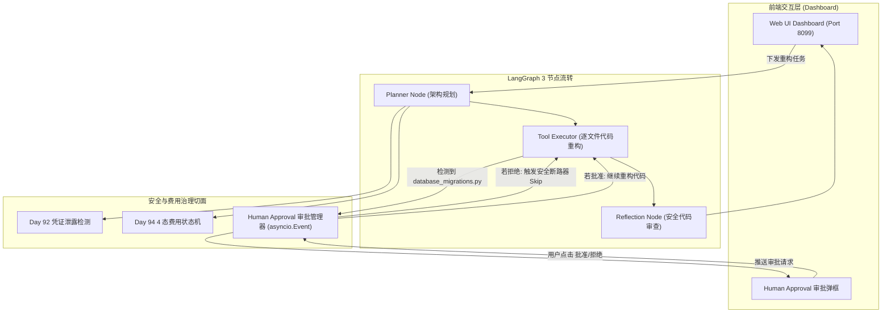

# Day 98 场景二: Coding Agent — 多文件代码重构与 Human Approval Runtime

> **Enterprise Agent Context Runtime Platform | 端口 8099**

## 📖 1. 业务场景与痛点分析

在企业级代码库重构任务中，平台工程师指示 Agent 将现有系统的认证模块从 Session-based Auth 全面升级至 JWT + Refresh Token 机制。该任务涉及 `auth_middleware.py`、`token_service.py`、`user_routes.py` 和 `database_migrations.py` 等 4 个核心文件。

**主要痛点**：
1. **代码凭证泄露风险**：源码中可能硬编码了真实 Secret Key 或数据库密码，Agent 在处理和上传 Context 时存在泄露隐患。
2. **高危操作无监督**：数据库迁移脚本（`database_migrations.py`）属于高危写操作，AI 若自动误删表或执行不当 Schema 变更将引发生产事故。
3. **上下文爆炸与费用失控**：4 个完整代码文件超 20,000 Tokens，若每个重构节点均全量携带并调用顶级模型，费用将急速攀升。

---

## 🌟 2. 核心系统功能 (System Features)

* **🔄 LangGraph 3 节点协同编排 (3-Node Graph Architecture)**：
  将重构解耦为 `Planner Node`（架构规划）、`Tool Executor`（代码改写）、`Reflection Node`（安全代码审查）3 个高内聚节点。
* **🔐 Tool 输出凭证泄露拦截 (Hardcoded Credentials Shield)**：
  集成 Day 92 隔离引擎，自动扫描代码中的硬编码 API Key / Secret Key，并在 Dashboard 上弹出红字安全提示。
* **🛑 真实 Human-in-the-Loop 审批与断路器 (Async Human Approval)**：
  在尝试改写 `database_migrations.py` 时触发 `asyncio.Event` 挂起，弹框请求 DBA 审批。**若用户点击“❌ 拒绝”，安全断路器生效，系统自动拦截并跳过该高危文件的重构**。
* **💰 FinOps 费用治理 4 态状态机 (4-State Cost Governance)**：
  实时监控 Token 与 USD 消耗，按预算触发 `NORMAL` -> `WARNING` -> `DEGRADED` -> `STOP` 状态流转。当预算超标时，自动将后继节点降级为轻量模型。
* **📊 节点级模型路由与费用节省量化 (Routing & Savings Analytic)**：
  支持节点差异化路由（如 Planner 使用旗舰大模型、Executor 自动使用轻量模型），并在 Dashboard 上量化对比“相比全量旗舰模型”所节省的费用比例（通常可达 30%~50% 成本优化）。

---

## 🏗️ 3. 生产级系统架构 (Architecture Diagram)



---

## 🧩 4. 微引擎集成契约 (Micro-Engine Matrix)

| 微引擎层级 | 核心物理文件 | 验证点与解决痛点 |
| :--- | :--- | :--- |
| **Day 92 信任边界** | [context_impl.py](file:///Users/zhouyi/03.AI/03.freshManStart/weekly/w14_context_engineering/day92/context_impl.py) | 扫描 Tool 输出代码中的硬编码 JWT Secret / Database Password |
| **Day 93 动态组装** | [builder_impl.py](file:///Users/zhouyi/03.AI/03.freshManStart/weekly/w14_context_engineering/day93/builder_impl.py) | 将 20,000 Token 的 4 代码文件组装并精简裁切至 3,000 Token |
| **Day 94 费用治理** | [governance_impl.py](file:///Users/zhouyi/03.AI/03.freshManStart/weekly/w14_context_engineering/day94/governance_impl.py) | 4 态状态机监控 ($0.15 预算限制) + `asyncio.Event` 审批挂起 |
| **Day 97 路由网关** | [router_gateway_impl.py](file:///Users/zhouyi/03.AI/03.freshManStart/weekly/w14_context_engineering/day97/router_gateway_impl.py) | 节点差异化路由 (Planner: gpt-4o, Executor: gpt-4o-mini) |

---

## 📡 5. API 与 HTTP/WebSocket 接口规范

### 1. WebSocket Endpoint: `/ws/coding`
发送任务指令：
```json
{
  "task": "将 Session-based Auth 重构为 JWT 机制"
}
```

### 2. HTTP POST API: `/api/approval/{approval_id}`
当接收到 `approval_request` 事件后，前端通过 HTTP 接口回传审批结果：
```bash
# 批准高危操作
curl -X POST "http://localhost:8099/api/approval/416bb9f4?approved=true"

# 拒绝高危操作 (触发安全断路器)
curl -X POST "http://localhost:8099/api/approval/416bb9f4?approved=false"
```

---

## 🚀 6. 快速启动

```bash
# 切换至场景二目录
cd weekly/w14_context_engineering/day98/scenario_coding

# 启动 Server 节点
bash start.sh
```

启动完成后，打开浏览器访问 **`http://localhost:8099`** 体验 Coding Agent 重构与安全审批 Dashboard。
