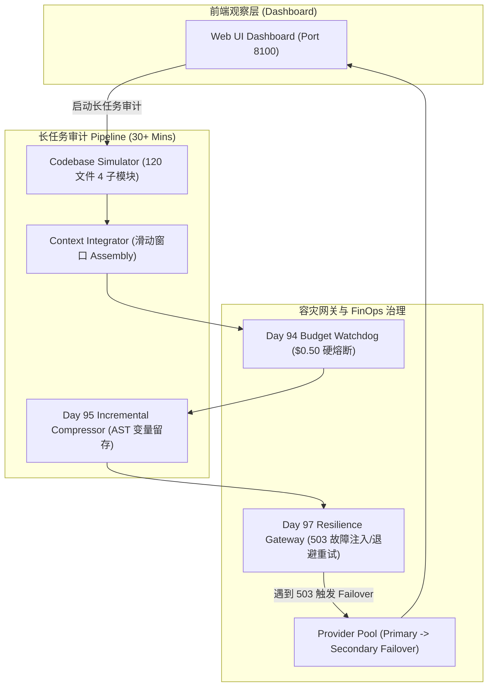

# Day 98 场景三: Long Task Agent — 120 文件长任务代码审计 Runtime

> **Enterprise Agent Context Runtime Platform | 端口 8100**

## 📖 1. 业务场景与痛点分析

在大型分布式微服务网关安全审计场景中，安全合规 Agent 需要对包含 120 个 Python 源码文件（涵盖 Auth、Gateway、Data Pipeline、Admin 等 4 大子模块）的代码库执行连续的 OWASP Top 10 漏洞扫描。任务持续运行 30 分钟以上。

**主要痛点**：
1. **Context 线性膨胀与 Window 溢出**：扫描 120 个文件产生的历史 Audit Trace 会使上下文轻松飙升至 100,000+ Tokens，造成 Context 溢出或严重延迟。
2. **长时间运行的配额击穿**：长任务运行中如果缺少实时 FinOps 配额看门狗，极易单次任务消耗数十美金。
3. **网络与 Provider 宕机断连**：长任务期间，第三方大模型 Provider 出现 `503 Service Unavailable` 或 `504 Gateway Timeout` 的概率高达 95%+，缺少容灾将导致整个任务崩溃前功尽弃。

---

## 🌟 2. 核心系统功能 (System Features)

* **🔍 120+ 文件连续代码安全审计 (Continuous Bulk Code Auditing)**：
  自动化遍历包含 4 子模块的工程树，逐文件扫描分析，生成漏洞判定矩阵（如发现 SQL 注入、未授权 CORS、DES 硬编码等）。
* **📦 增量上下文压缩与 AST 留存 (Incremental Context Compression)**：
  基于 Day 95 增量压缩算法 $S_t = \text{Compress}(S_{t-1} + \Delta M)$，在每个子模块扫描完成后自动触发增量压缩，在保留关键 AST 变量与漏洞指纹的前提下，将 Context 长度大幅压缩 70%+。
* **🛡️ $0.50 预算看门狗 (FinOps Budget Watchdog)**：
  集成看门狗控制，设置硬性 $0.50 预算上限。实时监控连续 30 分钟扫描过程中的资金消耗，超标自动平滑降级或熔断保护。
* **⚡ 503 故障注入与高可用容灾网关 (Fault Injection & High Availability Gateway)**：
  物理模拟在第 15、45、85 个文件审计时注入 `503 Service Unavailable` 故障，验证网关的指数退避重试（Exponential Backoff）与自动 Failover 备用 Provider 切换能力。
* **📈 长任务演进可视化 Dashboard (Long-task Observability Panel)**：
  实时绘制 120 文件扫描进度条、Token 增长折线图、增量快照演进时间线、漏洞判定列表以及 Provider 心跳健康度。

---

## 🏗️ 3. 生产级系统架构 (Architecture Diagram)



---

## 🧩 4. 微引擎集成契约 (Micro-Engine Matrix)

| 微引擎层级 | 核心物理文件 | 验证点与解决痛点 |
| :--- | :--- | :--- |
| **Day 92+93 组装管线** | [builder_impl.py](file:///Users/zhouyi/03.AI/03.freshManStart/weekly/w14_context_engineering/day93/builder_impl.py) | 120 个文件迭代滑动窗口 Context 组装 |
| **Day 94 预算看门狗** | [governance_impl.py](file:///Users/zhouyi/03.AI/03.freshManStart/weekly/w14_context_engineering/day94/governance_impl.py) | 30 分钟连续运行 $0.50 预算配额强管控 |
| **Day 95 增量压缩** | [compressor_impl.py](file:///Users/zhouyi/03.AI/03.freshManStart/weekly/w14_context_engineering/day95/compressor_impl.py) | $S_t = \text{Compress}(S_{t-1} + \Delta M)$ 增量快照，保留关键 AST 指纹 |
| **Day 96 静态哈希锁** | [layout_impl.py](file:///Users/zhouyi/03.AI/03.freshManStart/weekly/w14_context_engineering/day96/layout_impl.py) | 120 轮扫描保持前缀 Layout 稳定 |
| **Day 97 容灾网关** | [router_gateway_impl.py](file:///Users/zhouyi/03.AI/03.freshManStart/weekly/w14_context_engineering/day97/router_gateway_impl.py) | 第 15/45/85 文件处 503 故障注入与优雅指数退避 Failover |

---

## 📡 5. API 与 WebSocket 交互协议

### WebSocket Endpoint: `/ws/audit`
前端连接建立后，下发长任务指令：
```json
{
  "command": "start_audit",
  "scope": "all_120_files"
}
```

### 服务端事件流 (Event Stream Payload)
- **`file_scanned`**: 单文件审计完成 (`file_index`: 15, `vulnerability_found`: `true`, `vuln_type`: `"SQL_INJECTION"`)
- **`compression_triggered`**: 增量压缩完成 (`snapshot_id`: 2, `original_tokens`: 12500, `compressed_tokens`: 3200, `retention_ratio`: 0.95)
- **`fault_injected`**: 故障注入感知 (`injected_status`: 503, `action`: `"Exponential Backoff Retry 2/3"`)
- **`provider_failover`**: 供应商容灾切换 (`from`: `"Primary-LLM"`, `to`: `"Backup-LLM"`)

---

## 🚀 6. 快速启动

```bash
# 切换至场景三目录
cd weekly/w14_context_engineering/day98/scenario_longtask

# 启动 Server 节点
bash start.sh
```

启动完成后，打开浏览器访问 **`http://localhost:8100`** 体验 Long Task Agent 120 文件安全审计与容灾 Dashboard。
