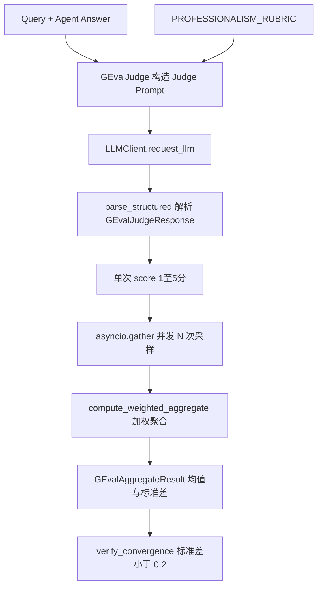
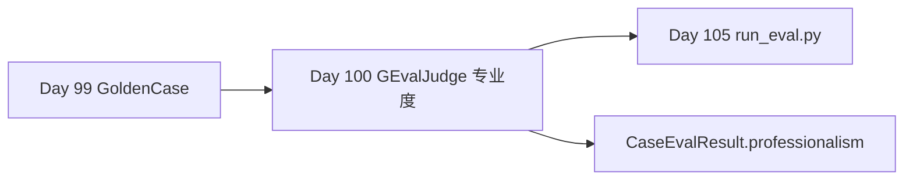

# Day 100 课堂笔记：G-Eval LLM-as-Judge 评测指标数学设计

## 一、工业背景：自由文本 Agent 回复的量化评测困境

W14 Research Agent 生成的蛋白质 LM 对比分析报告是自由文本，无法通过 BLEU、ROUGE 或精确字符串匹配来量化质量。传统 n-gram 重叠指标对 paraphrase（同义改写）完全失效：Agent 用不同措辞表达相同专业结论时会得零分，而堆砌错误术语的流畅文本反而可能得高分。

### 1. LLM-as-Judge 的核心矛盾

| 问题 | 表现 | 工程后果 |
| :--- | :--- | :--- |
| 判定标准主观 | 同一回复不同 Judge 给分差异大 | CI 阈值无法稳定 |
| 无 CoT 直接给分 | Judge 跳过推理直接输出分数 | 分数不可审计、不可复现 |
| 单次采样波动 | temperature > 0 时分数抖动 | 回归测试误报 |
| 思考链污染 | `<think>` 包裹 JSON | 解析崩溃 |

G-Eval 框架通过 **Rubric 离散化 + CoT 强制推理 + 多次采样聚合** 解决上述问题。

### 2. 权威文献引用

- 📄 **[G-Eval: NLG Evaluation using GPT-4 with Better Human Alignment (arXiv:2303.16634)](https://arxiv.org/abs/2303.16634)**：Rubric + CoT + 概率加权评分框架。
- 📄 **[Judging LLM-as-a-Judge with MT-Bench and Chatbot Arena (arXiv:2306.05685)](https://arxiv.org/abs/2306.05685)**：LLM Judge  position bias 与一致性分析。
- 🌐 **[DeepEval G-Eval Metric](https://deepeval.com/docs/metrics-llm-evals)**：工业级 G-Eval 接入参考。

---

## 二、G-Eval 框架：Rubric + CoT + 多次采样

### 1. Evaluation Rubric 离散化设计

G-Eval 要求每个分数段 (1-5) 有**可操作的判定标准**，避免 Judge 随意给分：

| 分数 | 标签 | W14 Research Agent 专业度判定 |
| :--- | :--- | :--- |
| 1 | 外行 | 术语误用、逻辑混乱、数据编造 |
| 2 | 入门 | 可读但无定量指标 |
| 3 | 合格 | 术语正确、对比简单 |
| 4 | 专业 | 含 F1/AUROC 指标与方法论区分 |
| 5 | 卓越 | 多维度对比 + Scaling/任务类型细分 |

### 2. CoT 强制推理步骤

Judge Prompt 必须列出强制推理步骤，要求 LLM **先逐步分析再给分**：

```text
步骤 1: 识别核心论点与对比模型
步骤 2: 检查术语准确性 (MLM, Contact Prediction 等)
步骤 3: 评估定量指标引用 (F1, AUROC, Spearman ρ)
步骤 4: 评估论证结构完整性
步骤 5: 对照 Rubric 给出 1-5 分
```

输出契约 (`GEvalJudgeResponse`) 通过 Pydantic 强制包含 `evaluation_steps` 数组。

### 3. G-Eval 评测数据流



---

## 三、多次采样聚合的数学定义

### 1. 分数归一化

G-Eval 原始输出为 1-5 分 Likert 量表，流水线统一归一化至 [0.2, 1.0]：

\[
s_{\text{norm}} = \frac{s_{\text{raw}}}{5}
\]

与 Day 102 Faithfulness (0-1) 及 CaseEvalResult.professionalism 字段对齐。

### 2. 加权均值

默认等权 \(w_i = \frac{1}{N}\)，支持自定义权重：

\[
\bar{s} = \sum_{i=1}^{N} w_i \cdot s_{\text{norm},i}
\]

### 3. 加权标准差 (收敛指标)

\[
\sigma = \sqrt{\sum_{i=1}^{N} w_i \cdot (s_{\text{norm},i} - \bar{s})^2}
\]

**过关标准**：\(\sigma < 0.2\) 表示 Judge 在重测时数值收敛，Rubric 边界清晰。

### 4. 收敛性判定逻辑

```python
# 极简伪代码 (< 8 行)
responses = await asyncio.gather(*[score_once(q, a) for _ in range(5)])
normalized = [r.score / 5.0 for r in responses]
mean = sum(normalized) / len(normalized)
variance = sum((s - mean) ** 2 for s in normalized) / len(normalized)
converged = math.sqrt(variance) < 0.2
```

---

## 四、LLM 响应解析：中间件集成

Judge 模型 (如 MiniMax-M3) 常在 JSON 前输出 `<think>` 思考链。**禁止手写 regex/json.loads**，统一使用：

```python
from middlewares.llm_reliability_adapter import parse_structured
result = parse_structured(raw_llm_output, GEvalJudgeResponse)
```

中间件自动完成：思考链剥离 → BracketExtractor 栈提取 → 尾随逗号修补 → Pydantic 强校验。

---

## 五、与 Week 15 流水线集成



Day 105 的 `run_eval.py` 将对每条 Golden Case 的 `final_answer` 调用 `GEvalJudge.evaluate_professionalism()`，写入 `EvalRunReport`。

---

## 六、性能与参数调优

| 参数 | 推荐值 | 说明 |
| :--- | :--- | :--- |
| sample_count | 5 | 独立采样次数 |
| temperature | 0.2 | 低温度保证格式稳定 |
| max_concurrency | 3 | Semaphore 限流防 429 |
| CONVERGENCE_STD_THRESHOLD | 0.2 | 归一化分数标准差门禁 |

若 σ >= 0.2：检查 Rubric 分数段是否边界模糊，或降低 temperature 至 0.1。

---

## 七、本日练习交付物

| 文件 | 职责 |
| :--- | :--- |
| `contracts/schemas.py` | `GEvalJudgeResponse` / `GEvalAggregateResult` 契约 |
| `day100/practice.py` | GEvalJudge TODO 练习模版 |
| `evaluators/g_eval_judge_impl.py` | G-Eval Judge 标准答案 |

**过关验证**：运行 `python evaluators/g_eval_judge_impl.py`，5 次采样归一化分数 σ < 0.2，终端输出 PASS。
