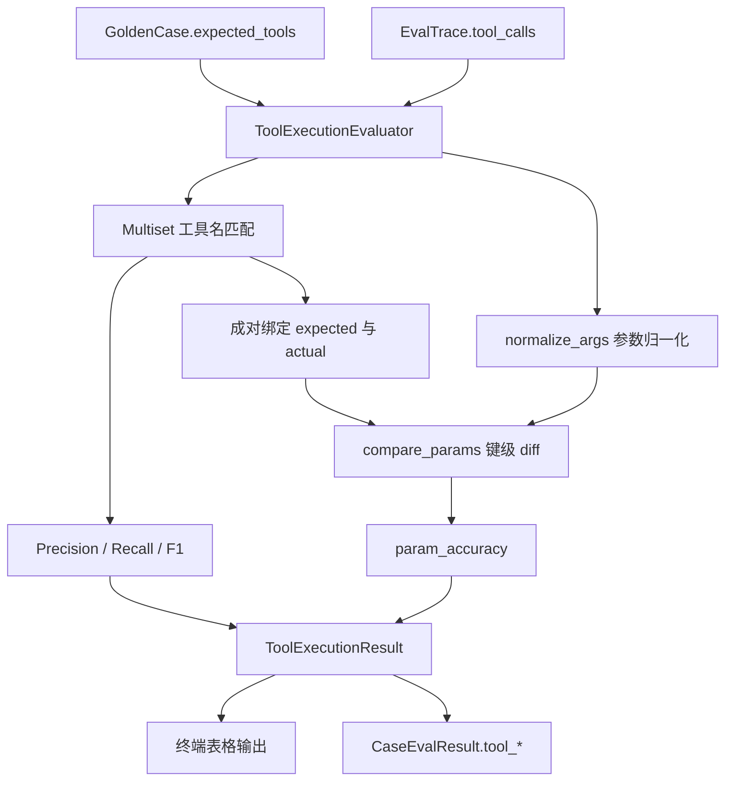
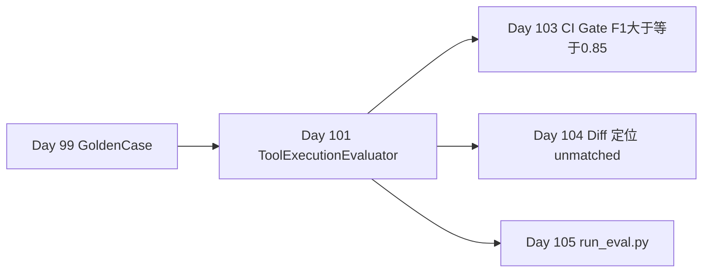

# Day 101 课堂笔记：工具调用 Precision / Recall / F1 评估

## 一、工业背景：ReAct Agent 工具链的确定性评测缺口

W14 Research Agent 通过 ReAct 循环调度 `rag_search`、`retrieve_memory`、`model_router` 等工具。自由文本回复可以"看起来专业"，但底层工具选错或参数漏传时，RAG 召回为空、Memory 偏好未注入，最终答案实质失效。Day 100 的 G-Eval 只能量化表述专业度，**无法检测工具链正确性**。

### 1. 工具调用失败的典型工程灾难

| 失败模式 | 表现 | 工程后果 |
| :--- | :--- | :--- |
| 工具选错 | 该调 `rag_search` 却调了无关工具 | 答案无检索依据，Faithfulness 虚假高分 |
| 参数漏传 | `top_k` 缺失或 `query` 为空 | 召回退化，CI 无确定性信号 |
| 多余调用 | 重复 / 无关 tool call | Token 成本上升，Precision 下降 |
| 参数漂移 | `query` 同义改写导致精确匹配失败 | 假阴性误报，阈值失真 |

确定性 P/R/F1 指标可在 CI 中零 LLM 成本复现，是 Day 103 门禁（F1 ≥ 0.85）的核心输入。

### 2. 权威文献与规范引用

- 📄 **[ReAct: Synergizing Reasoning and Acting in Language Models (arXiv:2210.03629)](https://arxiv.org/abs/2210.03629)**：工具调用轨迹作为 Agent 可观测中间态。
- 📄 **[ToolQA: A Dataset for LLM Question Answering with External Tools (arXiv:2306.13304)](https://arxiv.org/abs/2306.13304)**：工具选择准确率评测范式。
- 🌐 **[DeepEval Tool Correctness Metric](https://deepeval.com/docs/metrics-tool-correctness)**：工业级工具调用正确性参考。
- 🌐 **[Berkeley Function-Calling Leaderboard (BFCL)](https://gorilla.cs.berkeley.edu/leaderboard.html)**：参数 AST 级比对与 Multiset 匹配思路。

---

## 二、Multiset 匹配：顺序无关的工具名对齐

### 1. 为什么不用 list 顺序比对或 set 去重

ReAct Agent 的合法轨迹可能是：

```text
retrieve_memory → rag_search → rag_search (二次细化 query)
```

严格按序 list 比对会因调度顺序差异产生假阴性；简单 set 去重会丢失"同工具调用两次"的计数语义。

**正确方案**：将期望工具名与实际工具名视为 **Multiset（多重集合）**，贪心消费匹配：

```python
# 极简伪代码 (< 12 行)
from collections import Counter
expected_names = Counter(e.name for e in expected_tools)
actual_names = Counter(a.name for a in actual_calls)
tp = sum((expected_names & actual_names).values())
fp = sum((actual_names - expected_names).values())
fn = sum((expected_names - actual_names).values())
```

### 2. 评测数据流



---

## 三、Precision / Recall / F1 数学定义

### 1. 混淆矩阵映射

| 符号 | 含义 |
| :--- | :--- |
| TP | 期望工具名被实际调用"消费"的次数 |
| FP | 实际多调、期望中不存在的次数 |
| FN | 期望未调到的次数 |

\[
P = \frac{TP}{TP + FP},\quad
R = \frac{TP}{TP + FN},\quad
F_1 = \frac{2PR}{P + R}
\]

边界约定：分母为 0 时该指标记为 0.0（无调用且无期望 → 全 0；仅有期望无实际 → P=0, R=0）。

### 2. 参数准确率

仅在 **name 已匹配** 的对上计算：

\[
\text{param\_accuracy} = \frac{\text{参数完全正确的匹配对数}}{\text{name 匹配对数}}
\]

无 name 匹配对时，`param_accuracy = 0.0`。

### 3. 参数归一化规则

| 类型 | 归一化策略 |
| :--- | :--- |
| `str` | `strip()` + 连续空白折叠 + 可选 `lower()` |
| `int` / `float` | 绝对容差 `abs(a - b) <= numeric_tolerance`（默认 0） |
| `bool` | 严格相等 |
| `list` / `dict` | 递归归一化后深度相等 |
| 缺键 / 多键 | 记入 `param_errors` |

---

## 四、四类 Mock Trace 验证场景

| 场景 | 期望 vs 实际 | 预期指标 |
| :--- | :--- | :--- |
| 完美匹配 | 工具名与参数完全一致 | P=R=F1=1.0, param_acc=1.0 |
| 漏调 | 期望 2 个，实际只调 1 个 | R < 1, FN > 0 |
| 多调 | 实际多出一个无关工具 | P < 1, FP > 0 |
| 参数错误 | 工具名对但 `top_k` 错误 | F1=1.0, param_acc < 1 |

---

## 五、与 Week 15 流水线集成



Day 105 的 `run_eval.py` 对每条 Trace 调用 `evaluate()`，写入 `CaseEvalResult.tool_precision / tool_recall / tool_f1 / param_accuracy`。

---

## 六、性能与 CI 指标

| 指标 | 目标值 | 说明 |
| :--- | :--- | :--- |
| 单 Case 评测耗时 | < 1 ms | 纯 CPU，无 LLM |
| CI F1 均值阈值 | ≥ 0.85 | Day 103 门禁 |
| 数值容差默认 | 0 | `top_k` 等必须精确 |
| 字符串大小写 | 默认忽略 | query 语义等价 |

---

## 七、本日练习交付物

| 文件 | 职责 |
| :--- | :--- |
| `contracts/schemas.py` | `ToolMatchDetail` / `ToolExecutionResult` / `ToolExecutionBatchResult` |
| `day101/practice.py` | ToolExecutionEvaluator TODO 练习模版 |
| `evaluators/tool_execution_impl.py` | 标准答案 + 四类 Mock Trace 演示 |

**过关验证**：运行 `python evaluators/tool_execution_impl.py`，四类场景指标符合预期，终端表格输出 PASS。
