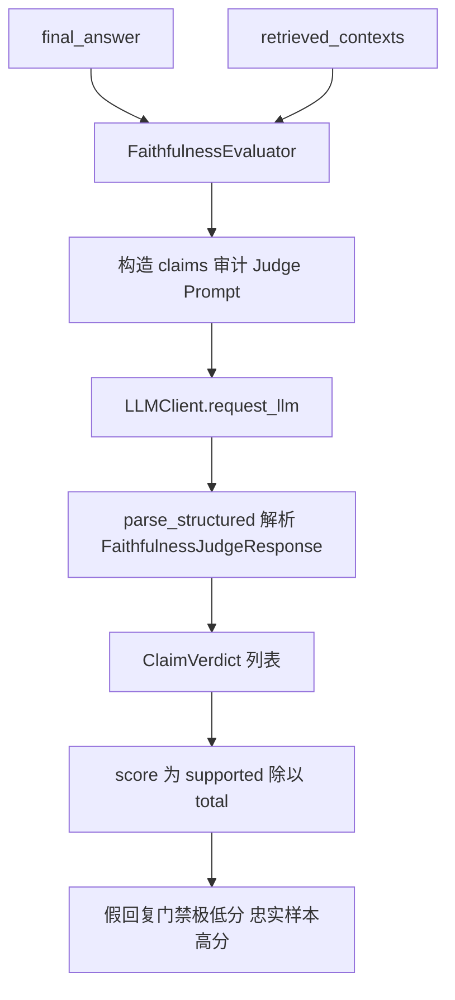
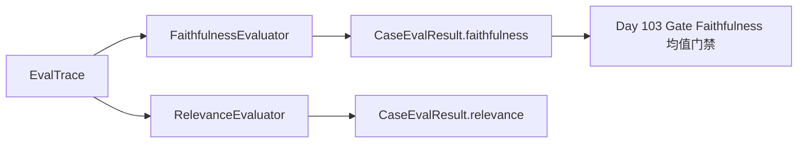

# Day 102 课堂笔记：Faithfulness 与 Relevance 探针打分

## 一、工业背景：通顺回复背后的幻觉与偏题

Day 100 G-Eval 量化"写得像不像论文"，Day 101 Tool F1 量化"工具调对没有"。二者都无法回答：**回复里的事实是否来自检索 Context？是否回答了用户真正问的问题？**

W14 Research Agent 的典型故障：RAG 召回了 ESM-2 相关段落，Generator 却编造 "contact prediction F1=0.99"，或大段讨论无关的 AlphaFold 训练技巧。CI 若只看专业度，这类幻觉会静默合入主干。

### 1. 两类正交失效模式

| 失效 | 输入信号 | 表现 | 检测探针 |
| :--- | :--- | :--- | :--- |
| 幻觉 (Hallucination) | contexts + answer | 数字漂移 / 张冠李戴 / 无中生有 | Faithfulness |
| 偏题 (Off-topic) | query + answer | 文采好但不答问题 | Relevance |
| 检索差 (Retriever) | query + contexts | 召回无关片段 | Context Precision（本日不实现） |

Faithfulness 与 Relevance **必须物理隔离为两个 Judge Prompt**，避免单一 Prompt 同时审计导致分数互相污染。

### 2. 权威文献引用

- 📄 **[RAGAS: Automated Evaluation of Retrieval Augmented Generation (arXiv:2309.15217)](https://arxiv.org/abs/2309.15217)**：Faithfulness / Answer Relevancy 形式化定义。
- 📄 **[G-Eval (arXiv:2303.16634)](https://arxiv.org/abs/2303.16634)**：LLM-as-Judge + CoT 打分范式（Day 100 已用，本日复用解析链路）。
- 🌐 **[DeepEval Faithfulness Metric](https://deepeval.com/docs/metrics-faithfulness)**：工业级 claims 拆解实现参考。
- 🌐 **[RAGAS Faithfulness Docs](https://docs.ragas.io/en/stable/concepts/metrics/available_metrics/faithfulness/)**：supported statements / total statements 公式。

---

## 二、Faithfulness：Claims 级审计

### 1. 数学定义

将 `final_answer` 拆解为原子声明集合 \(C = \{c_1, \ldots, c_n\}\)，对每个 \(c_i\) 判定是否被 `retrieved_contexts` 支撑：

\[
\text{Faithfulness} = \frac{|\{c_i \in C : \text{supported}(c_i)\}|}{|C|}
\]

**关键设计**：分数由 claims 计数**确定性推导**，禁止 LLM 直接输出一个与 claims 不一致的随意分数。

### 2. Faithfulness 评测数据流



### 3. 三类对抗假回复

| 类型 | Context 事实 | 假回复手法 | 期望分 |
| :--- | :--- | :--- | :--- |
| 数字幻觉 | F1=0.89 | 改写为 F1=0.99 | ≤ 0.2 |
| 张冠李戴 | ESM-2 结论 | 安到 ProteinBERT | ≤ 0.2 |
| 无中生有 | 未提某方法 | 编造未出现的训练技巧 | ≤ 0.2 |

```python
# 极简伪代码 (< 10 行)
resp = parse_structured(raw, FaithfulnessJudgeResponse)
score = sum(1 for c in resp.claims if c.supported) / len(resp.claims)
assert score <= 0.2  # 假回复必须极低分
```

---

## 三、Relevance：Query–Answer 切题判定

### 1. 判定维度

| 维度 | 说明 |
| :--- | :--- |
| `score` | [0, 1] 相关性连续分 |
| `is_on_topic` | 是否实质性回答 Query |
| `missing_aspects` | Query 中未被覆盖的关键方面 |

与 Faithfulness 解耦：一篇完全忠实于 Context 的回复，若 Context 本身跑题，Relevance 仍应打低分。

**Prompt 防污染**：Relevance Judge 必须用 Few-shot 评分锚点明确「切题 ≠ 论证完美」，禁止因指标不同基准、缺少参数量等专业度问题压分——那些属于 Day 100 / Faithfulness 职责。

### 2. 探针隔离数据流



---

## 四、LLM 响应解析约束

两个探针均**禁止手写 regex/json.loads**，统一：

```python
from middlewares.llm_reliability_adapter import parse_structured
result = parse_structured(raw, FaithfulnessJudgeResponse)  # 或 RelevanceJudgeResponse
```

中间件负责：`<think>` 剥离 → BracketExtractor → 尾随逗号修补 → Pydantic 校验。

---

## 五、与 Week 15 流水线集成

Day 105 `run_eval.py` 对每条 Trace 并发调用两探针，写入 `CaseEvalResult`；Day 103 以 Faithfulness 均值 ≥ 0.90 作为合并门禁之一。

---

## 六、性能与阈值

| 参数 | 推荐值 | 说明 |
| :--- | :--- | :--- |
| temperature | 0.1 | 低温度保证 claims 拆解稳定 |
| Faithfulness 假回复门禁 | ≤ 0.2 | 对抗样本过关 |
| Faithfulness 忠实样本 | ≥ 0.8 | 正样本过关 |
| Relevance 偏题门禁 | ≤ 0.3 | 对抗样本过关 |
| Relevance 切题样本 | ≥ 0.7 | 正样本过关 |
| CI 生产阈值 | Faithfulness ≥ 0.90 | Day 103 |

---

## 七、本日练习交付物

| 文件 | 职责 |
| :--- | :--- |
| `contracts/schemas.py` | `ClaimVerdict` / `FaithfulnessJudgeResponse` / `RelevanceJudgeResponse` / `ProbeScoreResult` |
| `day102/practice.py` | 两探针 TODO 练习模版 |
| `evaluators/faithfulness_impl.py` | Faithfulness 标准答案 + 对抗样本 |
| `evaluators/relevance_impl.py` | Relevance 标准答案 + 偏题样本 |

**过关验证**：分别运行两个 `*_impl.py`，假回复 Faithfulness ≤ 0.2，偏题 Relevance ≤ 0.3，终端输出 PASS。
