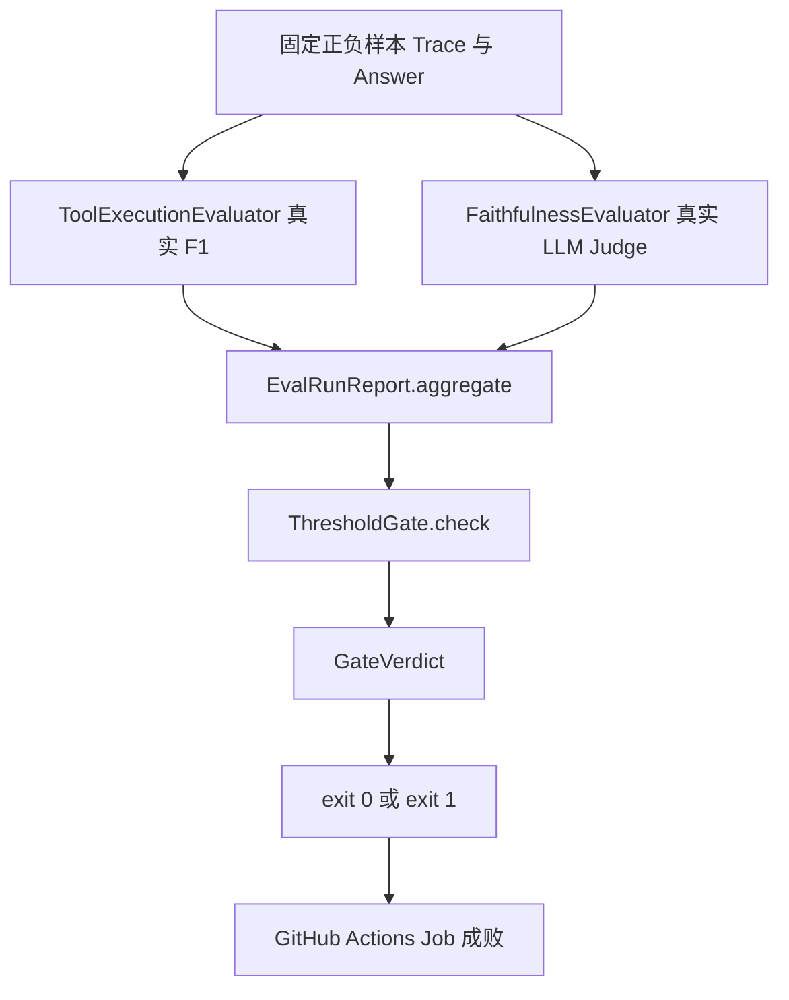
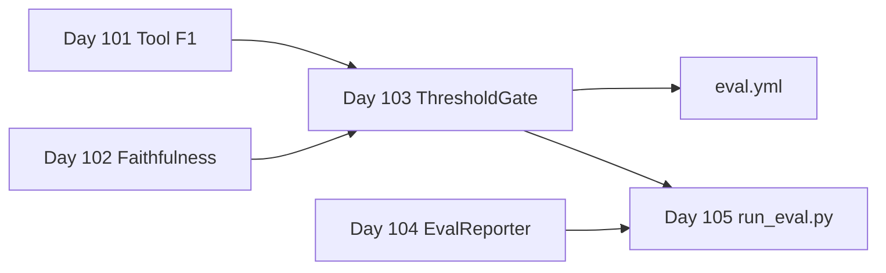

# Day 103 课堂笔记：GitHub Actions CI/CD 评测门禁

## 一、工业背景：无门禁的 Agent 回归灾难

Day 99–102 已具备 Golden Dataset、G-Eval、Tool F1、Faithfulness。若这些指标只停留在开发者本机手工跑，PR 合入主干时仍可能把「修 1 个 Case、退化 20 个 Case」的 Prompt 变更带进生产。

### 1. 无 CI 门禁时的典型损失

| 场景 | 后果 |
| :--- | :--- |
| Prompt 微调 | 专业度上升但 Faithfulness 断崖，用户投诉幻觉 |
| 工具 Schema 变更 | Tool F1 下跌，CI 无感知 |
| 模型升级 | 全量指标漂移，主干已污染 |
| 全员本机评测 | 无法强制统一阈值与可复现退出码 |

CI 门禁的本质契约：**指标低于阈值 → 进程 exit 1 → GitHub Actions Job 失败 → PR 无法合入**（需配合 branch protection）。

### 2. 权威规范引用

- 🌐 **[GitHub Actions Workflow Syntax](https://docs.github.com/en/actions/using-workflows/workflow-syntax-for-github-actions)**：`on` / `jobs` / `exit code` 语义。
- 🌐 **[OpenAI Evals CI Patterns](https://github.com/openai/evals)**：评测作为回归门禁的工业惯例。
- 📄 **[RAGAS (arXiv:2309.15217)](https://arxiv.org/abs/2309.15217)**：Faithfulness 等指标作为发布质量信号。
- 🌐 **[DeepEval CI/CD Integration](https://deepeval.com/docs/getting-started)**：阈值断言接入流水线参考。

---

## 二、ThresholdGate：确定性阈值裁决

### 1. 默认阈值（与 overview 对齐）

| 指标 | 阈值 | 来源 |
| :--- | :--- | :--- |
| `tool_f1` | ≥ 0.85 | Day 101 ToolExecutionEvaluator |
| `faithfulness` | ≥ 0.90 | Day 102 FaithfulnessEvaluator |

Gate 本身**不调用 LLM**；它只比对 `EvalRunReport.aggregate` 与阈值。但 **aggregate 必须由真实评测写入**，禁止手写假 JSON 充数。

### 2. 真实评测 → 门禁数据流



### 3. 退出码契约

```python
# 极简伪代码 (< 8 行)
verdict = gate.check(report)
if not verdict.passed:
    print(verdict.message)
    raise SystemExit(1)  # CI 拦截
```

| 场景 | 真实输入 | 期望 exit |
| :--- | :--- | :--- |
| demo_pass | 工具匹配正确 + 忠实复述 Context | 0 |
| demo_fail | 漏调工具 + 数字幻觉回复 | 1 |

---

## 三、GitHub Actions 工作流设计

### 1. 触发与成本控制

| 事件 | mode | 说明 |
| :--- | :--- | :--- |
| `pull_request` | `pr` | 跑子集真实评测 + 门禁，控制 Token |
| `push` (main) | `full` | 可扩量；Day 105 挂全量 Agent |

`paths` 过滤限制在 `weekly/w15_eval_system/**`、`middlewares/**`，避免无关 PR 触发评测烧钱。

### 2. Secrets

工作流通过 `env: MINIMAX_API_KEY: ${{ secrets.MINIMAX_API_KEY }}` 注入，与本地 `.env` 契约一致，由 `LLMClient` 读取。

---

## 四、与 Week 15 流水线集成



Day 105 将用同一 `ThresholdGate.enforce()` 消费全量 `run_eval.py` 报告。

---

## 五、性能与阈值

| 参数 | 推荐值 | 说明 |
| :--- | :--- | :--- |
| tool_f1 阈值 | 0.85 | overview / Day 103 对齐 |
| faithfulness 阈值 | 0.90 | overview / Day 103 对齐 |
| PR 样本规模 | 2–4 条 | 本日子集，控制 API 成本 |
| 本地过关 | 真实 API | 正样本 exit 0 + 负样本 exit 1 |

---

## 六、本日练习交付物

| 文件 | 职责 |
| :--- | :--- |
| `contracts/schemas.py` | `GateCheckItem` / `GateVerdict` |
| `day103/practice.py` | ThresholdGate TODO 练习模版 |
| `gate/threshold_gate_impl.py` | 真实评测编排 + 门禁标准答案 |
| `.github/workflows/eval.yml` | CI 工作流 |

**过关验证**：运行 `python gate/threshold_gate_impl.py`，真实 API 下正样本门禁 PASS（exit 0），负样本门禁 FAIL（exit 1）。
