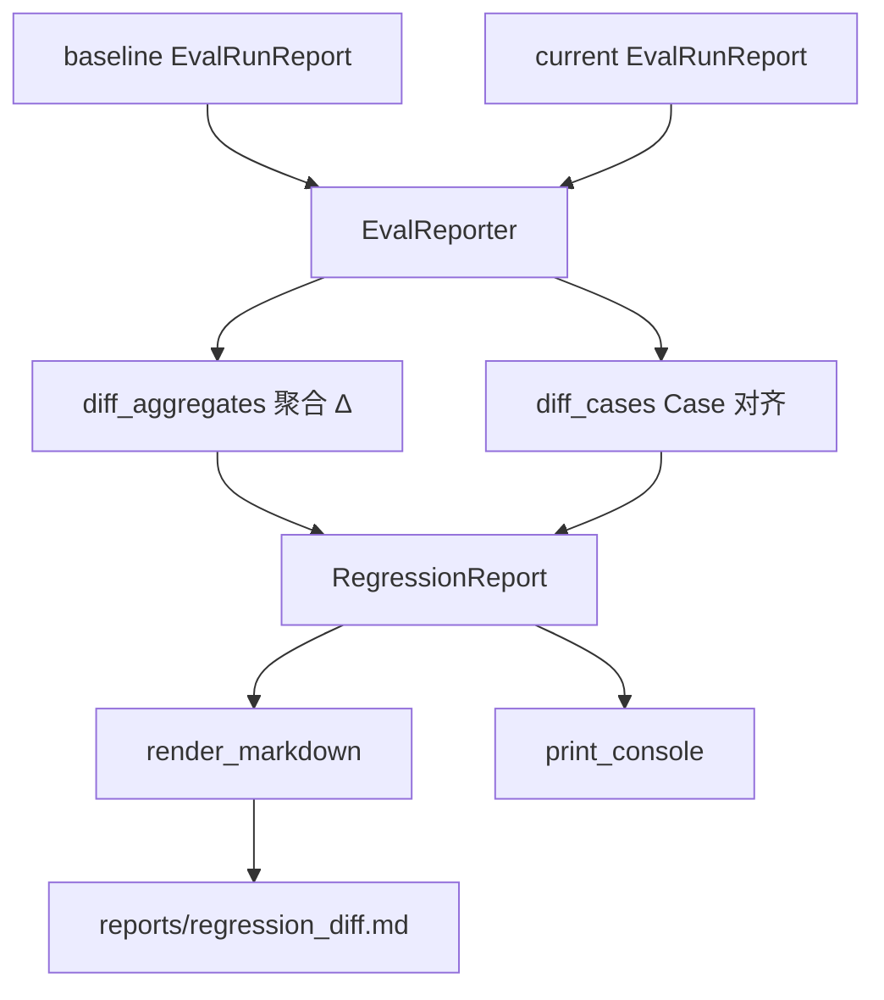
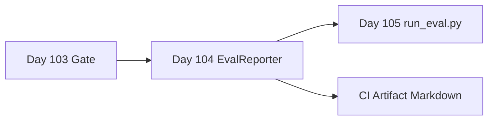

# Day 104 课堂笔记：回归测试与 EvalReporter 差异报告

## 一、工业背景：总分下降却找不到元凶

Day 103 ThresholdGate 只能回答「这次合不合格」。工程排障真正需要的是：**相对上一版，哪些指标掉了多少、哪几个 `test_case_id` 从 PASS 变成 FAIL**。没有 Diff，团队只能对着 50 条 JSONL 肉眼翻。

### 1. 无回归 Diff 时的典型损失

| 场景 | 后果 |
| :--- | :--- |
| 平均 Faithfulness -0.03 | 不知是全局抖动还是 3 个 Case 崩盘 |
| Prompt 微调 | 修了 `research_001`，静默打挂 `research_023` |
| CI 只红灯 | 开发者无法从 Artifact 定位回归 Case |
| 无 Markdown 报告 | PR 评论无法贴可读 Δ 矩阵 |

### 2. 权威规范引用

- 🌐 **[GitHub Actions Artifacts](https://docs.github.com/en/actions/using-workflows/storing-workflow-data-as-artifacts)**：评测报告作为 CI Artifact 持久化。
- 🌐 **[OpenAI Evals Regression Patterns](https://github.com/openai/evals)**：版本间指标对比的工业惯例。
- 📄 **[RAGAS (arXiv:2309.15217)](https://arxiv.org/abs/2309.15217)**：多指标矩阵作为质量信号源。
- 🌐 **[DeepEval Confident AI / Regression](https://deepeval.com/docs/getting-started)**：评测结果版本化与对比参考。

---

## 二、双层 Diff：聚合 Δ + Case 级状态机

### 1. 聚合层

对 `EvalRunReport.aggregate` 中每个共享指标：

\[
\Delta m = m_{\text{current}} - m_{\text{baseline}}
\]

| status | 判定 |
| :--- | :--- |
| `regressed` | Δ < -ε（默认 ε=1e-4） |
| `improved` | Δ > ε |
| `unchanged` | \|Δ\| ≤ ε |

### 2. Case 层状态

| status | 含义 |
| :--- | :--- |
| `regressed` | baseline PASS → current FAIL |
| `improved` | baseline FAIL → current PASS |
| `unchanged` | 通过态不变 |
| `added` | 仅 current 存在 |
| `removed` | 仅 baseline 存在 |

### 3. 数据流



---

## 三、报告模板（Markdown）

```markdown
## Eval Regression Report — current vs baseline

| Metric | Baseline | Current | Δ | Status |
|--------|----------|---------|---|--------|
| tool_f1 | 1.00 | 0.67 | -0.33 | regressed |
| faithfulness | 1.00 | 0.50 | -0.50 | regressed |

### Regressed Cases
- research_002: passed True→False, Δtool_f1=-0.33
```

---

## 四、真实评测输入约束

EvalReporter **本身不调用 LLM**（纯 Diff）。但演示用的 baseline/current JSON **必须由真实 Tool F1 + Faithfulness 评测写入**，禁止手写假分数凑 Δ。

```python
# 极简伪代码 (< 10 行)
baseline = await harness.build_pass_report()
current = await harness.build_regressed_report()  # 混入漏调或幻觉
diff = EvalReporter().compare(baseline, current)
assert diff.regressed_ids  # 必须定位到具体 Case
print(diff_markdown)
```

---

## 五、与 Week 15 流水线集成



Day 105 每次跑完评测后，自动与上一份 `eval_result.json` Diff，并把 Markdown 挂到 PR。

---

## 六、本日练习交付物

| 文件 | 职责 |
| :--- | :--- |
| `contracts/schemas.py` | `MetricDelta` / `CaseDelta` / `RegressionReport` |
| `day104/practice.py` | EvalReporter TODO 练习模版 |
| `reporter/eval_reporter_impl.py` | 标准答案 + 真实双报告演示 |

**过关验证**：运行 `python reporter/eval_reporter_impl.py`，真实 API 生成两份报告后输出含 Δ 与 `regressed_ids` 的 Markdown，终端 PASS。
