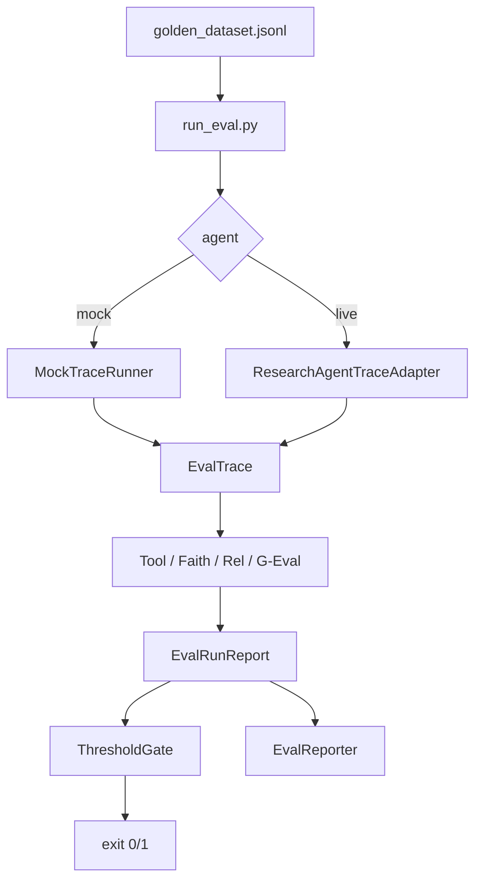

# Day 105 课堂笔记：全自动化 Agent 评测与 CI 拦截

## 一、本周拼装目标

Day 99–104 的微引擎（Golden / G-Eval / Tool F1 / Faithfulness / Gate / Reporter）在 Day 105 收敛为一条可发布流水线：改 Prompt 或工具逻辑后，PR 自动跑评测；指标掉线则 exit 1 卡点。

## 二、数据流



## 三、关键实现点

1. **Dashboard 交互**：`start.sh` → uvicorn → 页面点「运行评测」→ `/ws/eval` 触发流水线。
2. **默认真实 LLM**：未勾 Offline 时 Faithfulness（及 full 下 Relevance/G-Eval）走 MiniMax Judge；`agent=live` 时再挂 W14 ResearchAgent。
3. **TraceAdapter**：W14 `RoundTrace` 无标准 `tool_calls`，按检索 / Memory / 安全警报 / 路由故障合成。
4. **demo_fail**：污染多条 Case，保证 limit=20 时聚合均值仍可跌破门禁。
5. **`--offline` / 勾选 Offline**：仅调试与单测；不会调用真实 LLM。

## 四、过关验证

```bash
./weekly/w15_eval_system/day105/start.sh
# 浏览器 http://localhost:8105 ，不勾 Offline，limit=3，点运行评测
uv run pytest weekly/w15_eval_system/day105/tests -q
```

## 五、练习

见 [`practice.py`](practice.py)：补齐流水线编排中的 TODO，对照 [`../run_eval.py`](../run_eval.py)。
