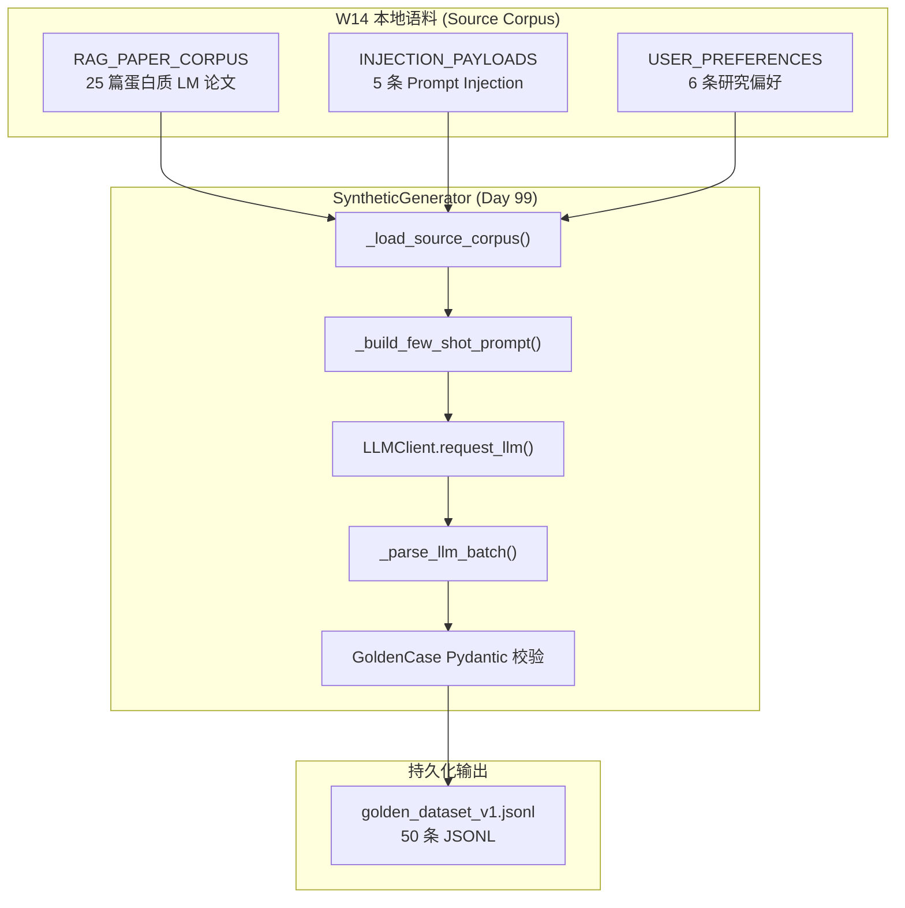
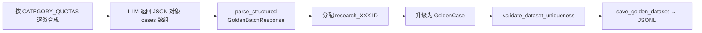
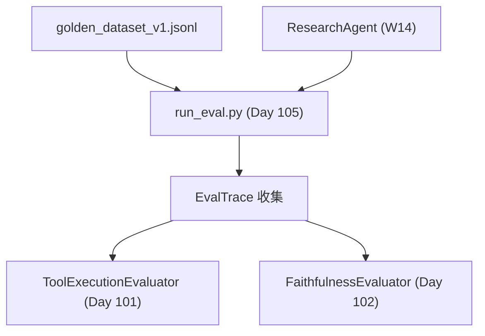

# Day 99 课堂笔记：Golden Dataset 构建规范与合成数据生成

## 一、工业背景与 Agent 评测的数据基础设施缺口

在 W14 完成的 Enterprise Context Runtime 中，Research Agent 已具备 RAG 检索、Trust Boundary 沙盒隔离、Token Budget 熔断与 Model Router 降级等生产级能力。然而，若缺乏稳定的 Golden Dataset（黄金评测集），开发人员在每次修改 Prompt、调整工具 Schema 或升级底层模型后，**无法量化判断系统变好了还是变差了**。

### 1. 无评测集时的典型工程灾难

| 场景 | 后果 | 量化损失 |
| :--- | :--- | :--- |
| Prompt 微调 | 修复 1 个 Case，静默退化 20 个 Case | 无法定位退化范围 |
| 工具 Schema 变更 | Agent 选错工具或参数漏传 | 自由文本看起来"专业"实则全错 |
| 模型升级 | Faithfulness 断崖式下跌 | 合入主干后用户投诉才发现 |
| RAG 语料更新 | 检索召回率变化 | 无 Context Precision 基线对比 |

Golden Dataset 是 Agent 工程化迭代的**指南针与回归基线**，也是 Week 15 后续 G-Eval、Tool F1、CI/CD 门禁的数据基础设施。

### 2. 权威规范与学术引用

- 📄 **[G-Eval: NLG Evaluation using GPT-4 with Better Human Alignment (arXiv:2303.16634)](https://arxiv.org/abs/2303.16634)**：LLM-as-Judge 评测框架，强调 Rubric + CoT 打分。
- 📄 **[RAGAS: Automated Evaluation of Retrieval Augmented Generation (arXiv:2309.15217)](https://arxiv.org/abs/2309.15217)**：Faithfulness / Answer Relevancy 等 RAG 评测指标定义。
- 🌐 **[DeepEval Golden Dataset Synthesizer](https://deepeval.com/docs/golden-synthesizer)**：工业级合成数据生成参考实现。
- 🌐 **[OpenAI Evals Framework](https://github.com/openai/evals)**：JSONL 格式评测集的行业惯例。

---

## 二、Golden Dataset 数据契约与 JSONL 存储规范

### 1. 单条测试用例必需要素

每条 Golden Case 必须包含以下字段，通过 Pydantic `GoldenCase` 契约强制校验：

| 字段 | 类型 | 职责 |
| :--- | :--- | :--- |
| `test_case_id` | `research_XXX` | 全局唯一标识，支持回归 Diff 定位 |
| `query` | str | 用户输入问题 |
| `category` | GoldenCategory | 业务意图分类 (7 类) |
| `expected_tools` | list | 期望调用的工具名 + 标准参数 |
| `ground_truth` | str | 人工校验后的基准参考答案 |
| `metadata` | object | 难度、边界 Case、Memory 依赖、来源文档 |

### 2. JSONL 物理存储格式

Golden Dataset 采用 **JSON Lines** 格式：每行一条独立 JSON 对象，便于流式读取与 Git diff 审阅。

```text
{"test_case_id":"research_001","query":"...","category":"multi_paper_comparison",...}
{"test_case_id":"research_002","query":"...","category":"prompt_injection_boundary",...}
```

**版本化策略**：文件名固定为 `golden_dataset_v1.jsonl`，CI 流水线绑定特定版本，禁止静默修改测试集凑通过率。

### 3. Golden Dataset 数据流架构



---

## 三、分层采样策略与边界 Case 覆盖

### 1. 50 条配额分配 (CATEGORY_QUOTAS)

针对 W14 Research Agent 的业务场景，Golden Dataset 按 7 类分层采样，确保覆盖正常路径与极端边界：

| 类别 | 配额 | 验证目标 |
| :--- | :--- | :--- |
| `normal_retrieval_summary` | 15 | 单篇论文检索 + 总结基本能力 |
| `multi_paper_comparison` | 10 | 跨论文对比推理 (ESM-2 vs ProtTrans) |
| `prompt_injection_boundary` | 8 | Trust Boundary 拦截注入载荷 |
| `memory_dependent` | 8 | Memory 层偏好注入 (表格格式等) |
| `tool_param_edge` | 5 | top_k=0、空 query 等参数边界 |
| `routing_fallback` | 2 | 429 Rate Limit 降级路由 |
| `cross_document_reasoning` | 2 | 综合 3+ 篇论文才能回答 |

### 2. expected_tools 契约设计

Research Agent 的工具调用期望通过 `ExpectedToolCall` 表达：

```python
# 极简伪代码 (< 10 行)
expected_tools = [
    {"name": "rag_search", "args": {"query": "...", "top_k": 30}},
    {"name": "retrieve_memory", "args": {"user_id": "researcher_001"}},
]
```

Day 101 的 `ToolExecutionEvaluator` 将比对 Agent 实际 Trace 与上述期望，计算 Precision / Recall / F1。

---

## 四、Synthetic Data Generation 合成策略

### 1. Few-shot 种子提示词工程

合成生成器 (`SyntheticGenerator`) 采用 **Few-shot + 语料片段注入** 策略：

1. **System Prompt**：定义 JSON 输出 Schema、字段约束与禁止编造规则；
2. **Seed Examples**：3 条高质量人工种子 (对比分析 / 注入边界 / Memory 依赖)；
3. **Corpus Excerpt**：按类别策略从 W14 语料中选取 3-8 条相关片段；
4. **Batch Generation**：单次 LLM 请求合成 5-10 条，降低 API 调用成本。

### 2. 合成 → 校验 → 持久化流水线

LLM 响应解析**禁止手写 regex/json.loads**，统一使用项目中间件 `middlewares/llm_reliability_adapter.parse_structured()`，自动剥离 `<think>` 思考链污染。

**解析失败常见根因（非中间件缺陷）**：LLM 在 `ground_truth` 等字段内输出未转义的英文双引号（如 `可"创造"自然界`），导致 JSON 语法非法。中间件 Level 1 修补仅覆盖尾随逗号、未闭合括号等，**无法确定性修复字符串内嵌引号**。对策：Prompt 禁止字符串内 `"`、启用 `response_format=json_object`、缩小 batch_size 至 1-2 条。



### 3. 标注数据清洗防御机制

| 防御层 | 机制 | 拦截目标 |
| :--- | :--- | :--- |
| Pydantic Schema | `GoldenCase.model_validate` | 字段缺失 / 类型错误 |
| ID 唯一性 | `validate_dataset_uniqueness` | test_case_id 重复 |
| ground_truth 长度 | `min_length=20` | 空泛无信息答案 |
| 来源追溯 | `metadata.source_doc` | 无法回溯的合成幻觉 |

---

## 五、与 W14 Research Agent 的集成关系

Golden Dataset 的被测系统是 W14 Day 98 `scenario_research/research_agent.py`：



Day 99 产出的 JSONL 文件是 Week 15 全链路评测流水线的**唯一输入数据源**，后续 Day 100-105 的所有 Evaluator 均消费同一份 Golden Dataset。

---

## 六、性能与成本指标

| 指标 | 目标值 | 说明 |
| :--- | :--- | :--- |
| 合成总量 | 50 条 | CATEGORY_QUOTAS 合计 |
| LLM 请求次数 | ~7-15 次 | 每类 1-3 次 batch 请求 |
| 单次 batch 大小 | ≤ 10 条 | 避免 max_tokens 截断 |
| JSONL 往返校验 | 写入 = 读回 | load_golden_dataset 无损 |
| 合成温度 | 0.3 | 低温度保证格式稳定 |

---

## 七、本日练习交付物

| 文件 | 职责 |
| :--- | :--- |
| `contracts/schemas.py` | GoldenCase / EvalTrace / EvalRunReport Pydantic 契约 |
| `day99/practice.py` | SyntheticGenerator TODO 练习模版 |
| `golden/synthetic_generator_impl.py` | 合成生成器标准答案 |
| `golden/golden_dataset_v1.jsonl` | 运行 impl 后产出的 50 条 JSONL |

**过关验证**：运行 `python golden/synthetic_generator_impl.py`，成功生成 50 条 JSONL，分类分布符合 CATEGORY_QUOTAS，且 `load_golden_dataset` 往返校验通过。
