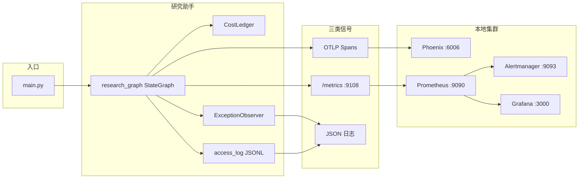
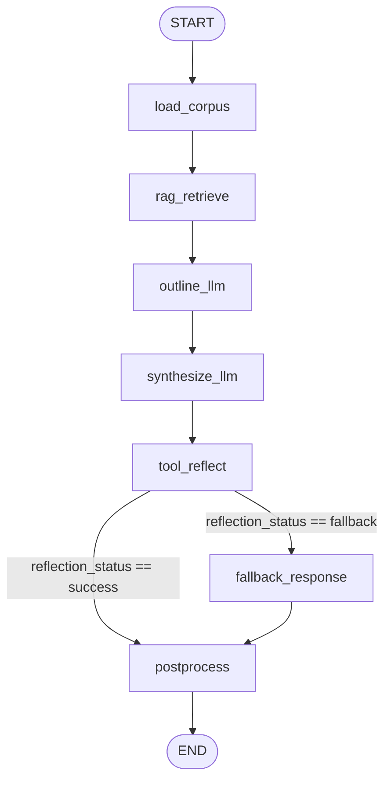

# Day 112 · AI 研究助手生产级可观测性底座

Week 16 收官实战：为「AI 研究助手」接入符合 OpenInference / OpenTelemetry 规范的本地化可观测性底座，覆盖分布式追踪、Token/成本上报、异常结构化落盘、Prometheus 指标与 Grafana 告警看板。

---

## 1. 项目介绍

### 要解决什么问题

Agent / LangGraph 在线运行时是黑盒：一次请求可能经过 RAG、多次 LLM、工具调用与条件回退，若没有统一的 Trace / Metrics / Logs：

- 无法定位是 RAG 慢还是 LLM TTFT 慢
- 无法把并发节点的 Token 账单上卷成「这一单总价」
- 工具失败时只有一句 Error，无法复盘调用栈与局部上下文
- SRE 无法用 QPS / Error Rate / Latency 做实时告警

### 本项目交付什么

| 能力 | 实现 |
| :--- | :--- |
| 真实业务图 | `langgraph.graph.StateGraph` 编排的研究助手（非手写 async 伪节点） |
| 分布式追踪 | Phoenix（OTLP）+ 节点级嵌套 Span；OpenInference 与 `gen_ai.*` 双写 |
| 成本与时延 | `CostLedger` 上卷 Token / 美分成本 / TTFT 到根 Span |
| 异常可观测 | `ExceptionObserver` 结构化 traceback + Span ERROR + JSON 落盘 |
| 指标与告警 | Prometheus RED + 节点/工具/Token/成本指标；Alertmanager + Grafana |

### 复用关系（Day 106–111）

| 模块 | 来源 | 本项目中的角色 |
| :--- | :--- | :--- |
| `phoenix_otel.py` | Day 107 | 绑定 OTLP → Phoenix，instrument LangChain |
| Span 语义 / 嵌套思路 | Day 108 | 由 `otel_langgraph.py` 提升为节点级包装 |
| `CostLedger` | Day 109 | 请求级成本账本，写入根 Span Attribute |
| `ExceptionObserver` | Day 110 | 工具失败时的结构化异常 |
| `MetricsTracker` | Day 111 | 请求级 Counter / Gauge / Histogram |

Day 112 只新增「节点级包装 + StateGraph 编排 + 告警/看板」，不重复造轮子。

---

## 2. 项目结构

```text
weekly/w16_observability/
├── day112/                          # 本项目
│   ├── main.py                      # 入口：绑定 OTEL、跑请求、暴露 /metrics
│   ├── research_graph.py            # StateGraph 编排 + 运行封装
│   ├── graph_state.py               # ResearchState（图全局状态契约）
│   ├── otel_langgraph.py            # instrumented_node：节点 Span + 上下文传播
│   ├── tools.py                     # 业务/演示工具（含可故障注入工具）
│   ├── reflection_policy.py         # 工具反射：重试 → 结构化异常 → 降级
│   ├── metrics_registry.py          # 扩展 Prometheus 指标
│   ├── access_log.py                # 请求级 JSONL 访问日志
│   ├── logs/
│   │   ├── access.jsonl             # 每次请求一行
│   │   └── error_latest.json        # 最近一次工具异常快照
│   └── tests/                       # 单元测试（Span / 回退 / 指标 / 反射）
│
├── day107/ … day111/                # 被复用的观测组件
├── day108/corpus/papers.json        # RAG 语料
│
└── infra/                           # 本地可观测性集群
    ├── docker-compose.yml           # Phoenix + Prometheus + Alertmanager + Grafana
    ├── prometheus/
    │   ├── prometheus.yml
    │   └── alert_rules.yml
    ├── alertmanager/alertmanager.yml
    └── grafana/provisioning/
        ├── datasources/prometheus.yml
        └── dashboards/
            ├── dashboards.yml
            └── ai_research_assistant.json
```

---

## 3. 端到端数据流

一次 `run_research_assistant(query)` 的完整信号流：



1. **Traces**：每个 LangGraph Node 打开 `LangGraph Node <name>` Span；LLM 子 Span 写入 `llm.input_messages` / `ttft_ms` / `gen_ai.usage.*`；根 Span `pipeline` 汇总 `cost.*`。
2. **Metrics**：请求级 RED + 节点延迟 / LLM 时长 / TTFT / 工具调用 / Token / 成本；由 Prometheus 刮取，Grafana 渲染，Alertmanager 接收告警。
3. **Logs**：工具失败写 `logs/error_latest.json`；每次请求追加 `logs/access.jsonl`（含 `trace_id`、耗时、成本、访问节点序列）。

---

## 4. LangGraph 流程设计

### 4.1 状态契约 `ResearchState`

全局共享状态（节点返回子集，由引擎合入）：

| 字段 | 含义 |
| :--- | :--- |
| `query` | 用户问题 |
| `docs` | 语料全文 |
| `chunks` | RAG Top-K 片段 |
| `outline` | 提纲 LLM 输出 |
| `answer` | 综合 LLM（或降级后）答案 |
| `tool_result` | 工具反射成功结果 |
| `reflection_status` | `success` / `fallback`，驱动条件边 |
| `fallback_reason` / `error` | 降级原因与结构化异常 |
| `report` | 后处理研究报告 |
| `visited_nodes` / `node_visits` | 观测用：访问路径与重入计数 |

### 4.2 拓扑



### 4.3 各节点职责

| 节点 | OpenInference kind | 行为 |
| :--- | :--- | :--- |
| `load_corpus` | CHAIN | 加载 `day108/corpus/papers.json` |
| `rag_retrieve` | RETRIEVER | 词项重叠打分，取 Top-2 `chunks` |
| `outline_llm` | LLM | 流式提纲；记录 TTFT / Token |
| `synthesize_llm` | LLM | 结合提纲 + 文献综合作答 |
| `tool_reflect` | TOOL | 调用 `fetch_citation_count` 等；失败则重试一次，仍失败写 `fallback` |
| `fallback_response` | CHAIN | 在已有答案上追加「系统降级」说明（仅失败路径） |
| `postprocess` | CHAIN | 组装 `report`（标题、答案、doc_id、工具结果） |

### 4.4 条件边与故障注入

- 路由函数：`route_reflection(state)`  
  - `reflection_status == "fallback"` → `fallback_response`  
  - 否则 → `postprocess`
- 触发失败：query 含「故障注入」或 `force_fail` 时，`tool_reflect` 强制工具异常，用于验收 ERROR Span 与回退分支。

### 4.5 运行时包装（`run_research_assistant`）

```text
MetricsTracker.track_request()
  └── Span "pipeline" (AGENT)
        ├── attach CostLedger
        ├── graph.ainvoke({query})
        ├── ledger.apply_to_span(root)  → cost.usd / tokens / latency
        ├── observe_cost(...)
        └── append_access_log(...)
```

每个图节点经 `@instrumented_node` 包装：

- `opentelemetry.context.attach()` 显式传播父 Span（避免 LangGraph 调度丢上下文）
- Span 名：`LangGraph Node <name>`
- 属性：`openinference.span.kind` + `gen_ai.operation.name` / `gen_ai.langgraph.node` / `visit_count`

### 4.6 Phoenix 中预期 Trace 树

```text
pipeline (AGENT)
├── LangGraph Node load_corpus
├── LangGraph Node rag_retrieve
├── LangGraph Node outline_llm
│   └── outline_llm_call (LLM, ttft_ms, gen_ai.usage.*)
├── LangGraph Node synthesize_llm
│   └── synthesize_llm_call (LLM, ...)
├── LangGraph Node tool_reflect
│   └── [失败时] exception.structured + Status=ERROR
├── LangGraph Node fallback_response   ← 仅 fallback 路径
└── LangGraph Node postprocess
```

根 Span Attribute 示例：`cost.input_tokens`、`cost.output_tokens`、`cost.usd`、`cost.cents`、`cost.total_latency_ms`。

---

## 5. 可观测性契约

### 5.1 Prometheus 指标

| 指标 | 类型 | 标签 | 用途 |
| :--- | :--- | :--- | :--- |
| `agent_requests_total` | Counter | `status` | Rate / Error Rate |
| `agent_request_latency_seconds` | Histogram | — | 端到端 Duration |
| `agent_active_coroutines` | Gauge | — | 瞬时并发 |
| `agent_node_latency_seconds` | Histogram | `node` | 节点瓶颈 |
| `agent_llm_call_duration_seconds` | Histogram | `node` | LLM 调用时长 |
| `agent_llm_ttft_seconds` | Histogram | `node` | 首字延迟 |
| `agent_tool_calls_total` | Counter | `tool`,`status` | 工具错误率 |
| `agent_tokens_total` | Counter | `type` | Token 趋势 |
| `agent_cost_usd_total` | Counter | — | 成本燃烧速率 |

默认暴露：`http://0.0.0.0:9108/metrics`（`AGENT_METRICS_PORT`）。

### 5.2 告警规则（`infra/prometheus/alert_rules.yml`）

- `AgentHighErrorRate`：错误率 > 5%（5m）
- `AgentP95LatencyHigh`：P95 > 5s（5m）
- `AgentToolErrorRateHigh`：工具错误率 > 10%（5m）
- `AgentCostBurnRateHigh`：估算燃烧 > 5 USD/小时（10m）
- `AgentTrafficDrop`：相对基线流量骤降（15m）

### 5.3 本地服务端口

| 服务 | 地址 | 它是干什么的（一句话） |
| :--- | :--- | :--- |
| Phoenix | http://127.0.0.1:6006 | 看**每一次请求**的调用树（Trace） |
| Agent `/metrics` | http://127.0.0.1:9108/metrics | Agent 暴露的**原始指标文本**（给 Prometheus 刮） |
| Prometheus | http://127.0.0.1:9090 | **存储/查询**指标，并评估告警规则 |
| Grafana | http://127.0.0.1:3000 | 把 Prometheus 数据画成**看板曲线** |
| Alertmanager | http://127.0.0.1:9093 | 接收**已触发（firing）**的告警并路由通知 |

> 建议用 `127.0.0.1` 打开浏览器，避免 macOS 上 `localhost` 走 IPv6 导致偶发连不上。

Grafana 看板：`Week16` 文件夹 → `AI Research Assistant`  
直达链接：http://127.0.0.1:3000/d/ai-research-assistant/ai-research-assistant

---

## 6. 快速开始

### 前置

1. 仓库根目录已配置 `.env`（参考 `.env.example`）：`MINIMAX_API_KEY`、Phoenix / 价目 / Grafana 账号等。
2. Docker 可用。

### 两套进程都要开（很重要）

| 进程 | 命令 | 职责 |
| :--- | :--- | :--- |
| 可观测性集群 | `infra` 里 Docker Compose | Phoenix / Prometheus / Grafana / Alertmanager |
| 研究助手 Agent | 宿主机跑 `day112/main.py` | 产生 Trace + 在 `:9108` 暴露 `/metrics` |

**集群不会自动启动 Agent。** Prometheus Targets 里 `ai-research-assistant` 显示 DOWN，几乎总是因为本机没有在跑 `main.py`。

### 启动可观测性集群

```bash
cd weekly/w16_observability/infra
./start.sh
```

若刚改过 Grafana 看板 JSON，建议重启 Grafana 使 provisioning 生效：

```bash
cd weekly/w16_observability/infra
docker compose restart grafana
```

### 跑研究助手（真实 LLM + 故障注入 + 压测）

另开一个终端：

```bash
cd weekly/w16_observability/day112
uv run python main.py --serve-forever
```

学习验收时优先 `--serve-forever`（或至少 `--serve-seconds 300`）：  
**Prometheus 每 5 秒刮一次；Agent 进程退出后，`:9108` 会立刻 DOWN，Grafana 会变空。**

同一时间 **只跑一个** `main.py`。若出现：

```text
OSError: [Errno 48] Address already in use
```

说明 `9108` 已被占用（通常是另一个 `--serve-forever` 还在）。保持那个进程即可，不要再开第二个。

入口行为：

1. 绑定 Phoenix OTEL  
2. 启动 `/metrics`  
3. 1 次正常研究请求 + 1 次「故障注入」请求  
4. 高频模拟（默认 100 次，控制真实 LLM 成本）  
5. 打印成本汇总与 metrics 快照，并持续暴露 `/metrics`

### 测试

```bash
cd weekly/w16_observability/day112
uv run pytest tests -q
```

---

## 7. 新手必读：四个 UI 分别怎么看（降低学习成本）

四个界面**职责不同**，打开默认页不等于“有没有数据”。按下面路径走，可在 5 分钟内确认整条链路。

### 7.1 先建立心智模型

```text
Agent 跑请求（宿主机 main.py，需单独启动）
   │
   ├─ push Trace ──► Phoenix（看调用树）
   │
   └─ 暴露 127.0.0.1:9108/metrics
              ▲
              │ scrape（容器内写成 host.docker.internal:9108）
              │
         Prometheus（存指标/算告警）
              │
              ├─► Grafana（画图，日常主要看这里）
              └─► Alertmanager（只显示已触发告警）
```

- Phoenix 有内容、Grafana 暂时空：**不一定坏**，先查 Prometheus Targets。  
- `/metrics` 有文本、Grafana 仍空：多半是 **Agent 已退出** 或 **看错了 Grafana 首页**。

### 7.2 Phoenix（Trace）——看“这一次请求怎么走的”

1. 打开 http://127.0.0.1:6006  
2. 选择项目：`freshman-w16-observability`（或 `.env` 里 `PHOENIX_PROJECT_NAME`）  
3. 点开一条 Trace，应看到类似：

```text
pipeline
├── LangGraph Node load_corpus
├── LangGraph Node rag_retrieve
├── LangGraph Node outline_llm / synthesize_llm
├── LangGraph Node tool_reflect
└── LangGraph Node postprocess（失败时多一个 fallback_response）
```

4. 点根 Span，右侧 Attribute 找 `cost.usd`、`cost.total_latency_ms`  
5. 点 LLM Span，找 `ttft_ms`、`llm.input_messages`、`gen_ai.usage.*`

### 7.3 Agent `/metrics`——确认“指标源还活着”

在 **Mac 浏览器 / 终端** 里请用本机回环地址（不要用 Docker 内部名）：

- 浏览器：http://127.0.0.1:9108/metrics  
- 或命令行：

```bash
curl -s http://127.0.0.1:9108/metrics | rg 'agent_requests_total|agent_cost_usd_total|agent_tool_calls_total'
```

应能看到类似：

```text
agent_requests_total{status="success"} 6.0
agent_tool_calls_total{status="error",tool="fetch_citation_count"} ...
agent_cost_usd_total ...
```

这里没有图表，是**纯文本**，正常。

### 7.4 Prometheus Targets 变 UP 之后有什么用？数据怎么看？

Targets = **UP** 只表示一件事：Prometheus **已经能定期刮到 Agent 指标，并写入自己的时序库**。  
真正“观察数据”请走下面三条路，而不是去点 Targets 页面上的 endpoint 链接。

| 目的 | 打开哪里 |
| :--- | :--- |
| 看曲线（推荐） | Grafana 看板 http://127.0.0.1:3000/d/ai-research-assistant/ai-research-assistant |
| 临时查 PromQL | Prometheus Graph http://127.0.0.1:9090/graph |
| 看原始文本 | http://127.0.0.1:9108/metrics |

#### 为什么点 `http://host.docker.internal:9108/metrics` 打不开？

Prometheus Targets 页会显示 scrape 地址 `host.docker.internal:9108`。这是给 **Docker 容器访问宿主机** 用的名字：

| 谁访问 | 该用什么地址 |
| :--- | :--- |
| Prometheus 容器 → Agent | `host.docker.internal:9108`（配置里已写好，人不用点） |
| 你在 Mac 浏览器里看 | **`http://127.0.0.1:9108/metrics`** |

在宿主机浏览器里打开 `host.docker.internal` 经常失败或行为怪异，**这不代表 scrape 坏了**。只要 Targets 显示 UP，抓取就是通的。

#### A. 看抓取是否成功

打开：http://127.0.0.1:9090/targets  

找 job = `ai-research-assistant`：

| 状态 | 含义 | 你该做什么 |
| :--- | :--- | :--- |
| **UP** | 已刮到本机 `:9108` | 去 Grafana / Graph 看数，不必点 endpoint 链接 |
| **DOWN** | Agent 没跑 / 端口不对 | 另开终端跑 `uv run python main.py --serve-forever` |

#### B. 临时查数（Graph）

打开：http://127.0.0.1:9090/graph  

依次输入并 Execute：

```promql
up{job="ai-research-assistant"}
agent_requests_total
sum(rate(agent_requests_total[5m]))
histogram_quantile(0.95, sum by (le) (rate(agent_request_latency_seconds_bucket[5m])))
```

- `up == 1`：抓取正常  
- `agent_requests_total` 有数字：已经存进 TSDB  
- `rate(...)` 在请求停掉几分钟后会接近 0：**Counter 还在，速率没了**，不是丢数

#### C. 看告警规则

打开：http://127.0.0.1:9090/alerts  

| 状态 | 含义 |
| :--- | :--- |
| inactive | 条件未满足 |
| pending | 已满足，但还在 `for:` 等待窗口（例如还要持续 5 分钟） |
| firing | 已正式触发，才会送到 Alertmanager |

### 7.5 Grafana——不要看首页，打开指定看板

1. 登录 http://127.0.0.1:3000  
   - 用户/密码见 `.env`：`GF_SECURITY_ADMIN_USER` / `GF_SECURITY_ADMIN_PASSWORD`  
   - 默认常为 `admin` / `change_me_grafana_admin`  
2. 左侧 **Dashboards** → 文件夹 **Week16** → **AI Research Assistant**  
3. 或直接打开：http://127.0.0.1:3000/d/ai-research-assistant/ai-research-assistant  
4. 右上角时间范围先选 **Last 30 minutes**，刷新选 **5s**

看板底部有三个 **Stat** 面板，用来快速验活：

| 面板 | 期望 |
| :--- | :--- |
| Total Requests | > 0 |
| Scrape Target Up | UP / 1 |
| Total Cost USD | ≥ 0 |

若 Stat 有数、上面 `rate` 曲线接近 0：说明历史已刮到，当前没有新请求——再跑一轮会产生新流量的 `main.py` 即可。

若整板 No data：

1. Prometheus Targets 是否 UP？  
2. Explore（指南针图标）里查 `agent_requests_total` 有没有结果？  
3. 刚改过看板 JSON 后是否执行了 `docker compose restart grafana`？

### 7.6 Alertmanager——空列表经常是正常的

打开：http://127.0.0.1:9093  

- **只显示 firing 告警**  
- pending / inactive **不会出现在这里**  
- 本仓库 Alertmanager 是本地学习用空 receiver：UI 能看到告警即可，不会发 Slack/邮件

想“故意”看到告警：保持 `main.py --serve-forever`，等 `AgentP95LatencyHigh` 从 pending 撑满 5 分钟变成 firing（真实 LLM 请求较慢时容易触发）。

### 7.7 一分钟排障清单

| 现象 | 优先检查 |
| :--- | :--- |
| 只有 Phoenix 有内容 | 正常分流：Trace≠Metrics。去看 `:9090/targets` |
| Targets DOWN | 是否单独启动了 `main.py --serve-forever`？ |
| `Address already in use` | 9108 已被占用，不要开第二个 main.py |
| 点 `host.docker.internal:9108` 打不开 | 改用 `http://127.0.0.1:9108/metrics`；UP 即表示 scrape 正常 |
| `:9108` 有文本，Grafana 空 | 是否打开了正确看板 URL？ |
| rate 曲线变平 | 请求停了；看 Stat「Total Requests」确认累计值 |
| Alertmanager 一直空 | 看 `:9090/alerts` 是否还在 pending |
| Tool Error Rate 一直 0 | 需跑过含「故障注入」的请求（工具失败会记 `status=error`） |

---

## 8. 验收清单

1. Compose 启动后：Prometheus `/targets` 中 `ai-research-assistant` = **UP**；`/alerts` 能看到规则。  
2. Phoenix 中可见嵌套 Span 树；LLM Span 含 `ttft_ms` / `gen_ai.usage.*` / `llm.input_messages`；根 Span 含 `cost.*`。  
3. 故障注入路径命中 `tool_reflect` → `fallback_response`；工具 Span 标红；`logs/error_latest.json` 与 `logs/access.jsonl` 有记录。  
4. `curl :9108/metrics` 可见指标；Grafana 看板 Stat「Total Requests」「Scrape Target Up」有值。  
5. `pytest tests -q` 全绿。

---

## 9. 设计要点小结

- **图是真的**：业务拓扑用 `StateGraph` + 条件边，可观测性挂在节点包装与运行时外壳上，而不是侵入每个业务函数。  
- **语义双写**：Phoenix 吃 OpenInference；`gen_ai.*` 便于对接其他 OTel 后端。  
- **失败可降级**：工具反射失败不炸整条链路，走 `fallback_response`；业务状态仍是 `fallback`，Prometheus 工具指标记为 `status=error` 以便告警。  
- **指标可告警**：RED 之外补节点 / 工具 / Token / 成本，规则与看板已随 `infra` 一起交付。  
- **四个 UI 各司其职**：Trace 看 Phoenix，原始文本看 `127.0.0.1:9108/metrics`，查询/规则看 Prometheus，曲线看 Grafana，已触发告警看 Alertmanager。  
- **两套进程**：Docker 集群 ≠ Agent；Targets UP 只说明 scrape 通了，日常看数用 Grafana / Graph，不要在浏览器点 `host.docker.internal`。
